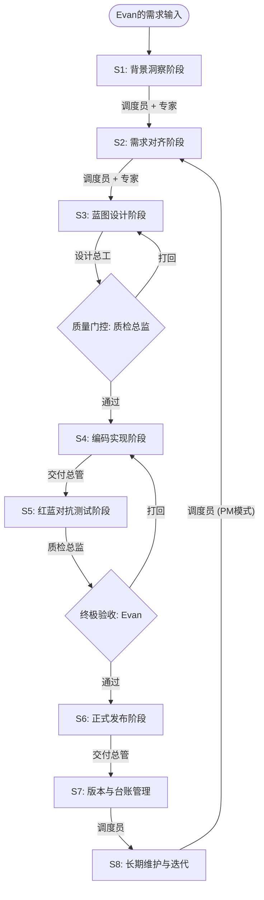

# Agent Factory (造物工厂) —— 业务 Skill 工业化生产线

## 1. 我们是谁？(Who We Are)

**Agent Factory (造物工厂)** 是一个专为复杂业务逻辑设计的 **AI 技能工业化生产体系**。

我们通过标准化的“八步走”生命周期，将模糊的业务管理意图转化为可运行、高品质的 **Skill 产品**。

---

## 2. 我们的核心角色 (Roles & Responsibilities)

工厂实行“一调度三总师”的协作模式，确保每一行代码背后都有管理思想支撑：

1.  **工厂调度员 (Orchestrator)**：作为你的数字代理人和产品经理，负责需求洞察与全局调度。
2.  **设计总工 (Chief Designer)**：负责逻辑转译、技术蓝图绘制与执行标准制定。
3.  **交付总管 (Delivery Manager)**：负责工业化代码编写、系统集成与四重分发。
4.  **质检总监 (Quality Director)**：负责红蓝对抗、极端压测与业务样件的最终核验。

---

## 3. 生产全景流程图 (The Workflow)

---

## 4. 生产流程详解 (Step-by-Step)

### 【第一阶段：洞察与对齐 —— 确保做对的事】
*   **S1 背景洞察 (Context)**：深度分析业务系统 API，确认识别核心对象，拒绝盲目开发。
*   **S2 需求对齐 (Requirements)**：挖掘隐性管理意图，定死需求边界与验收标准。

### 【第二阶段：设计与门控 —— 确保方案靠谱】
*   **S3 蓝图设计 (Design)**：由**设计总工**起草“技术蓝图”，明确数据流向和逻辑算法。
*   **Gate 1 质量门控**：由**质检总监**预审方案，逻辑不通绝不下发执行。

### 【第三阶段：实现与测试 —— 确保交付质量】
*   **S4 编码实现 (Development)**：由**交付总管**编写工业级代码、配置脚本、实现全自动化。
*   **S5 红蓝对抗 (Testing)**：由**质检总监**担任“找茬者”，用真实数据进行边界压测与样件核验。

### 【第四阶段：发布与演进 —— 确保价值落地】
*   **S6 四重发布模式 (Release)**：发布不再是单向上传，而是针对四种受众的资产化交付：
    1.  **物理发布 (Local On-boarding)**：成果入库至 `05_products/`，实现本地生产力即时转化。
    2.  **云端发布 (ClawHub Registry)**：通过 `clawhub publish` 注册全球仓库，实现跨环境一键分发。
    3.  **企业发布 (Internal Market)**：同步至公司内部 Skill 市场，确保核心业务技能在组织内部安全流转。
    4.  **业务发布 (Artifact Delivery)**：将“工业级业务样件”正式推送至 Evan 窗口，完成业务价值的最终闭环。
*   **S7 版本台账 (Versioning)**：严苛的版本管理（SemVer），确保每一处代码改动都有管理依据。
*   **S8 持续维护 (Maintenance)**：持续收集用户反馈，进行敏捷的版本迭代和热修复。

---

## 5. 我们的最终产出物 (Deliverables)

1.  **标准化 Skill 包**：可跨环境一键安装的生产力单元。
2.  **工业级文档集**：包含需求洞察、技术蓝图、测试报告、版本台账。
3.  **业务样件库**：提供完全对齐真实业务语境的产出样件（如报表、模板）。

---
*造物工厂：将管理思想转化为数字生产力。*
