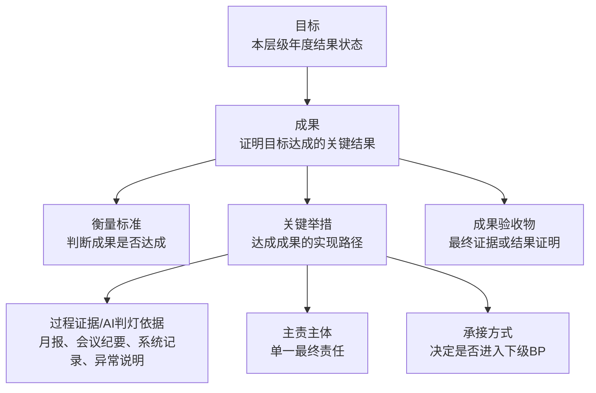
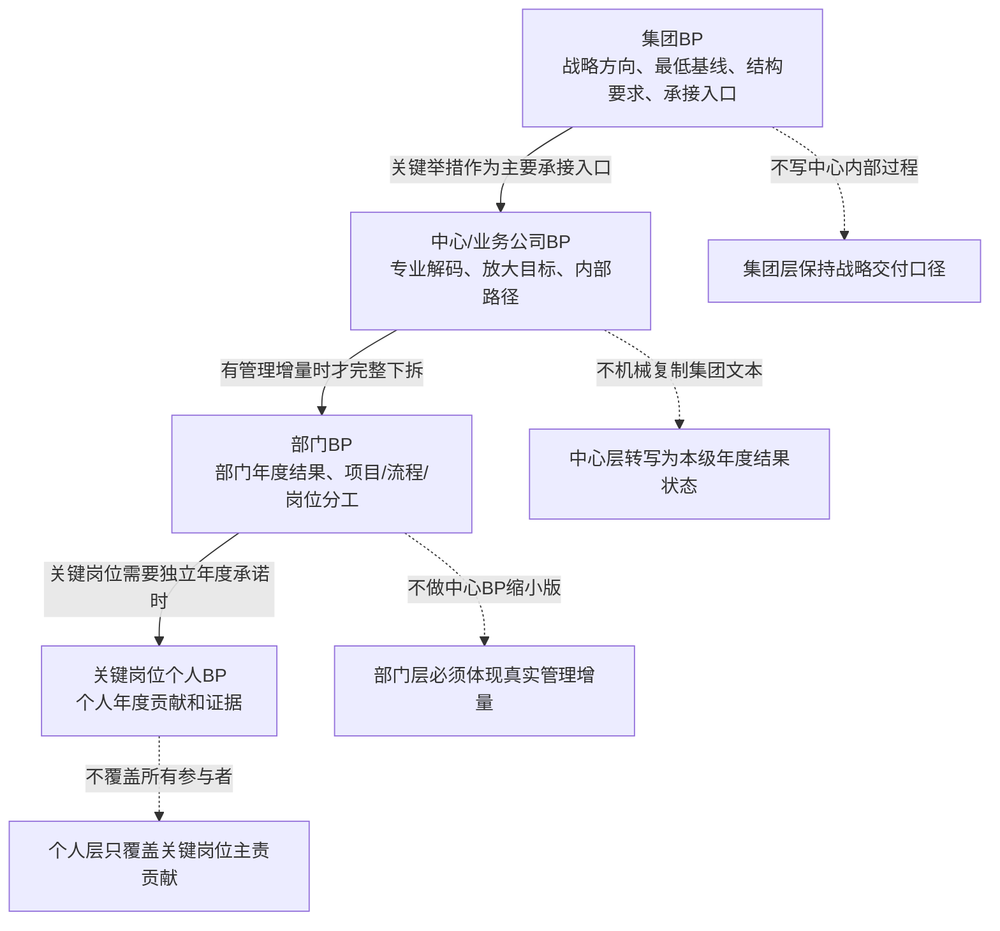
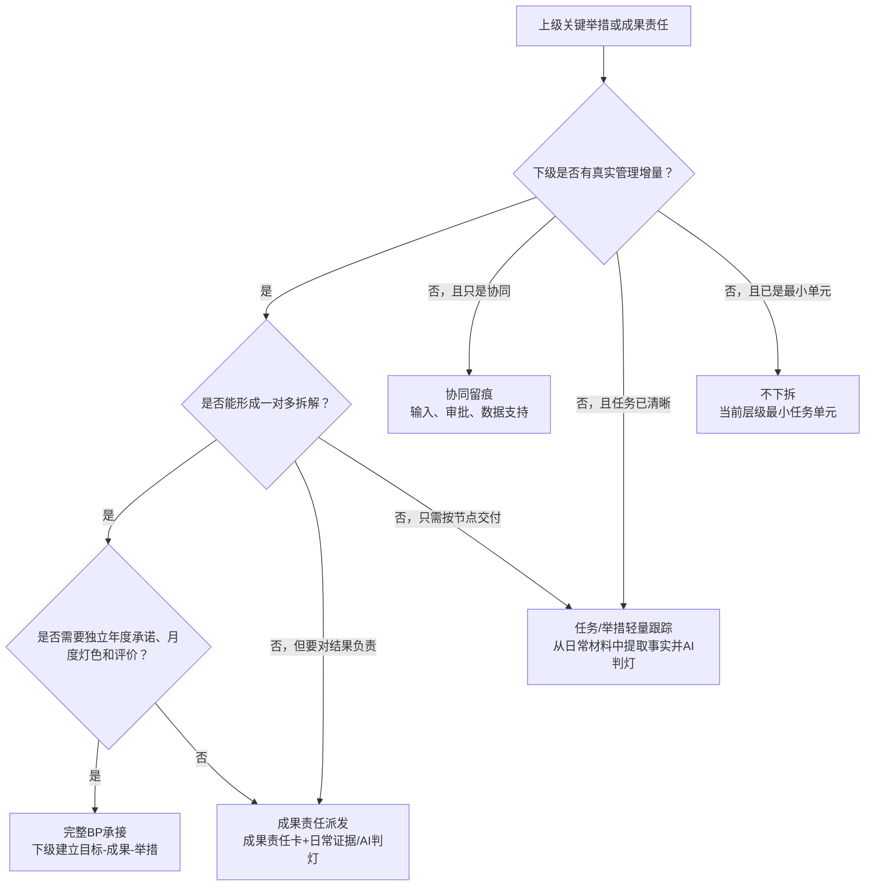
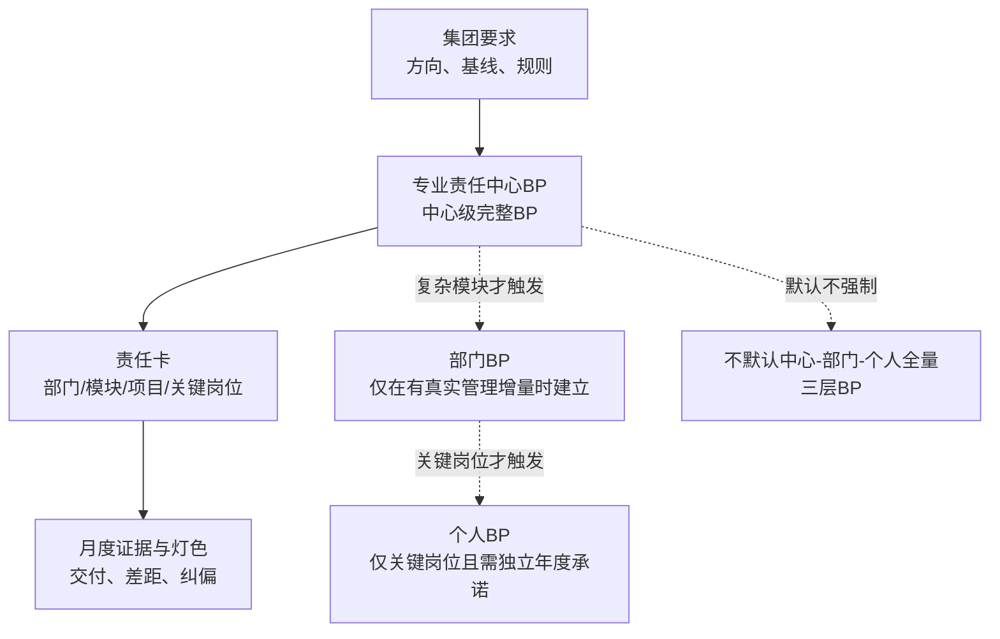
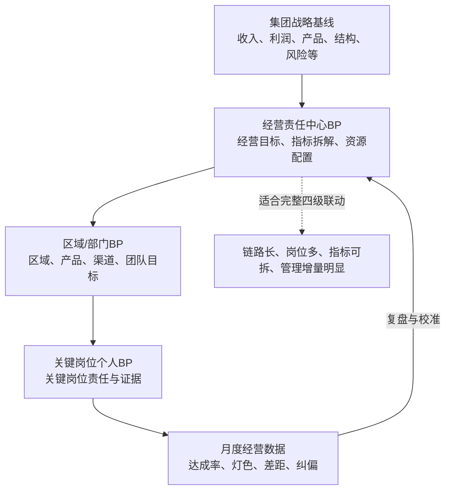

# 集团BP生成要求规划书

> 版本：v1.5，已补强承接方式唯一性、判定卡、AI预判确认机制和后续分拆/月报预留控制点  
> 日期：2026-06-14  
> 状态：工作稿，随集团BP重构过程持续迭代  
> 用途：指导集团、中心、部门、个人BP的生成、审查、承接、回写与后续Skill落地  

---

## 一、规划书目标

本规划书用于沉淀集团BP重构过程中的共识、规则和生成要求，形成一套可反复使用的BP生成方法。

它不是单次BP文稿写作说明，而是面向后续全公司统一使用的BP生成指引，最终应能支持：

1. 生成年初系统外BP工作稿；
2. 审查BP是否符合集团战略、层级承接、OKR逻辑和月度复盘要求；
3. 生成正式BP短正文；
4. 生成规则卡、口径卡、证据卡、责任承接表；
5. 支撑后续BP生成Skill、审查Skill、回写包Skill和检查器的建设。

本规划书当前目标是沉淀BP生成、审查、承接和回写的统一规则，并逐步转化为后续Skill可执行的判断逻辑、问题模板、规则卡模板和检查器规则。

---

## 二、BP系统的基本链路

集团BP不是单层文件，而是一套组织层级承接系统。

完整链路为：

> 集团 -> 中心/业务公司 -> 部门 -> 部门关键岗位个人

每一个组织层级都有负责人：

| 层级 | BP对象 | 负责人类型 |
|---|---|---|
| 集团 | 集团年度BP | CEO、CFO及集团层面目标负责人 |
| 中心/业务公司 | 中心BP、业务公司BP | 中心总经理、业务公司负责人 |
| 部门 | 部门BP | 部门负责人 |
| 个人 | 关键岗位个人BP | 部门关键岗位个人 |

组织目标不是抽象文本。每个组织层级的目标达成，都依赖该组织中负责人和关键岗位个人的集合贡献。

---

## 三、BP的标准结构

单个BP对象统一采用以下语义结构，但不要求每一级组织、每一个责任人都机械生成完整三层BP。

核心原则：

> 结构统一，承接分型；语义统一，深度可变。

统一语义链路为：

> 目标 -> 成果 -> 衡量标准 -> 成果输出对象/最终验收物 -> 关键举措 -> 主责主体 -> 承接方式 -> 下级承接对象/分工 -> 过程证据/AI判灯依据

| 层级 | 定义 | 作用 |
|---|---|---|
| 目标 | 年度要形成的结果状态 | 表达该层级年度战略结果 |
| 成果 | 证明目标达成的关键结果 | 作为目标达成的KR |
| 衡量标准 | 判断成果是否达成的定量或定性标准 | 作为成果裁决规则 |
| 关键举措 | 支撑成果达成的实现路径 | 作为下一级BP主要承接入口 |
| 成果输出对象/最终验收物/成果验收条件 | 每个成果达成后必须形成或证明的最终输出、正式验收对象、结果证据或验收条件 | 支撑验收、评分、问责和冻结 |
| 主责主体 | 对该举措或任务承担单主责的组织或个人 | 明确责任，不虚化 |
| 承接方式 | 判断该举措是否进入下级完整BP、责任卡、轻量跟踪、协同留痕或不下拆 | 控制承接深度，避免机械套层 |
| 下级承接对象/分工 | 每条关键举措均须显式写清下级承接对象、责任归口、统筹承办、分项承接、协同输入或不下拆理由 | 防止共同主责、承接断裂和多中心分工不清 |
| 过程证据/AI判灯依据 | 举措推进过程中自然形成、可被AI读取和判断的月度材料 | 支撑红黄绿灯、差距识别和纠偏 |

成果层负责“交付验收”，举措层负责“过程推进”。

举措层不默认固化交付内容，也不固化日常汇报方式。日常工作中的会议纪要、月报、系统记录、审批进度、异常说明等，作为过程证据来源，由AI提取事实并对照成果验收条件、时间节点和异常说明判断红黄绿灯。

每个成果必须有明确的成果输出对象。成果不能只写方向、状态、机制形成或能力建设，而不说明最终输出什么、验收什么、以什么事实证明完成。

成果输出对象可以是：

| 类型 | 示例 |
|---|---|
| 经营结果 | 达成的收入、利润、现金流、市场份额、费用率、断货率、回款质量等 |
| 规则机制 | 经确认的规则、制度、流程、决策机制、评价机制、分配机制 |
| 业务模型 | 跑通的新业务模式、产品模型、渠道模型、商业化模型 |
| 系统能力 | 上线并验收的系统能力、数据贯通能力、AI诊断能力、知识库能力 |
| 数据/知识资产 | 可复核的数据资产、资料资产、规则库、诊断库、证据库 |
| 组织机制 | 关键岗位机制、骨干队伍机制、协同机制、激励机制 |
| 合作成果 | 已签署或进入实质执行的合作、准入、注册、转移生产、商业化承接成果 |
| 复盘结论 | 经集团确认并用于下一轮决策、纠偏或规则迭代的正式复盘结论 |

如果某个举措的产出已经成为下一阶段结果、正式验收对象、评分依据或问责依据，就不应继续停留在举措层，而应上提为本级成果层的最终验收物，或转化为下级BP的成果。

| 情况 | 处理 |
|---|---|
| 只是日常推进动作 | 留在举措层 |
| 只是月度过程材料 | 作为AI判灯证据 |
| 需要正式验收、评分或问责 | 放到成果层的成果输出对象/最终验收物/衡量标准 |
| 会成为下级承接结果 | 转化为下级BP的成果 |
| 与成果验收物完全重叠 | 合并或重构，不保留两个交付字段 |

---

## 四、OKR逻辑在BP中的落地规则

本BP系统基于OKR，但不是简单复制OKR格式。

基本映射为：

| BP结构 | OKR角色 | 说明 |
|---|---|---|
| 目标 | O | 该层级年度结果状态 |
| 成果 | KR | 证明目标是否达成的关键结果 |
| 衡量标准 | KR裁决规则 | 判断成果是否达成，不是新的KR |
| 关键举措 | 实现路径/承接点 | 支撑成果达成，也是下一级O的主要落点 |

重要修正规则：

> 成果证明上级目标是否达成；关键举措/承接点才是下一级组织继续承接的主要入口。

不能把下一级承接点主要放在成果层。集团层成果往往仍然宏观，不能直接拆给中心、部门和个人完整承担。真正能被下级接住的，是带有主责主体、承接方式和实现路径的关键举措。

但关键举措作为承接入口，不等于所有关键举措都必须进入下级完整BP。承接方式应分型判断：完整BP承接、任务/举措轻量跟踪、成果责任派发、协同留痕或不下拆。

### 4.1 三层拆解与对象聚合规则

BP采用“目标-成果-关键举措”三层结构的目的，是把复杂问题拆成可执行、可承接、可复盘的管理对象。

理想结构应呈现为扇形递进：

> 一个目标 -> 多个成果 -> 每个成果下多个关键举措 -> 关键举措被下级BP继续承接

如果某个目标只有一个成果，且该成果只有一个关键举措，说明该对象没有形成有效拆解，不应机械保留三层空结构。此时应进行对象聚合。

对象聚合规则：

| 情形 | 处理 |
|---|---|
| 一个目标只有一个成果，且该成果只有一个关键举措 | 聚合为上级关键举措或任务对象 |
| 一个成果只有一个举措，且举措内容与成果高度重合 | 合并成果与举措，保留为一个可管理对象 |
| 一个关键举措没有完整下级BP承接 | 该举措即为当前层级最小任务单元，按任务/举措轻量跟踪或当前层级自然运行材料判灯 |
| 一个关键举措设置完整下级BP承接 | 下级BP必须按“目标-成果-关键举措”结构继续拆解 |
| 完整下级BP承接后仍是一对一结构 | 继续判断是否应聚合，不应制造形式化层级 |
| 完整下级BP承接后形成一对多结构 | 说明承接有效，形成扇形目标递进 |

判断标准：

1. 目标层应回答“年度要形成什么结果状态”；
2. 成果层应回答“用哪些关键结果证明目标达成”；
3. 关键举措层应回答“通过哪些实现路径支撑成果达成”；
4. 承接方式应回答“哪些举措需要下级完整BP承接，哪些只需轻量跟踪、成果责任派发、协同留痕或不下拆”；
5. 如果三层结构没有产生一对多拆解，应优先聚合为更简洁的管理对象；
6. 不能为了满足格式而制造空目标、空成果、空举措。

该规则的管理含义是：

> BP层级不是越多越好，拆解必须产生责任、路径和管理增量。如果没有产生增量，就应聚合；如果需要下级继续承担，就必须形成一对多的承接结构。

### 4.2 上级举措转写为下级目标规则

承接入口可以是上级关键举措，但下级目标必须改写为本级年度结果状态，不能机械复制上级举措名称。

| 上级关键举措 | 下级目标应该怎么转写 | 不建议写法 |
|---|---|---|
| 承接集团产品资产输入输出基线，并在中心BP中设置放大目标 | 产品中心年度产品资产输入输出目标体系已形成并达到不低于集团基线的年度结果 | 承接集团产品资产输入输出基线，并设置放大目标 |
| 完成集团总部战略项目奖激励机制，并上线战略项目管理平台 | 战略项目激励与平台化管理机制已建成并进入常态运行 | 完成战略项目奖机制和平台上线 |
| 推进总部关键岗位招聘完成率>=90% | 总部关键岗位供给保障达到年度要求 | 推进总部关键岗位招聘完成率>=90% |

### 4.3 完整BP对象成立标准

不是所有承接事项都值得生成完整BP。建议先用“三问”判断是否需要下级完整BP：

| 判断问题 | 如果答案是否 | 处理 |
|---|---|---|
| 下级是否有真实管理增量 | 没有，只是同一个人/同一个模块负责 | 不建完整BP，改用任务/成果责任卡 |
| 下级是否能形成一对多拆解 | 不能，仍是一目标一成果一举措 | 不建完整BP，聚合为上级任务对象 |
| 是否需要年度承诺而不是轻量过程跟踪 | 不需要，只需按节点推进 | 不建完整BP，按任务/举措轻量跟踪 |

至少满足以下三项，才建议建立完整BP：

1. 有独立年度结果状态；
2. 至少能拆出两个以上成果或工作流；
3. 有多个责任角色或跨部门协作；
4. 需要独立月度灯色或独立评价；
5. 需要下一级继续拆到多个关键岗位；
6. 不只是一个文档、一次审批、一个系统上线节点。

#### 4.3.1 承接方式唯一性与判定卡规则

承接方式不是描述性字段，而是决定后续中心、业务公司、部门、个人BP是否拆解、是否形成纵向父子链、月度报告如何汇报、证据和灯色是否上卷、责任如何追溯的结构性字段。

每条关键举措必须且只能有一个主承接方式。不得在“承接方式”字段中混写多个承接方式，例如“成果责任派发 + 协同留痕”“完整BP承接 + 协同留痕”。如果一个举措涉及多个主体、多个输入或多个协同关系，应在“下级承接对象/分工”字段中区分统筹承办、分项承接、协同输入和裁决升级，而不是把多个承接方式并列写入。

承接方式不得由下级承接主体自行选择，也不得由AI黑箱判断后直接冻结。生成机制应为：

| 步骤 | 执行动作 | 输出 |
|---|---|---|
| AI预判 | AI按统一判定卡判断承接方式 | 输出预判承接方式、判定依据和不适用方式 |
| 用户确认 | 用户或集团BP生成负责人确认、修正或要求重判 | 形成已确认承接方式 |
| 目标关闭复盘 | 单目标关闭前检查所有关键举措承接方式是否唯一、是否与分工一致 | 不通过则不得关闭目标 |

承接方式判定卡必须回答以下问题：

| 判定项 | 要回答的问题 | 对承接方式的影响 |
|---|---|---|
| 最终结果责任 | 这条举措的最终结果是不是由下级承担？ | 是，才可能完整BP承接或成果责任派发 |
| 下级解码必要性 | 下级是否必须把它转写成自己的年度目标，并继续拆出多个成果或举措？ | 是，才可能完整BP承接 |
| 管理增量 | 下级是否有真实管理增量，如多部门、多项目、多流程、多岗位或多工作流？ | 是，支持完整BP承接 |
| 证据上卷 | 未来月报、证据、灯色是否需要沿这条链正式上卷？ | 是，支持完整BP承接 |
| 本级裁决权 | 最终确认、例外、裁决是否留在集团、CEO、管委会或投决机制？ | 是，通常不得判为完整BP承接 |
| 输入性质 | 下级是否只是提供事实、数据、测算、专业意见、审核意见或材料？ | 是，通常为协同留痕 |
| 结果验收物 | 下级是否只需交一个明确成果或验收物，不需要完整三层拆解？ | 是，通常为成果责任派发 |
| 过程动作 | 是否只是节点、材料、进度、会议、跟踪或推进动作？ | 是，通常为任务/举措轻量跟踪 |
| 横向关系 | 是否是另一个O或另一个专业体系的触发、分流、输入或协同？ | 是，通常为横向协作规则 |

判定优先级如下：

| 优先级 | 判断 | 承接方式 |
|---:|---|---|
| 1 | 如果是跨O触发、分流、输入或协同，不应形成纵向父子链 | 横向协作规则 |
| 2 | 如果最终裁决权留在集团、CEO、管委会或投决机制 | 不下拆/集团裁决机制 |
| 3 | 如果下级承担年度结果，且必须转写为下级目标并继续拆成果和举措 | 完整BP承接 |
| 4 | 如果下级承担一个明确成果或验收物，但不需要完整三层拆解 | 成果责任派发 |
| 5 | 如果只是动作、节点、材料或进度 | 任务/举措轻量跟踪 |
| 6 | 如果只是事实、数据、测算、审核或专业意见输入 | 协同留痕 |

完整BP承接必须同时满足以下条件：

1. 下级承担年度结果责任；
2. 下级需要把上级关键举措转写为本级年度目标；
3. 下级需要继续拆出多个成果或关键举措；
4. 下级存在真实管理增量；
5. 未来月度报告、证据和灯色需要沿该纵向链路上卷。

缺少上述条件时，不得写成完整BP承接。集团级裁决机制、专业输入、材料提供、事实校验、测算校验、审批留痕和跨O协同不得误写为完整BP承接。

示例：

| 关键举措 | 判定结论 | 理由 |
|---|---|---|
| 承接集团产品资产输入输出基线，并在产品中心BP中设置不低于集团基线的放大目标 | 完整BP承接 | 产品中心承担年度结果，需要转写为中心目标并继续拆成果、举措和部门动作 |
| 建立产品资产基线达成的集团级确认和例外裁决机制 | 不下拆/集团裁决机制 | 产品中心和财经中心只提供事实与测算，最终裁决留在CEO/管委会 |
| 由财经中心提供NPV测算和产品力得分 | 协同留痕或成果责任派发，视是否形成独立验收物判断 | 如果只提供测算输入则为协同留痕；如果财经中心需交付正式规则卡或测算报告，则为成果责任派发 |

#### 4.3.2 承接方式对后续分拆和月度报告的预留控制点

承接方式不仅服务当前集团BP文本，还必须为后续中心BP、业务公司BP、部门BP、个人BP和月度报告规则预留控制点。

后续生成中心BP、部门BP、个人BP或月度报告规则时，必须回看集团BP中已确认的承接方式，并按以下口径处理：

| 承接方式 | 后续BP分拆要求 | 后续月度报告和证据要求 |
|---|---|---|
| 完整BP承接 | 下级必须转写为本级目标，并形成目标-成果-举措结构 | 月报、证据、灯色、差距和责任沿纵向父子链上卷 |
| 成果责任派发 | 不强制完整三层BP，但必须形成成果责任卡、验收物或结果证据 | 按成果完成情况汇报，可作为上级成果证据 |
| 任务/举措轻量跟踪 | 不进入完整BP树，进入任务台账、节点跟踪或轻量月度状态 | 只报告进度、异常和关闭情况，不承担上级成果灯色上卷 |
| 协同留痕 | 不承担主结果，只提供事实、数据、测算、审核意见或材料 | 提供协同证据；缺失可影响主责方判断，但不作为独立目标灯色上卷 |
| 横向协作规则 | 形成跨O、跨中心或跨专业协作关系卡，不形成纵向父子链 | 记录触发、输入、反馈和协同关闭，不参与正式父子灯色汇总 |
| 不下拆/集团裁决机制 | 保留在集团层、CEO/管委会或投决机制中 | 只保留裁决材料、会议纪要、确认记录和关闭证据 |

本节是后续中心分拆和月度报告规则的预留控制点。未来编制中心BP生成规则、部门BP生成规则、个人BP生成规则、月度报告规则和AI判灯规则时，必须调用本节，防止当前集团BP中的承接方式在后续分拆和报告环节被重新解释或遗忘。

### 4.4 单目标修订后闭环复盘规则

每完成一个集团目标的成果层和关键举措层修订后，不得直接进入下一个集团目标。只要该目标在生成过程中发生过修订、删改、合并、主责调整、承接方式调整或字段结构调整，就必须先输出该目标的完整复盘版，并经用户确认后，方可进入下一目标。

本规则用于防止局部逐项确认替代整体确认，避免修订过程中出现成果重复、字段漂移、责任错位、承接方式混乱或集团-中心边界回退。

闭环复盘至少包含三部分：

| 复盘输出 | 内容 |
|---|---|
| 目标完整确认版 | 目标、成果层完整表、关键举措层完整表，按当前最新规划书字段结构完整重列 |
| 闭环检查表 | 检查目标表述、成果层、衡量标准、最终验收物、举措层、主责主体、承接方式、集团-中心边界、规则沉淀和未决问题 |
| 用户确认入口 | 由用户确认“关闭本目标，进入下一目标”或“返回修改指定项” |

#### 4.4.1 单目标完整复盘版强制输出结构

单目标完整复盘版不得只输出成果名称和关键举措。完整结构必须显式包含：

1. 目标表；
2. 成果层完整表；
3. 关键举措层完整表；
4. 闭环检查表；
5. 用户确认入口。

成果层完整表必须按以下字段输出：

| 字段 | 是否必填 | 说明 |
|---|---:|---|
| 成果编号 | 是 | 对应本目标下的成果序号 |
| 成果名称 | 是 | 证明目标达成的关键结果 |
| 成果主责主体 | 是 | 对成果最终达成负责的单主责主体 |
| 衡量标准 | 是 | 判断成果是否达成的定量或定性标准 |
| 成果输出对象/最终验收物/成果验收条件 | 是 | 成果达成后必须形成的最终输出、正式验收对象、结果证据或验收条件 |
| 证据路径/规则卡位置 | 可选 | 取数、归档、规则卡或系统字段位置 |

硬性要求：

1. “衡量标准”不得省略；
2. “衡量标准”不得被“成果验收口径”“成果说明”“交付内容”等合并字段替代；
3. 如果衡量标准暂未完全确定，必须在衡量标准字段中写“待确认”并说明缺口，不能整列省略；
4. 成果输出对象/最终验收物/成果验收条件不得省略，必须回答“最终形成什么、验收什么、以什么事实证明完成”；
5. 如果成果输出对象暂未完全确定，必须在该字段中写“待确认”并说明缺口，不能整列省略；
6. 最终验收物可以和衡量标准相互支撑，但不能替代衡量标准；
7. 一个成果原则上应有一个主输出对象；如果包含多个独立验收物，应拆分成果，或明确主输出和辅助输出；
8. 若输出完整复盘版时缺少成果层衡量标准或成果输出对象，应视为复盘未完成，不得进入下一目标。

由于本规则是在O8生成过程中进一步强化的，O1-O8已经生成或阶段确认的成果必须在O1-O9总复盘前进行回查。回查重点包括：

1. 是否存在成果只写方向、状态、机制形成或能力建设，但没有成果输出对象；
2. 是否存在成果只有衡量标准，没有最终验收物、结果证据或验收条件；
3. 是否存在一个成果包含多个独立正式验收物，导致成果边界过宽；
4. 是否存在把会议纪要、台账、月报、审批进度等过程证据误写成成果输出对象；
5. 是否存在成果输出对象与关键举措过程证据重复，导致验收层和执行层混淆。

关键举措层完整表必须按以下字段输出：

| 字段 | 是否必填 | 说明 |
|---|---:|---|
| 对应成果 | 是 | 说明该举措支撑哪个成果 |
| 关键举措 | 是 | 支撑成果达成的实现路径 |
| 主责主体 | 是 | 单一最终责任主体 |
| 承接方式 | 是 | 完整BP承接、任务/举措轻量跟踪、成果责任派发、协同留痕或不下拆 |
| 下级承接对象/分工 | 是 | 必须显式展示；如完整BP承接、成果责任派发、多对象协同或轻量跟踪，应写清对象和分工；如确实不下拆，应写“不下拆”及理由 |
| 过程证据来源/AI判灯依据 | 是 | 用于后续月度事实提取、灯色判断和差距识别 |

本结构是完整复盘版的输出契约。若字段不完整，不能用闭环检查表的“基本通过”替代。

下级承接对象/分工字段不得整列省略。每条关键举措都必须在该字段中给出明确判断：

| 情况 | 字段写法 |
|---|---|
| 完整BP承接 | 写明承接中心/部门/业务公司/关键岗位，并说明由其转写为下级目标 |
| 成果责任派发 | 写明成果责任对象和其承担的结果责任 |
| 多中心或多对象协同 | 写明统筹承办、分项承接对象、协同输入对象和各自分工 |
| 任务/举措轻量跟踪 | 写明轻量跟踪对象或责任归口 |
| 协同留痕 | 写明协同输入、审批、数据支持或校验对象 |
| 不下拆 | 写明“不下拆：当前层级最小任务单元”或其他不下拆理由 |

不得使用以下模糊写法：

| 模糊写法 | 问题 |
|---|---|
| 各中心 | 无法判断谁承接什么 |
| 相关部门 | 承接对象不清 |
| 多部门协同 | 没有区分统筹、分项承接和协同输入 |
| 信息化相关团队 | 组织边界不清，除非当前阶段确实无法定位且标注待确认 |
| 不填 | 无法判断是否漏承接、轻量跟踪或不下拆 |

闭环检查表建议固定检查以下事项：

| 检查项 | 检查问题 |
|---|---|
| 目标表述 | 是否仍表达集团年度结果状态 |
| 成果层 | 成果是否完整、是否重复、是否过细、是否有成果输出对象、最终验收物或成果验收条件 |
| 衡量标准 | 指标、阈值、口径、证据是否足以判断成果达成 |
| 举措层 | 是否使用当前最新规划书字段，是否避免旧字段回流 |
| 主责主体 | 是否单主责，是否存在责任混乱 |
| 承接方式 | 是否区分完整BP承接、成果责任派发、协同留痕、任务/举措轻量跟踪和不下拆 |
| 集团-中心边界 | 是否把中心内部工作法误写进集团BP |
| 规则沉淀 | 是否产生需要写入规划书或年度规则卡的新规则 |
| 未决问题 | 是否仍有待确认口径；未确认不得进入下一目标 |

建议确认口径：

> 只有当用户确认“本目标完整复盘通过”后，该目标才视为阶段关闭；否则继续回到指定成果或举措修订。

#### 4.4.2 过程确认暂存与目标关闭集中写入规则

单个集团目标生成过程中，成果、衡量标准、成果输出对象、关键举措、主责主体、承接方式和下级承接对象/分工可以逐项讨论和逐项确认，但逐项确认不等于必须逐项写入阶段确认稿、生成包或正式回写包。

本规则用于区分“执行检查强度”和“文件沉淀频率”：

1. 执行检查不降级。每生成一个成果或关键举措时，仍必须执行集团-中心边界、字段完整性、单主责、承接方式和下级承接对象/分工等硬性检查；
2. 文件写入可降频。单个成果或单条举措确认后，先作为目标内过程确认保留在当前目标工作稿、对话记录或临时复盘草稿中，不强制立即另存阶段确认稿或生成包；
3. 目标关闭必须集中写入。只有当该目标成果层和关键举措层完成整体复盘，并经用户确认“关闭本目标”后，才将该目标完整确认版集中写入阶段确认稿、生成包或后续回写包；
4. 后确认覆盖前确认。若后续举措层、主责分工或承接方式反向影响前面成果表述，应以目标关闭复盘版为准，早期过程确认不得替代关闭版；
5. 跨目标规则必须即时处理。若生成过程中产生影响后续目标的通用规则、字段结构、承接规则、版本规则、重大边界规则或年度口径规则，应在用户批准后立即另存新版本写入规划书或年度规则卡，不等目标关闭；
6. 长时间暂停或上下文切换时，可以输出“目标内暂存稿”作为防丢失材料，但必须标注“未关闭、未进入阶段确认稿”，不得作为正式关闭依据。

沉淀位置应按以下规则判断：

| 内容类型 | 沉淀位置 | 写入时点 |
|---|---|---|
| 单个成果或单条举措的过程确认 | 目标内过程稿、对话记录或临时复盘草稿 | 逐项确认后暂存，不强制另存版本 |
| 单目标完整确认版 | 阶段确认稿、生成包或后续回写包 | 目标关闭复盘经用户确认后集中写入 |
| 通用生成规则、字段结构、承接规则、版本规则 | 规划书 | 用户批准后立即另存新版本写入 |
| 年度具体口径、某个O的特殊边界、重大事件分流规则 | 年度规则卡字典 | 用户批准后立即另存新版本写入 |
| 未决问题、总复盘回写事项 | 问题清单、总控复查表或闭环检查表 | 发现时记录，目标关闭或总复盘时处理 |

硬性约束：

| 检查点 | 约束 |
|---|---|
| 逐项生成时 | 不得因为暂不写入文件而省略集团-中心边界判断、字段完整性判断、单主责判断和承接方式判断 |
| 目标关闭前 | 不得用零散过程确认替代完整复盘版 |
| 进入下一目标前 | 必须已有用户确认的目标完整复盘版和闭环检查表 |
| 通用规则变化时 | 不得等到O1-O9总复盘后才写入；经用户批准后应即时新版本写入规划书或年度规则卡 |
| 正式回写前 | 必须以目标关闭复盘版和最新规则文件为准，早期过程稿只作为历史依据 |

复杂目标可以设置阶段性复盘节点。若一个目标在成果层已经发生明显修订，不应等关键举措全部写完后才整体回看，而应先输出成果层完整复盘版，经确认后再进入举措层。

| 复盘节点 | 触发条件 | 输出 |
|---|---|---|
| 成果层阶段复盘 | 成果名称、衡量标准、成果输出对象/最终验收物、主责方向或边界发生调整 | 目标定位、成果层完整表、成果层闭环检查表 |
| 举措层阶段复盘 | 关键举措、主责主体、承接方式、下级承接对象或过程证据发生调整 | 关键举措完整表、承接方式检查表 |
| 目标关闭复盘 | 成果层和举措层均完成确认 | 目标完整复盘版、闭环检查表、用户关闭确认 |

### 4.5 复杂目标先锁定位和成果目录规则

对体系化、组织力、信息化、风控、投资、资本循环等复合型集团目标，不应直接进入关键举措清单。

生成顺序应为：

1. 先判断该目标的管理定位；
2. 再列出成果层目录；
3. 经用户确认成果层目录后，再逐项展开成果；
4. 成果层确认后，再进入关键举措层；
5. 举措层完成后，按4.4规则复盘关闭。

该规则用于防止宽目标被写成任务堆叠，或把多个中心的工作全部混入一个无法承接的集团举措。

| 目标类型 | 先确认什么 | 不应直接做什么 |
|---|---|---|
| 体系化运营 | 管理闭环、制度沉淀、知识资产、复盘机制 | 直接列系统或会议清单 |
| 组织力与价值分配 | 关键岗位、人才结构、协同机制、评价与分配闭环 | 直接列招聘、培训或薪酬动作 |
| AI数字化 | 管理对象、数据贯通、证据链、AI工作流样板 | 直接列工具、看板、提示词或系统模块 |
| 风险防线 | 集团级风险边界、预警机制、处置责任、升级裁决 | 直接列中心内部检查动作 |
| 投资与资本循环 | 集团收益、纪律、退出、回收、反哺研究的闭环 | 直接列投后项目台账或具体项目推进 |

---

## 五、集团BP与中心BP的边界

集团BP不是中心BP的汇总，也不是把中心BP向上压缩。

集团BP是集团经营层对各中心、业务公司提出的年度战略交付要求。

### 5.1 集团-中心边界前置预判规则

在生成集团BP的目标、成果和关键举措之前，必须先判断哪些内容应进入集团层，哪些内容应退出集团BP正文并进入其他管理载体。

本规则的目的，是避免把中心内部工作法反向提升为集团成果或集团关键举措，导致集团BP过细、中心BP失去承接空间。

#### 5.1.0 集团BP事项重要性准入规则

集团BP是年度战略选择，不是部门职责清单。凡是候选事项进入集团BP前，必须先判断其是否属于年度战略事项、集团必须控制事项或重大专项事项。

核心原则：

> 战略是有限资源的选择。集团BP只写年度重大结果、重大能力、重大规则、重大风险、重大资源配置和跨中心关键协同；法定例行职责、行政后勤、常规人事操作、中心内部流程和日常保障事项，不默认进入任何层级BP。未通过集团BP准入的事项，应先退出集团BP正文，再按管理载体分流：只有构成中心年度重点、放大目标、重大专项或跨部门承接任务的，才进入中心BP或部门BP；属于稳定职责、例行操作或合规留痕的，进入岗位职责、制度/SOP、任务台账、日常证据体系或AI判灯材料。

进入集团BP的正向触发条件：

| 触发条件 | 判断问题 | 可进入集团BP的表达 |
|---|---|---|
| 年度战略选择 | 是否决定2026年集团资源投向、战略主线或能力建设重点？ | 目标、成果或关键举措 |
| 重大经营影响 | 是否直接影响收入、利润、现金流、研发投入覆盖、资本循环或政策性收益？ | 目标、成果或衡量标准 |
| 重大风险底线 | 是否涉及集团级合规底线、质量安全、劳动用工底线、数据安全、跨境风险或重大审计整改？ | 成果、规则或风险防线 |
| 重大资源配置 | 是否需要CEO、管委会或集团层冻结预算、组织、激励、投资、办公资产、系统资源等安排？ | 成果或关键举措 |
| 跨中心关键协同 | 是否多个中心共同完成，且不写集团层会导致责任断裂、无人负责或重复建设？ | 关键举措和下级承接分工 |
| 重大专项 | 是否属于金额大、风险高、跨年度、跨中心或对组织运行有明显影响的专项项目？ | 专项成果或协同举措 |

不得进入集团BP或需要分流处理的事项：

| 事项类型 | 处理方式 | 示例 |
|---|---|---|
| 法定例行操作 | 不默认写入中心BP或部门BP；若仅为稳定职责，进入岗位职责、制度/SOP、日常证据或合规留痕；集团层仅保留合规底线对象 | 社保、医保、工资发放、劳动合同日常管理 |
| 行政后勤日常 | 不默认进入集团、中心或部门BP；进入行政职责、服务标准、任务台账、采购/资产/接待制度和日常证据体系 | 办公室日常维护、接待、车队、普通租退、日常采购 |
| 中心内部流程 | 若不构成中心年度重点或重大专项，不进入中心BP；进入SOP、任务台账、会议机制或过程证据 | 项目表、月报、内部审批、会议机制、台账维护 |
| 个案人事动作 | 不进入集团BP；只有构成关键岗位、关键人才或价值分配机制时进入O8或人力资源中心BP；个案操作进入岗位管理流程 | 个别提拔、调动、涨薪、员工关系处理 |
| 普通政府事务 | 不默认进入BP；只有形成重大政策性收益、专项资金或重要外部资源兑现时才进入O1或相关中心BP | 零散沟通、材料递交、日常关系维护 |

例外上提规则：

| 日常事项 | 触发例外后如何上提 |
|---|---|
| 社保、医保、工资等人事基础工作 | 若出现重大劳动合规风险、员工权益风险或集团级薪酬分配机制改革，可进入O9合规底线或O8价值分配机制；日常操作进入人力资源制度、岗位职责、SOP或证据体系 |
| 提拔、调动、涨薪 | 若服务关键岗位、关键人才、战略任务承接或价值分配机制改革，可进入O8；个案操作进入人力资源流程和岗位管理 |
| 办公室装修、租赁、退租 | 若金额大、合同复杂、影响集团办公布局、消防安全或跨中心搬迁，可作为重大专项进入O1/O9协同；日常维护进入行政职责、合同台账或资产管理流程 |
| 政府补贴、返税、奖励 | 若金额重要、可体系化兑现或影响利润/现金流，应进入O1政策性收益或财务质量成果；普通申报动作进入归口部门任务台账和过程证据 |

执行机制：

| 时点 | 必须动作 | 失败处理 |
|---|---|---|
| 目标目录形成前 | 对候选一级O判断是否为独立战略主题，防止新增“杂项O” | 不满足独立战略主题的事项，不得新增一级O；先判断能否回填O1-O9，不能回填则进入非集团BP事项分流表 |
| 成果层生成前 | 对候选成果判断是否满足战略、经营、风险、资源配置、跨中心协同或重大专项触发 | 不满足则不得写成集团成果；进入非集团BP事项分流表，并判断是否需要中心BP二次准入 |
| 关键举措生成前 | 对候选举措判断是否只是日常动作、中心流程或岗位职责 | 不满足集团准入则不得写成集团关键举措；分流为中心BP候选、专项任务、岗位职责、SOP、任务台账或日常证据 |
| 中心BP生成前 | 对从集团BP剔除或分流的事项重新做中心BP准入判断 | 不能自动写入中心BP；不构成中心年度重点、放大目标、重大专项或跨部门承接任务的，进入职责/SOP/台账/证据 |
| 单目标复盘时 | 检查是否把日常事项上提为集团成果或关键举措 | 降级为合规对象、协同分工、过程证据或非集团BP事项分流项 |
| O1-O9总复盘时 | 检查是否存在战略缺口和日常事项污染集团BP | 缺口回填相关O；日常事项从集团BP正文移出，并输出非集团BP事项分流表 |

非集团BP事项分流表至少包括：

| 字段 | 说明 |
|---|---|
| 事项名称 | 被讨论但未进入集团BP正文的事项 |
| 未进入集团BP原因 | 日常职责、例行合规、行政后勤、中心流程、个案操作、证据材料等 |
| 是否需要中心BP二次准入 | 是/否；不能默认进入中心BP |
| 推荐管理载体 | 中心BP、部门BP、专项任务、岗位职责、制度/SOP、任务台账、日常证据、AI判灯材料或不纳入 |
| 复核时点 | 中心BP生成前、部门BP生成前、月度运行或总复盘 |

典型归位口径：

| 事项 | 推荐归位 |
|---|---|
| 政府补贴、返税、政策奖励 | O1待复核；如形成重要收益，归入政策性收益/财务质量/现金流成果 |
| 关键岗位、关键人才、价值分配、战略任务承接 | O8.2/O8.3 |
| 劳动用工、薪酬社保、员工权益合规底线 | O9合规对象或人力资源中心BP；不默认单列集团成果 |
| 行政办公、接待、车队、日常资产维护 | 行政部/总裁办中心BP或部门职责；不默认进入集团BP |
| 重大办公装修、重大租赁、重大搬迁 | 重大专项，按O1预算/成本和O9合同/安全/合规协同处理 |

核心原则：

> 集团BP只写集团必须控制的结果、规则、最低基线、重大协同和承接入口；中心BP负责写专业路径、目标放大、部门分工、过程管理、工具系统和内部复盘机制。

该判断必须前置，不得只在写完后复核。

| 阶段 | 必须动作 | 作用 |
|---|---|---|
| 生成前 | 完成集团-中心边界预判 | 决定哪些内容允许进入集团BP |
| 生成中 | 每生成一个成果或关键举措时逐条校验 | 防止颗粒度漂移 |
| 生成后 | 做整体复核 | 查漏、查重、查责任和承接是否混乱 |

结论：

> 前置判断为主，生成中校验，生成后复核。

#### 5.1.1 前置预判四步法

| 步骤 | 判断问题 | 输出 |
|---|---|---|
| 1. 目标定位预判 | 该集团O的本质是经营结果、专业能力、规则治理、资本循环、风险防线还是组织体系？ | 决定集团O的管理强度 |
| 2. 上提触发判断 | 是否触发集团冻结目标、跨中心协同、无人负责风险、重大决策权、重大风险控制？ | 触发则可进入集团BP |
| 3. 分流判断 | 是否只是中心工作法、内部流程、部门分工、项目台账、会议机制、具体工具、具体项目动作？ | 是则退出集团BP正文，进入非集团BP事项分流表 |
| 4. 生成许可 | 只有通过上提触发且未被分流规则排除的内容，才能进入集团成果或关键举措 | 形成集团BP草稿 |

#### 5.1.2 集团层上提触发条件

满足以下任一条件，才允许写入集团BP：

| 触发条件 | 含义 | 示例 |
|---|---|---|
| 集团冻结目标 | 涉及集团年度硬承诺、财务数字、战略基线 | 投资收益15亿、院外穿透29.18亿、IRR>=25% |
| 跨中心协同 | 涉及多个中心共同完成，且不写集团层容易责任断裂 | 产品中心业务判断 + 财经中心财务校验 + CEO重大决策 |
| 无人负责风险 | 如果不在集团层指定，中心可能不设或弱化 | 投资收益反哺研究、退出策略分类、不重复加总规则 |
| 重大决策权 | 涉及CEO、管委会、投决机制或重大例外裁决 | 重大投资例外、重大商业规则、重大资源配置 |
| 重大风险控制 | 涉及集团级风险、资金、合规、供应、资本回收 | 供应链外部扰动、投资失败项目处置、合规重大风险 |

#### 5.1.3 非集团BP事项分流条件

满足以下任一条件，原则上不得进入集团BP。是否进入中心BP、部门BP或其他载体，必须在对应层级生成前重新做准入判断，不能自动下沉。

| 分流条件 | 含义 | 示例 |
|---|---|---|
| 中心工作法 | 中心为完成目标采用的专业路径 | 投后项目日常跟踪、具体标的搜寻 |
| 内部流程 | 中心内部流程、SOP、台账、会议 | 季度会议、项目转交、部门协同台账 |
| 部门分工 | 中心内部部门或岗位承办 | 战投二部、注册部、数据管理部具体承办 |
| 具体项目动作 | 单个项目、单个产品、单个合作方推进动作 | 某项目IPO、某品种License-out、某CRO识别 |
| 工具建设细节 | 系统、看板、模板等内部工具 | 投后模板、BI看板、系统上线细节 |
| 过程复盘动作 | 中心内部复盘、日常检查、问题关闭 | 项目复盘会、内部评审记录 |

#### 5.1.4 成果层和关键举措层的边界写法

集团成果应写“证明集团目标达成的关键结果”，不得写成中心内部过程。

| 可以写 | 不宜写 |
|---|---|
| 投资退出、变现与资本回收达成 | 财经中心建立某个退出台账 |
| 商业化规则治理机制形成 | 经营中心组织某次规则讨论 |
| 院外责任结构形成清晰口径 | 院外中心整理业务材料 |
| 供应链风险预警与成本韧性机制形成 | 供应链中心每月做风险排查 |
| 投资收益对研究投入形成反哺评价闭环 | 产品中心开会讨论投资复盘 |

集团关键举措不是中心任务清单，而是集团成果向下承接的入口。

集团关键举措应写：

1. 集团要求下级必须承接的控制点；
2. 跨中心必须协同的规则入口；
3. 财务、风险、合规、资本、口径等纪律要求；
4. 下级BP必须继续拆解的承接入口。

集团关键举措不应写：

1. 中心内部怎么搜项目；
2. 中心怎么开会；
3. 中心怎么做台账；
4. 中心哪个部门具体怎么干；
5. 单个项目的推进细节。

#### 5.1.5 主责主体预判规则

| 事项类型 | 主责主体 |
|---|---|
| 品种价值、产品协同、研发生态价值判断 | 产品中心 |
| 估值、IRR、资金纪律、投资额度、退出变现、财务确认 | 财经中心 |
| 重大例外、重大方向、重大资源配置 | CEO/管委会/投决机制 |
| 经营规则归口、商业规则初审、经营口径审定 | 经营管理中心 |
| 业务事实、经营结果、商业化落地 | 对应经营责任主体 |
| 中心内部部门或岗位 | 不作为集团BP主责主体，只在下级承接对象或备注中体现 |

#### 5.1.6 承接方式预判规则

| 内容类型 | 承接方式 |
|---|---|
| 下级必须形成完整年度目标、成果、举措 | 完整BP承接 |
| 只需交付事实、材料或结果责任 | 成果责任派发 |
| 只表达支持、输入、校验、协作 | 协同留痕 |
| 只需轻量跟踪，不形成下级BP | 任务/举措轻量跟踪 |
| 不需要继续拆解 | 不下拆 |

#### 5.1.7 强制检查问题

每生成一个集团成果或关键举措前，必须回答：

| 问题 | 如果答案为“否” |
|---|---|
| 这是集团必须控制的结果或规则吗？ | 退出集团BP正文，进入非集团BP事项分流表 |
| 它是否触发集团冻结目标、跨中心协同、无人负责风险、重大决策或重大风险？ | 退出集团BP正文，并判断是否需要中心BP二次准入 |
| 它是否只是中心内部怎么做？ | 不进入集团BP |
| 它是否会挤压中心BP自主解码空间？ | 降颗粒度，或退出集团BP后按管理载体分流 |
| 它的主责主体是否清晰且单一？ | 拆分或重写 |
| 它是否能作为下级承接入口？ | 改写为控制点或删除 |

#### 5.1.8 示例：O7战略投资目标的边界应用

| 内容 | 处理 |
|---|---|
| 投资收益15亿 | 集团成果/衡量标准 |
| IRR>=25% | 集团投资组合质量规则 |
| 投资收益反哺研究投入 | 集团成果，因为不写可能没人负责 |
| 投后项目日常跟踪 | 进入非集团BP事项分流表；如构成中心年度重点，再由产品中心BP二次准入 |
| 技术平台/疾病领域具体合作推进 | 如构成产品战略成果则进入O2或产品中心BP；否则进入项目台账/专项机制 |
| 退出策略分类和三年滚动退出规划 | 集团成果/关键控制点 |
| 具体项目IPO跟进 | 进入非集团BP事项分流表；按项目规则卡、专项任务或中心BP二次准入处理 |

### 5.2 集团BP写什么

集团BP只写四类内容：

| 类型 | 含义 | 示例 |
|---|---|---|
| 战略方向 | 集团年度必须形成的战略状态 | 某项战略能力形成年度基线、某条增长曲线启动、某个平台能力成型 |
| 最低交付 | 集团对中心/业务单元下达的必须达成结果 | 某项年度指标达到集团最低基线 |
| 结构要求 | 集团要求形成的业务结构或能力结构 | 某类产品/市场/组织/能力结构达到集团要求 |
| 承接入口 | 哪个中心/业务单元要把集团要求接进自己的BP | 某中心承接集团基线，某中心承接测算或裁决规则 |

集团BP不写中心内部过程动作，例如：

1. 月报怎么做；
2. 会议怎么开；
3. 项目怎么归档；
4. 风险预警怎么设计；
5. SOP怎么编；
6. 人员怎么排班；
7. 项目节点表怎么维护。

这些属于中心BP、部门BP或个人BP的内部管理设计。

### 5.3 中心BP写什么

中心BP应在集团要求基础上进行专业解码：

| 类型 | 含义 |
|---|---|
| 放大目标 | 不低于集团直传目标，必要时设置保底、基线、卓越或挑战目标 |
| 专业路径 | 中心基于专业判断设计实现路径 |
| 部门分工 | 拆到中心内部部门和关键岗位 |
| 过程管理 | 项目表、月报、预警、复盘、会议、SOP、证据归档 |
| 能力建设 | 组织、人才、系统、流程、机制等中心自主目标 |

中心总经理应有专业发挥空间。集团告诉中心必须交付什么，但不替中心规定每一步怎么做。

### 5.4 层级强度规则

| 层级 | 管理强度 | 指标强度 | 动作颗粒度 |
|---|---|---|---|
| 集团BP | 战略交付控制 | 少而硬，必须可裁决 | 粗颗粒，到中心/业务单元承接入口 |
| 中心BP | 专业经营控制 | 承接集团并适度放大 | 中颗粒，拆到部门和关键项目 |
| 部门BP | 执行交付控制 | 部门目标应覆盖中心目标 | 细颗粒，拆到项目、流程、岗位 |
| 个人BP | 关键贡献控制 | 个人集合应支撑部门目标 | 最细，拆到个人交付和证据 |

### 5.5 部门BP与个人BP成立边界

部门BP不是中心BP的缩小版。部门BP只在部门有真实管理增量时成立：

1. 部门有多个成果或多个工作流；
2. 部门需要管理多个关键岗位；
3. 部门需要形成自己的年度结果承诺；
4. 部门不是只执行中心已完整拆好的一个项目。

个人BP只覆盖关键岗位个人，不覆盖所有参与者。

个人BP成立条件：

1. 个人对某个年度结果承担主要责任；
2. 个人工作不是单一任务执行；
3. 个人需要形成可评价的年度结果和证据；
4. 个人承接内容能明显区别于部门目标。

如果只是执行某个中心举措，建议放在“任务/举措轻量跟踪”或责任卡中，不建个人完整BP。

### 5.6 专业责任中心与经营责任中心差异化规则

集团、中心、部门、个人共用同一套BP语义，但不强制同一套拆解深度。专业责任中心和经营责任中心应差异化应用。

#### 5.6.1 专业责任中心

适用对象：人力资源中心、财经中心、经营管理中心、法务合规等总部职能部门。

组织特征：

1. 人数少，部门层级浅；
2. 很多工作是项目制、制度制、系统制；
3. 中心、部门、个人的责任高度重合；
4. 日常工作不宜全部进入BP；
5. 很多成果天然由一个模块或一个关键岗位负责。

建议模式：

> 中心完整BP + 部门/个人责任卡 + 日常证据/AI判灯。

对专业责任中心，不建议默认“中心、部门、个人全部完整三层BP”。应默认轻量承接，只有满足完整BP对象成立标准时才建部门BP或个人BP。

#### 5.6.2 经营责任中心

适用对象：经营责任中心（深康、德镁、维盛〔康哲维盛〕、院外业务中心）及其他承担经营结果的业务经营主体。

组织特征：

1. 链路长，区域/产品/渠道/岗位多；
2. 指标可量化、可拆分、可滚动；
3. 上级方向需要通过多层经营动作实现；
4. 下级管理增量明显；
5. 关键岗位数量多。

建议模式：

> 集团战略基线 + 经营责任中心完整BP + 区域/部门BP + 关键岗位个人BP。

经营责任中心可以更完整地使用四级联动，因为其下级组织确实有管理增量。但集团仍不应替经营责任中心写过细路径，集团应给方向、底线、结构要求和关键承接入口。

#### 5.6.3 混合型中心

产品中心、供应链中心可能介于专业责任中心与经营责任中心之间。建议按目标逐项判断：

| 情形 | 承接方式 |
|---|---|
| 多项目、多专业线、多部门共同形成年度能力 | 完整部门BP |
| 单个项目或清晰任务由某部门直接完成 | 任务/举措轻量跟踪 |
| 需要业务公司输入需求、中心转化方案 | 双主线拆分，经营主体负责需求输入，专业中心负责转化交付 |

---

## 六、放大效应规则

上级目标不是由下级简单相加等于。

集团给中心的是最低战略交付基线；中心不能缩小，只能承接并放大。部门承接中心目标时也应形成放大，个人集合应支撑并覆盖部门目标。

表达方式：

> 集团设定年度最低交付基线；中心在承接该基线基础上，可结合专业判断设置保底、基线、卓越或挑战目标，并进一步拆解到部门和关键岗位。下级目标之和或能力覆盖应高于上级最低交付要求，以形成目标达成冗余。

示例：

| 层级 | 指标关系 |
|---|---|
| 集团 | 设定某项年度最低交付基线 |
| 中心/业务公司 | 在集团基线基础上设置保底、基线、卓越或挑战目标 |
| 部门 | 承接中心目标并按专业条线或经营单元放大 |
| 关键岗位个人 | 个人任务集合应覆盖部门目标，并形成证据冗余 |

---

## 七、关键举措与责任主体规则

关键举措是主要承接入口，因此必须清楚、可拆、可判断，但不默认固化交付内容或日常汇报方式。

### 7.1 呈现顺序

关键举措表统一按以下顺序：

> 关键举措 -> 主责主体 -> 承接方式 -> 下级承接对象/分工（每条关键举措必显：写明承接对象、分工或不下拆理由） -> 过程证据来源/AI判灯依据

不能把责任主体放在最前面。因为承接路径应从成果走向举措，再由举措找到责任主体。

成果层另行控制最终验收物和成果验收条件。关键举措层不默认增加“交付内容”字段，避免把日常会议、月报、审批进度、项目台账等过程材料提前写成冻结承诺。

### 7.2 单主责规则

每一条关键举措原则上只设一个主责主体。

如果多个主体同时参与，必须拆成不同关键举措，或者写清主责与协责边界。

禁止出现两个主体并列但分工不清的表达，例如：

> 经营管理中心、财经中心负责统一收入口径。

应拆为：

| 关键举措 | 主责主体 | 承接方式 | 过程证据来源/AI判灯依据 |
|---|---|---|---|
| 制定集团收入经营分析口径和异常差异解释规则 | 经营管理中心 | 完整BP承接或任务/举措轻量跟踪 | 口径讨论纪要、月度经营分析材料、异常说明记录 |
| 建立BP管理口径与年报预测口径对照机制 | 财经中心 | 完整BP承接或任务/举措轻量跟踪 | 双口径对照材料、财务测算记录、月度差异说明 |

### 7.3 承接方式规则

下级BP主要承接关键举措，不直接承接宏观成果。但关键举措进入下级后，应先判断承接方式，而不是默认生成完整下级BP。

如果某条内容只是内部月报、预警、证据归档或会议机制，通常不应写入集团BP关键举措，而应放入中心BP内部。

承接方式分为五类：

| 承接方式 | 适用场景 | 下级是否建完整BP | 过程判断方式 |
|---|---|---:|---|
| 完整BP承接 | 下级需要形成自己的目标、多个成果、多个举措 | 是 | 下级BP进入月度运行 |
| 任务/举措轻量跟踪 | 任务已足够清晰，不需要再拆三层 | 否 | 从日常材料中提取事实并AI判灯 |
| 成果责任派发 | 一个成果天然由某部门/个人完整负责，但不需要再造一套目标树 | 否或轻量 | 成果责任卡 + 日常证据/AI判灯 |
| 协同留痕 | 只是协办、输入、审批、数据支持 | 否 | 从协同记录、审批、数据输入中留痕 |
| 不下拆 | 当前层级最小任务单元 | 否 | 当前层级自然运行材料作为证据 |

如果某条关键举措没有指定完整下级承接，不代表无人负责，而是说明它可以通过任务/举措轻量跟踪、成果责任派发、协同留痕或不下拆方式运行。

如果某条关键举措指定了完整下级承接，下级组织必须把该举措转化为自己的目标，并继续按照“目标-成果-关键举措”结构拆解。承接结果原则上应形成一对多结构；如果仍然是一对一，应重新判断是否需要聚合为一个任务对象。

关键举措层不要求责任人围绕每条举措额外写一套日常报告；它只要求日常工作自然形成的材料能够被识别、归集，并由AI提取与该举措相关的事实，结合成果验收条件、时间节点和异常说明判断红黄绿灯。

#### 7.3.1 多下级承接对象分工表达规则

一个集团关键举措可以有多个下级承接对象，但只能有一个主责主体。

本规则用于解决多中心、多部门、多岗位共同参与同一集团举措时的分工表达问题，避免把多个中心写成共同主责，也避免因为单主责要求而漏写必要承接对象。

本规则不是可选补充字段，而是关键举措层的必显判断字段。每条关键举措都必须判断并写明下级承接对象/分工，即使结论是“不下拆”或“任务/举措轻量跟踪”。

核心原则：

1. 主责主体坚持单主责，回答“这条集团举措成不成功最终由谁负责”；
2. 下级承接对象可以多个，回答“哪些中心、部门、业务公司或关键岗位按职责接住这件事”；
3. 统筹承办、分项承接和协同输入必须分开表达；
4. 总裁办、项目办或专项小组可以作为统筹承办，但不当然替代集团CEO或中心负责人作为主责主体；
5. 多个承接对象不能只并列名称，必须写清每个对象承担什么；
6. 如果多个中心分别承担独立成果，应拆成多条关键举措；如果只是同一举措下的分工协同，可以在下级承接对象/分工字段中分项列明；
7. 下级承接对象不等于都要建完整BP，仍按承接方式判断是否完整BP承接、成果责任派发、协同留痕、任务/举措轻量跟踪或不下拆；
8. 每条关键举措只能有一个主承接方式，其他参与关系应写入下级承接对象/分工字段，不得在承接方式字段中混写多个方式。

每条关键举措生成时，必须先做以下判断：

| 判断问题 | 是 | 否 |
|---|---|---|
| 是否需要下级形成完整BP？ | 写明完整BP承接对象 | 继续判断是否轻量承接 |
| 是否需要某个中心/部门承担成果责任？ | 写明成果责任派发对象 | 继续判断是否协同留痕 |
| 是否涉及多个中心、业务公司、部门或关键岗位共同承接？ | 写明统筹承办、分项承接和协同输入 | 继续判断是否单对象轻量跟踪 |
| 是否只是当前层级最小任务单元？ | 写明“不下拆”及理由 | 写明轻量跟踪对象或协同留痕对象 |

常见触发场景：

| 场景 | 要求 |
|---|---|
| 集团CEO主责但多个中心参与 | 必须写总裁办或其他统筹承办、各中心分项承接和协同输入 |
| 涉及规则、流程、体系、数字化、数据、AI、诊断、风险、国际化、分配 | 通常需要多对象分工判断，不得留空 |
| 使用“协同留痕” | 必须写明谁协同、协同什么、留下什么证据 |
| 使用“成果责任派发” | 必须写明成果责任对象，不得只写上级主责 |
| 使用“任务/举措轻量跟踪” | 必须写明轻量跟踪对象或归口，不得空白 |
| 使用“不下拆/集团裁决机制” | 必须写明本级裁决主体和下级输入对象，不得伪装成下级完整BP承接 |

推荐写法：

| 关键举措 | 主责主体 | 承接方式 | 下级承接对象/分工 | 过程证据来源/AI判灯依据 |
|---|---|---|---|---|
| 推动某集团级规则进入统一版本化沉淀与复盘回流 | 集团CEO | 成果责任派发 | 总裁办统筹版本收口；A中心承接业务规则沉淀成果；B中心承接组织与分配规则沉淀成果；C中心提供财务或合规校验输入 | 规则版本、会议纪要、复盘记录、校验材料 |

不建议写法：

| 不建议写法 | 问题 |
|---|---|
| 主责主体：总裁办、人力资源中心、经营管理中心 | 多主体并列，主责不清 |
| 下级承接对象：各中心 | 分工不清，无法判断谁承接什么 |
| 下级承接对象：各O主责中心 | 只能作为过程稿占位，完整复盘版无法独立阅读和承接 |
| 下级承接对象：相关主体/O9相关主体 | 对象未反写，无法判断承接边界；未生成目标只能写待确认并列明待确认范围 |
| 下级承接对象：经营责任中心 | 未列明具体业务主体，容易漏掉深康、德镁、维盛或院外业务中心 |
| 承接方式：完整BP承接 | 未判断是否每个对象都需要完整BP，容易机械套层 |
| 承接方式：成果责任派发 + 协同留痕 | 混写两个承接方式，无法判断未来是否下拆、是否上卷、谁承担结果责任 |

执行机制：

| 使用时点 | 判断强度 | 必须动作 |
|---|---|---|
| 每生成一条关键举措时 | 强制判断 | 判断是否存在多个下级承接对象；如有，区分单主责、统筹承办、分项承接、协同输入和承接方式 |
| 每完成一个集团O闭环复盘时 | 必查 | 检查该O是否存在多中心承接写成共同主责、承接对象漏写、分工不清或承接方式机械套层 |
| O1-O9总复盘时 | 总查/补漏 | 检查跨目标协作是否误写成纵向承接，是否出现一子多父汇总或协同遗漏 |
| 年度规则卡沉淀时 | 归档 | 把已确认的多中心承接案例写入年度规则卡，作为后续执行样例 |

由于本规则是在O8生成过程中强化的，O1-O7已经生成的内容必须在O1-O9总复盘前进行回查。回查重点包括：

1. 是否存在关键举措未显式填写下级承接对象/分工；
2. 是否把多个中心写成共同主责；
3. 是否只写“相关中心”“各中心”“信息化相关团队”等模糊对象；
4. 是否存在承接方式为成果责任派发、协同留痕或轻量跟踪，但没有写明责任归口；
5. 是否存在横向协作被误写成纵向承接，或下级目标一子多父。

### 7.4 归口占位词反写规则

过程生成中可以临时使用归口占位词帮助讨论，但单目标完整复盘版、关闭版、总复盘版和后续写入正式BP的文本，必须把归口占位词反写成具体承接主体。

归口占位词包括但不限于：

| 占位词 | 完整复盘版处理 |
|---|---|
| 各O主责中心 | 按已确认O编号和成果主责反写为具体中心、业务公司或部门 |
| 各中心 | 反写为具体中心；如确实覆盖全部中心，应写清“全部中心”并说明各自分工类型 |
| 相关部门/相关主体 | 反写为具体部门或主体；无法确认时标注待确认，不得视为通过 |
| O9相关主体 | O9未生成前写作“待O9确认：数据安全、权限管理、隐私保护、AI治理和合规风控归口主体”；O9确认后反写为具体主体 |
| 信息化相关团队 | 反写为信息技术部、经营管理中心数据管理部、玄关健康，或按实际参与边界列明 |
| 经营责任中心 | 反写为经营责任中心（深康、德镁、维盛、院外业务中心）；如只涉及其中部分，必须列具体主体 |

完整复盘版必须具备独立可读性。读者不应依赖生成过程上下文才能理解谁承接、谁输入、谁校验、谁负责留痕。

执行机制：

| 使用时点 | 必须动作 |
|---|---|
| 过程生成中 | 可以短暂使用占位词，但应尽量同步注明“待反写” |
| 单目标完整复盘前 | 主动扫描占位词，并反写为具体承接主体 |
| 目标关闭确认前 | 若仍存在占位词，必须列入待确认问题，不得关闭该目标 |
| O1-O9总复盘时 | 对跨O引用、未生成目标引用、经营责任中心引用做总查和补漏 |
| 年度规则卡沉淀时 | 将已确认的具体主体名单和跨O反写结果沉淀为年度口径 |

经营责任中心与经营管理中心必须严格区分：

| 名词 | 含义 |
|---|---|
| 经营责任中心 | 主要指深康、德镁、维盛、院外业务中心等承担经营结果的业务主体 |
| 经营管理中心 | 指负责经营规则、经营诊断、经营管理协同和部分审核统筹的职能中心 |

如果一句话同时涉及经营管理中心和经营责任中心，必须分别写清：经营管理中心负责规则、诊断、审核、统筹或复盘；经营责任中心（深康、德镁、维盛、院外业务中心）负责业务事实、经营承接、整改反馈或业务结果。

### 7.5 纵向承接链路唯一与横向协作分期规则

BP系统同时存在两类关系，但两类关系的管理强度不同：

| 关系 | 作用 | 强度 | 首期是否必须 |
|---|---|---|---:|
| 纵向承接关系 | 决定目标、成果、举措如何向上汇总 | 底线规则 | 必须 |
| 横向协作关系 | 表达不同目标之间的支撑、输入、依赖、引用、协同 | 增强规则 | 可预留、可后置 |

核心原则：

> 纵向承接管汇总，横向协作管协同。两者不能混用。

#### 7.4.1 纵向承接链路唯一

每一个进入正式BP树的下级目标，如果承接上级关键举措，必须且只能有一个主承接来源。

允许：

> 一个上级关键举措拆解为多个下级目标。

不允许：

> 一个下级目标同时承接多个上级关键举措，并向多个上级举措自动汇总。

简称：

> 一父多子可以，一子多父不可以。

纵向承接关系参与月报汇总、证据归集、灯色上卷、差距分析和责任追溯。因此，首期BP生成必须遵守以下规则：

| 必须项 | 说明 |
|---|---|
| 每个下级目标有唯一主承接来源 | 若承接上级举措，只能选一个 |
| 每条上级举措明确承接方式 | 完整BP承接、任务/举措轻量跟踪、成果责任派发、协同留痕、不下拆 |
| 主汇总链路唯一 | 系统只能沿唯一链路上卷月报、证据和灯色 |
| 禁止一子多父汇总 | 不允许一个下级目标向多个上级举措正式汇报 |

如果某个下级目标同时看起来服务多个上级举措，应按以下方式处理：

| 情况 | 处理 |
|---|---|
| 多个上级举措都需要正式汇总 | 拆成不同目标、成果或任务卡 |
| 多个上级举措属于不同中心、不同业务公司或不同月报对象 | 必须拆，不能合并为一个下级目标 |
| 多个上级举措的验收物、证据来源、灯色规则不同 | 必须拆 |
| 多个上级举措对应不同主责主体 | 必须拆 |
| 只是自然支持多个方向 | 选择一个主承接来源，其他不进入主汇总链路 |
| 拆分后没有管理增量 | 不拆完整目标，可在成果、任务卡或备注材料中说明 |

#### 7.4.2 横向协作关系卡

横向协作关系卡用于表达一个目标与其他目标之间的支撑、输入、依赖、引用或协同关系。它不是纵向承接关系，不参与月报汇总、证据上卷、灯色上卷、正式责任替代或上级举措承接判断。

横向协作关系卡可包含以下字段：

| 字段 | 含义 |
|---|---|
| 发起目标 | 哪个目标提出协作 |
| 协作对象目标 | 对齐到哪个目标 |
| 协作关系类型 | 支撑、输入、依赖、引用、协同 |
| 协作事项 | 具体协作内容 |
| 响应主体 | 谁负责响应 |
| 期望时间 | 什么时候完成 |
| 协作状态 | 未确认、已确认、推进中、已完成、有风险 |
| 证据链接 | 会议纪要、数据表、需求清单、方案等 |
| 是否参与BP汇总 | 固定为否 |

首期BP生成不强制所有BP对象填写横向协作关系卡，但应预留两个基础：

1. BP对象应有稳定编号，便于未来目标对目标、成果对成果、任务对任务建立协作关系；
2. 规则中先明确横向协作不参与汇总，避免后续把协作关系误写进承接链路。

分期建议：

| 阶段 | 要做什么 | 不做什么 |
|---|---|---|
| 第一期：BP主结构生成 | 做纵向承接唯一、主汇总链路、承接方式、对象编号 | 不强制横向协作卡 |
| 第二期：运行稳定后 | 增加横向协作关系卡，用于跨中心协同可视化 | 仍不让横向关系参与汇总 |
| 第三期：系统增强 | 增加协作提醒、状态跟踪、证据链接、复盘分析 | 不改变纵向BP树的主承接规则 |

本规则的管理含义是：先解决BP树和月报汇总不乱的问题，同时不给未来横向协作堵路。

#### 7.4.3 业务结果与能力建设分离规则

同一业务场景可能同时产生经营结果和能力建设结果。此时不得为了表达关联关系，把同一个下级目标同时纵向承接到多个上级目标。

处理原则：

| 类型 | 应归属 | 示例 |
|---|---|---|
| 经营结果 | 对应业务O | 新媒体收入、VBP转化、商业化结果 |
| 能力建设 | 体系化、数字化、组织力或风控类O | 新媒体AI工作流、数据底座、证据链、复盘机制 |
| 自然协同 | 横向协作关系卡 | O4新媒体业务结果与O8新媒体AI工作流能力之间的协同 |

规则：

1. 经营结果归业务目标，不因涉及系统或AI而转移到数字化目标；
2. AI、信息化、流程和知识沉淀归能力建设目标，不重复计算业务收入；
3. 两者通过横向协作关系说明，不形成一子多父的纵向汇总；
4. 如果一个下级目标确实承担两类不同验收物，应拆分为两个目标、成果或任务卡。

---

## 八、集团成果数量控制规则

集团层每个目标下的成果不宜过多。

原则：

1. 集团成果只保留集团经营层必须看到的少数关键结果；
2. 不穷举中心所有目标；
3. 不把中心内部发展目标全部上提；
4. 不复制中心BP的成果标题、项目清单和节点计划；
5. 同一集团成果下的关键举措应尽量精简，通常每个成果保留2到4条集团级承接点。

判断标准：

| 问题 | 如果答案是“是” | 处理 |
|---|---|---|
| 这是集团经营层必须下达的年度战略交付吗 | 是 | 可放集团成果 |
| 这是中心必须接住的结果，而不是中心内部怎么做吗 | 是 | 可放集团关键举措 |
| 这是中心内部管理动作、项目表、风险预警或月报吗 | 是 | 放中心BP |
| 这条能否给中心总经理留下专业解码空间 | 否 | 说明写得过细，应下沉 |

---

## 九、过程型表达改写规则

凡是在成果层出现以下表达，应审查是否过于过程化：

1. 建立；
2. 启动；
3. 完善；
4. 构建；
5. 推动；
6. 优化；
7. 跟踪；
8. 预警；
9. 复盘。

处理原则：

| 原位置 | 处理 |
|---|---|
| 目标层 | 改为年度结果状态 |
| 成果层 | 改为可验证的关键结果 |
| 衡量标准层 | 补充指标、阈值、周期、来源、裁决规则 |
| 关键举措层 | 可以保留动作表达，但不默认固化交付内容；必须明确主责主体、承接方式、过程证据来源和AI判灯依据 |
| 中心内部过程管理 | 下沉到中心BP、部门BP或个人BP |

### 9.1 外来概念本地化表达规则

对AI、数字化、组织变革、管理工程等外来概念，不应机械引用外部术语作为正式BP标题。

处理原则：

1. 先理解外来概念背后的管理意义；
2. 再转译为公司内部可理解、可执行、可评价的业务管理语言；
3. 如果外来概念有解释价值，可放入规则卡、背景说明或内部培训材料；
4. 正式BP正文优先使用集团管理层、中心总经理和责任主体能直接理解的表达。

示例：

| 不宜直接写 | 推荐转译方向 |
|---|---|
| FDE骨干队伍 | 适应管理升级、业务流程重塑和AI数字化运行要求的业务骨干与关键人才 |
| AI Agent项目 | AI驱动的重点业务工作流重构 |
| Dashboard上线 | 数据贯通、证据链和管理评价能力形成 |

### 9.2 AI数字化与系统类目标写法规则

AI、信息化和系统建设不是目标本身，而是支撑管理闭环、业务流程、数据证据、组织协同和复盘评价的能力引擎。

集团层AI数字化类成果应写清：

1. 支撑哪个管理闭环；
2. 打通哪些数据、文档、证据或知识资产；
3. 重构哪些重点业务工作流；
4. 如何支持判断、复盘、纠偏和责任追溯；
5. 哪些内容需要下沉为信息化专项、中心BP或项目计划。

不宜写法：

1. 用系统名称替代成果；
2. 用模块清单替代管理目标；
3. 用看板上线替代数据贯通；
4. 用AI工具清单替代工作流重构；
5. 把所有AI应用都上提为集团级目标。

AI类集团成果应优先表达“工作流重构”而不是“工具使用”。每个AI工作流样板至少明确：

| 要素 | 说明 |
|---|---|
| 管理对象 | 该样板管理什么业务、流程或决策对象 |
| 流程节点 | AI介入前后的关键节点 |
| 数据/证据来源 | 可读取的文件、系统、表单、记录或会议材料 |
| AI应用方式 | 提取、归集、诊断、预警、生成、复盘或推荐 |
| 责任主体 | 谁对工作流结果负责 |
| 复盘回流 | 结果如何进入月度复盘、规则修订或BP调整 |

---

## 十、口径管理与年度口径字典边界

本规划书只规定“口径如何生成和审查”，不沉淀某一年、某个目标、某个中心的具体数字和目标规则。

具体年度口径应进入年度执行口径字典，例如：

> `2026集团BP执行口径与规则卡字典_v0.3_20260614.md`

### 10.1 通用口径定义要求

BP中所有关键数字必须先定义口径，再进入目标或衡量标准。

每个关键数字至少明确：

1. 指标名称；
2. 单位；
3. 时间范围；
4. 是否含税；
5. 是否财务报表口径；
6. 是否BP管理口径；
7. 是否可加总；
8. 数据来源；
9. 裁决主体。

### 10.2 两套书的关系

| 文件 | 作用 | 使用时点 | 更新方式 |
|---|---|---|---|
| 《集团BP生成要求规划书》 | 说明如何生成、审查、承接和冻结BP | 每年写BP之前先使用 | 跨年度持续迭代，保留通用规则 |
| 年度BP执行口径与规则卡字典 | 记录当年具体BP的执行口径和目标规则 | 当年BP生成后或生成过程中沉淀 | 随当年BP对象逐步补充，年度结束后作为当年口径档案 |

处理原则：

1. 通用生成规则留在本规划书；
2. 年度数字、O/KR特殊口径、具体目标边界、证据规则、灯色规则进入年度字典；
3. 年度字典中的规则只有在被抽象为跨年度通用方法后，才回写到本规划书；
4. 每年BP写完后，应根据当年正式BP重新生成或大幅更新年度字典。

---

## 十一、未定项与冻结规则

以下内容不得进入正式冻结版BP：

1. 星号占位符；
2. 空阈值；
3. “待2026年完善”；
4. 带问号的指标；
5. 明显残留错字；
6. 无口径数字；
7. 无责任主体的关键举措；
8. 无主责主体、无承接方式或无过程证据来源/AI判灯依据的关键举措。

处理方式：

| 类型 | 处理 |
|---|---|
| 可补数 | 补数后进入衡量标准 |
| 口径不清 | 标为待确认，不冻结 |
| 不属于集团层 | 进入非集团BP事项分流表；必要时做中心BP二次准入 |
| 明显错字 | 修正后进入正式文本 |
| 无法裁决 | 放入规则卡或待确认清单 |

---

## 十二、责任承接规则

集团BP不再只写责任部门。

每个集团O/KR至少应补充：

1. 集团负责人；
2. 中心主责；
3. 中心协责或关键承接人；
4. 承接方式；
5. 下级承接对象/分工（每条关键举措必显，写明承接对象、分工或不下拆理由）；
6. 过程证据来源/AI判灯依据。

但在关键举措表中，主责主体必须保持单主责原则。承接方式不能替代主责主体，过程证据也不能替代正式成果验收物。

对下级目标而言，如其由上级关键举措转写生成，应补充唯一主承接来源或上级关键举措ID。该字段是系统进行月报汇总、证据归集、灯色上卷和责任追溯的唯一纵向路径。集团关键举措层可以写多个下级承接对象/分工，但下级正式目标进入BP树时仍必须选择唯一主承接来源。横向协作关系即使存在，也不得替代主承接来源，不得参与正式汇总。

---

## 十三、Skill落地预留结构

本规划书后续应被拆成可执行Skill规则。

建议未来Skill至少包括：

| Skill模块 | 用途 |
|---|---|
| BP生成Skill | 根据SP、集团要求和中心材料生成BP工作稿 |
| BP层级审查Skill | 检查集团、中心、部门、个人颗粒度是否越界 |
| BP口径审查Skill | 检查数字、公式、含税/不含税、管理口径/报表口径是否清楚 |
| BP承接审查Skill | 检查关键举措承接方式是否合理、是否需要完整下级BP承接、是否单主责、是否存在多下级承接对象分工不清、下级目标是否存在一子多父汇总 |
| BP冻结检查Skill | 检查占位符、待确认、无证据、无责任主体、无承接方式、无过程证据来源等是否清除 |
| BP回写包Skill | 将确认后的正式文本、规则卡、承接关系和变更依据整理为回写包 |

每个Skill都应遵守以下底层规则：

1. 证据先行；
2. 不替用户默默补口径；
3. 区分集团、中心、部门、个人颗粒度；
4. 生成集团成果和关键举措前，先执行集团-中心边界前置预判；
5. 关键举措是主要承接入口；
6. 每条关键举措单主责；
7. 正式BP短正文与规则卡分层；
8. 未确认口径不得冻结；
9. 纵向承接链路必须唯一，禁止一子多父汇总；
10. 横向协作关系不参与BP汇总；
11. 多下级承接对象必须区分单主责、统筹承办、分项承接和协同输入；
12. 规划书规则必须写清执行机制，不能只写原则；
13. 变更后必须重跑受影响规则。

### 13.1 规则转Skill的执行机制要求

凡是写入本规划书、未来可能转化为Skill的规则，都不能只写“应该怎样”，必须同时写清“如何执行”。

每条规则至少回答以下五个问题：

| 问题 | 说明 |
|---|---|
| 什么时候触发 | 生成前、逐条生成中、单目标复盘、O1-O9总复盘、回写前、月度运行中 |
| 作用对象是什么 | 目标、成果、衡量标准、关键举措、承接对象、规则卡、证据材料或BP版本 |
| 检查什么 | 具体判断条件、通过标准、失败信号 |
| 由谁或哪个Skill执行 | BP生成Skill、层级审查Skill、承接审查Skill、冻结检查Skill、回写包Skill或人工确认 |
| 结果沉淀到哪里 | 目标内过程稿、阶段确认稿、正式BP正文、年度规则卡、规划书、闭环检查表、问题清单、回写包或月度运行卡；必须区分过程暂存、目标关闭集中写入和通用规则即时写入 |

执行强度分三层：

| 层级 | 含义 | 示例 |
|---|---|---|
| 前置判断 | 写之前必须先判断，否则会导致结构方向错误 | 集团-中心边界前置预判、复杂目标先锁成果目录 |
| 逐条判断 | 每生成一个对象都必须判断 | 单主责、多下级承接对象、承接方式、过程证据来源 |
| 复盘判断 | 单目标或全BP完成后做闭环检查 | O8完整复盘、O1-O9总复盘、横向协作与纵向承接混用检查 |

任何输出Skill在生成单目标完整复盘版前，必须先执行结构契约检查：

| 检查对象 | 失败信号 | 处理 |
|---|---|---|
| 成果层完整表 | 缺少成果主责、衡量标准或成果输出对象/最终验收物/成果验收条件字段 | 立即补表，不得输出为完整复盘版 |
| 成果输出对象字段 | 为空，或只写方向、状态、机制形成、能力建设等抽象表达，没有说明最终输出什么、验收什么、以什么事实证明完成 | 补成果输出对象；无法确定时标注待确认，不得视为通过 |
| 成果输出对象过多 | 一个成果包含多个互相独立的正式验收物 | 拆分成果，或标明主输出和辅助输出 |
| 衡量标准字段 | 用成果验收口径、成果说明或交付内容替代 | 拆回衡量标准和成果输出对象/最终验收物 |
| 关键举措层完整表 | 缺少承接方式、下级承接对象/分工或过程证据来源 | 补齐后再进入复盘确认 |
| 下级承接对象/分工字段 | 为空，或只写各中心、相关部门、多部门协同、信息化相关团队等模糊对象 | 改为具体对象和分工；无法确定时标注待确认，不得视为通过 |
| 承接方式与下级承接对象不匹配 | 写了成果责任派发、协同留痕或轻量跟踪，但没有写明责任归口或协同输入对象 | 补充分工或调整承接方式 |
| 闭环检查表 | 检查表说通过但正文缺字段 | 以正文缺字段为准，判定复盘未完成 |

原则：

> 规则如果需要在生成过程中防止结构漂移，就必须前置或逐条执行，不能只留到最后总检查。

### 13.2 执行检查与文件写入频率分离规则

未来Skill执行BP生成时，必须区分“检查是否已经执行”和“是否已经写入版本文件”。

| 动作 | 是否必须逐条执行 | 是否必须逐条写入文件 |
|---|---:|---:|
| 集团-中心边界判断 | 是 | 否 |
| 成果层字段完整性检查 | 是 | 否 |
| 衡量标准与成果输出对象检查 | 是 | 否 |
| 关键举措单主责、承接方式和下级承接对象/分工检查 | 是 | 否 |
| 单目标完整复盘版输出 | 是，按目标关闭执行 | 是，目标关闭确认后集中写入 |
| 通用规则、字段结构、版本规则或重大边界规则写入 | 按触发即时执行 | 是，经用户批准后立即新版本写入 |

Skill不得把“暂不写入文件”理解为“暂不检查”。逐项生成时可以只保留过程确认，但必须在内部草稿、问题清单或复盘草稿中保留当前确认状态，确保目标关闭时能够完整重列。

失败信号：

| 失败信号 | 处理 |
|---|---|
| 因未逐项写文件而遗漏已确认内容 | 回到目标内过程稿或对话记录补齐，并在闭环检查表标记补录 |
| 目标关闭版与过程确认不一致但未说明 | 不得关闭目标，必须列出差异并请用户确认 |
| 通用规则变化未及时写入规划书或年度规则卡 | 暂停进入后续目标，先补写规则版本或列入明确待写清单 |
| 只在总复盘检查，生成中未做硬校验 | 判定执行机制不合格，需重跑受影响成果或举措的结构检查 |

### 13.3 承接方式判定卡的Skill执行要求

BP生成Skill在生成每条关键举措时，不得直接写出承接方式作为冻结结论。Skill必须先输出承接方式判定卡，说明判定依据，并将结论标为预判；只有经用户确认后，承接方式才可进入阶段确认稿、目标关闭版或正式BP回写包。

执行顺序：

| 步骤 | Skill动作 | 用户动作 | 输出状态 |
|---|---|---|---|
| 1 | 识别关键举措的交付对象、责任对象、裁决对象和协同对象 | 无 | 待判定 |
| 2 | 按判定卡预判唯一主承接方式，并列出不适用方式 | 查看预判 | AI预判 |
| 3 | 显示下级承接对象/分工，包括主责、统筹、分项承接、协同输入和裁决升级 | 确认或修正 | 待确认 |
| 4 | 用户确认后写入目标内过程稿 | 确认 | 已确认承接方式 |
| 5 | 单目标关闭复盘时重查全部关键举措的承接方式唯一性和分工一致性 | 确认关闭或返回修改 | 可关闭/需重判 |

每条关键举措的判定卡至少包含：

| 字段 | 必填 | 说明 |
|---|---:|---|
| 关键举措 | 是 | 当前要判定的举措原文 |
| 交付对象 | 是 | 下级年度结果、成果验收物、任务节点、协同输入、横向触发或本级裁决机制 |
| 最终结果责任 | 是 | 谁对结果最终负责 |
| 下级解码必要性 | 是 | 是否必须转写为下级目标并继续拆成果和举措 |
| 管理增量 | 是 | 是否存在多部门、多项目、多流程、多岗位或多工作流 |
| 证据上卷 | 是 | 月报、证据、灯色是否沿纵向链路上卷 |
| 裁决权限 | 是 | 是否由集团、CEO、管委会或投决机制裁决 |
| 横向协作关系 | 是 | 是否只是跨O、跨中心或跨专业输入、触发、分流或协同 |
| AI预判承接方式 | 是 | 只能填写一个主承接方式 |
| 不适用方式及理由 | 是 | 说明为什么不采用其他承接方式 |
| 用户确认状态 | 是 | 待确认、已确认、需重判 |

硬性约束：

1. AI预判承接方式只能有一个；
2. 若AI输出多个承接方式，应判定为结构错误，必须重判；
3. 下级承接对象/分工可以有多个对象，但必须区分统筹承办、分项承接、协同输入和裁决升级；
4. 完整BP承接必须证明下级需要完整目标-成果-举措解码；
5. 本级裁决机制不得因存在下级材料输入而误写为完整BP承接；
6. 横向协作规则不得参与纵向父子链、月报上卷和灯色上卷；
7. 用户未确认的承接方式不得进入目标关闭版或正式BP回写包。

本规则的输出应在单目标闭环检查表中增加检查项：

| 检查项 | 检查问题 |
|---|---|
| 承接方式唯一性 | 每条关键举措是否只有一个主承接方式 |
| 判定卡完整性 | 是否已说明交付对象、最终责任、解码必要性、管理增量、证据上卷、裁决权限和横向关系 |
| 预判确认 | AI预判是否经用户确认 |
| 分工一致性 | 下级承接对象/分工是否与主承接方式一致 |
| 后续控制点 | 是否已说明该承接方式对中心分拆和月度报告的影响 |

---

## 十四、后续迭代方式

本规划书是活文档。

### 14.1 版本管理与最新版本优先规则

每次对规划书、年度规则卡、正式BP阶段稿、诊断书或确认稿进行实质性修订时，应另存为新版本文件，不覆盖旧版本。

执行规则：

1. 同一文件族存在多个版本时，默认以版本号和日期最新的文件为当前执行依据；
2. 旧版本只作为历史依据，不得覆盖最新版本中的结构、字段或已确认口径；
3. 只有用户明确要求回退、对比或引用旧版本时，才使用旧版本；
4. 每次输出结果时，应说明本次生成的新文件路径和当前最新版本；
5. 继续某个目标或规则生成前，应重新加载最新相关文件，防止旧结构回流。

### 14.2 源材料读取状态分级规则

BP生成、诊断或规则沉淀前，应建立源材料读取状态，不得把未读材料当作事实依据。

| 读取状态 | 含义 | 使用限制 |
|---|---|---|
| 已完整读取 | 正文和关键附件均已读取 | 可作为事实依据 |
| 已读取关键正文 | 已读主要正文，附件或部分细节未读 | 可引用已读正文，附件内容须标注未读 |
| 只读到片段 | 只看到摘录、截图、目录或用户转述 | 只能作为线索或待确认依据 |
| 已定位但未打开 | 知道文件或链接存在但未读取 | 不得作为事实 |
| 附件未读 | 正文已读但附件未读 | 附件内容不得推断 |
| 缺失待补 | 材料未提供或无法访问 | 列为缺口，不写成结论 |

输出诊断、规划书或规则卡时，凡涉及源材料，应区分：

1. 已读事实；
2. 基于已读事实的判断；
3. 未读或缺失材料；
4. 需要用户确认的业务口径。

### 14.3 规则追加位置判断

后续在集团BP重构过程中，只要出现新的规则，应按以下方式追加：

| 类型 | 写入位置 |
|---|---|
| 层级边界新规则 | 第五章、第八章 |
| 通用口径生成规则 | 第十章 |
| 年度具体口径、某个集团O的特殊边界 | 年度BP执行口径与规则卡字典 |
| 责任承接规则 | 第七章、第十二章 |
| Skill实现要求 | 第十三章 |
| 冻结前检查规则 | 第十一章 |
| 后续中心/部门/个人BP分拆和月度报告预留控制点 | 第四章、第十三章、第十六章待完善事项 |

每次追加规则时，应保留来源说明：

1. 来自SP；
2. 来自集团BP；
3. 来自中心BP；
4. 来自用户业务确认；
5. 来自审查推断，待确认。

### 14.4 规则追加的执行机制记录要求

每次向本规划书追加新规则时，除说明规则内容和写入位置外，还必须同步记录执行机制。

建议使用以下表格：

| 字段 | 说明 |
|---|---|
| 规则名称 | 新增或修订的规则名称 |
| 规则内容 | 规则本身解决什么问题 |
| 触发时点 | 生成前、逐条生成时、单目标复盘时、O1-O9总复盘时、回写前或月度运行时 |
| 执行对象 | 目标、成果、衡量标准、关键举措、承接对象、证据或规则卡 |
| 判断动作 | 具体检查什么 |
| 失败处理 | 重写、拆分、下沉、转为横向协作、列入待确认或触发PDCA |
| 沉淀位置 | 目标内过程稿、阶段确认稿、规划书、年度规则卡、闭环检查表、问题清单、回写包或月度运行卡；必须区分过程暂存、目标关闭集中写入和通用规则即时写入 |

如果一条规则没有执行机制，不应直接进入Skill规则库，只能作为讨论原则暂存。

---

## 十五、当前已确认通用规则清单

| 编号 | 规则 | 状态 |
|---|---|---|
| R01 | 过程型表达不得直接占据成果层 | 已确认 |
| R02 | 未定项不得进入冻结版 | 已确认 |
| R03 | 关键举措是主要承接入口，但不等于所有举措都必须完整下级BP承接 | 已确认 |
| R04 | 关键举措表顺序为关键举措-主责主体-承接方式-下级承接对象/分工（每条关键举措必显，写明承接对象、分工或不下拆理由）-过程证据来源/AI判灯依据 | 已确认 |
| R05 | 每条关键举措原则上单主责 | 已确认 |
| R06 | 集团BP只写战略交付、最低基线、结构要求和承接入口 | 已确认 |
| R07 | 中心BP负责专业解码、放大目标和过程管理 | 已确认 |
| R08 | 目标-成果-举措应形成一对多扇形拆解；一对一空结构应聚合为任务对象 | 已确认 |
| R09 | 无完整下级BP承接的关键举措可轻量跟踪、成果责任派发、协同留痕或不下拆；有完整下级BP承接则由下级BP继续三层拆解 | 已确认 |
| R10 | 成果层控制最终验收物和成果验收条件；举措层只控制过程证据来源和AI判灯依据 | 已确认 |
| R11 | 主责主体和承接方式不能合并；主责主体回答谁负责，承接方式回答是否进入完整下级BP或采用轻量承接 | 已确认 |
| R12 | 下级目标不能机械复制上级举措名称，必须转写为本级年度结果状态 | 已确认 |
| R13 | 专业责任中心默认中心BP+责任卡+日常证据/AI判灯，不默认四级全量拆解 | 已确认 |
| R14 | 经营责任中心因链路长、岗位多、指标可拆，通常适合完整四级联动 | 已确认 |
| R15 | 纵向承接链路必须唯一：一父多子可以，一子多父不可以；月报、证据、灯色、差距和责任追溯只能沿唯一主汇总链路上卷 | 已确认 |
| R16 | 横向协作关系卡属于增强规则，可预留、可后置；它只表达支撑、输入、依赖、引用和协同，不参与BP汇总 | 已确认 |
| R17 | 集团-中心边界判断必须在生成成果和关键举措前前置完成，不能只在写完后复核 | 已确认 |
| R18 | 对总部职能和专业中心类目标，集团BP只写集团必须控制的结果、规则、最低基线、重大协同和承接入口；中心工作法、内部流程、部门分工和具体项目动作不得自动进入集团BP，是否进入中心BP须按中心BP准入判断，稳定职责进入制度/SOP、任务台账或日常证据体系 | 已确认 |
| R19 | 判断内容是否上提集团层时，必须优先检查集团冻结目标、跨中心协同、无人负责风险、重大决策权和重大风险控制五类触发条件 | 已确认 |
| R20 | 每完成一个集团目标的成果层和关键举措层修订后，必须输出该目标完整复盘版和闭环检查表，经用户确认后才能进入下一目标 | 已确认 |
| R21 | 对复杂集团目标，应先确认目标定位和成果层目录，经确认后再展开成果和举措 | 已确认 |
| R22 | 复杂目标可设置成果层阶段复盘和举措层阶段复盘，未复盘确认不得进入下一层级或下一目标 | 已确认 |
| R23 | 同一文件族默认以最新版本号和日期为最高优先级，实质修订必须另存新版本，不覆盖旧文件 | 已确认 |
| R24 | BP生成前必须标注源材料读取状态，未读材料不得作为事实依据 | 已确认 |
| R25 | AI、信息化和系统建设不是目标本身，集团层应表达管理闭环、数据贯通、知识沉淀、证据链和评价判断 | 已确认 |
| R26 | AI类成果应表达重点业务工作流重构，不写成工具清单、提示词清单或零散场景清单 | 已确认 |
| R27 | 外来概念应转译为公司内部可理解、可执行、可评价的业务管理语言后再进入正式BP | 已确认 |
| R28 | 同一业务场景的经营结果归业务O，能力建设归体系/数字化O，二者通过横向协作说明，不形成一子多父纵向汇总 | 已确认 |
| R29 | 一个关键举措可以有多个下级承接对象，但必须保持单主责，并区分统筹承办、分项承接和协同输入 | 已确认 |
| R30 | 规划书规则必须同步写清执行机制，包括触发时点、执行对象、判断动作、失败处理和沉淀位置；需要前置或逐条执行的规则不得只留到最后总检查 | 已确认 |
| R31 | 单目标完整复盘版必须显式输出成果层完整表，成果层不得省略衡量标准和最终验收物/成果验收条件 | 已确认 |
| R32 | 衡量标准不得被成果验收口径、成果说明或交付内容替代；若暂未确定，必须在衡量标准字段中标注待确认并说明缺口 | 已确认 |
| R33 | 关键举措层必须显式输出下级承接对象/分工字段；每条关键举措都必须写明完整BP承接、成果责任派发、协同留痕、轻量跟踪或不下拆的具体对象和理由 | 已确认 |
| R34 | 下级承接对象/分工不得使用各中心、相关部门、多部门协同等模糊表达；如存在多对象承接，必须区分统筹承办、分项承接和协同输入 | 已确认 |
| R35 | 因下级承接对象/分工规则在O8阶段强化，O1-O7已生成内容必须在O1-O9总复盘前回查并补齐该字段 | 已确认 |
| R36 | 每个成果必须显式输出成果输出对象/最终验收物/成果验收条件，回答最终形成什么、验收什么、以什么事实证明完成 | 已确认 |
| R37 | 一个成果原则上只设置一个主输出对象；如存在多个独立正式验收物，应拆分成果，或明确主输出和辅助输出 | 已确认 |
| R38 | 因成果输出对象规则在O8阶段强化，O1-O8已生成成果必须在O1-O9总复盘前回查并补齐成果输出对象 | 已确认 |
| R39 | 过程稿可临时使用归口占位词，但单目标完整复盘版、关闭版和总复盘版必须将各O主责中心、相关主体、O9相关主体等占位词反写为具体承接主体 | 已确认 |
| R40 | 经营责任中心必须显性写作经营责任中心（深康、德镁、维盛、院外业务中心）；如只涉及其中部分，必须列具体主体 | 已确认 |
| R41 | 经营责任中心与经营管理中心必须严格区分；前者承担经营结果和业务事实，后者承担经营规则、诊断、审核、统筹或复盘 | 已确认 |
| R42 | 集团BP事项进入前必须通过重要性准入判断；年度战略选择、重大经营影响、重大风险底线、重大资源配置、跨中心关键协同和重大专项可进入集团BP，法定例行职责、行政后勤、常规人事操作、中心内部流程和日常保障事项不默认进入任何层级BP，未通过集团BP准入的事项必须先进入非集团BP事项分流表，再判断是否需要中心BP二次准入、专项任务、岗位职责、制度/SOP、任务台账或日常证据/AI判灯材料承接 | 已确认 |
| R43 | 单个目标生成过程中，逐项成果和举措确认为目标内过程确认，不强制逐条写入阶段确认稿或生成包；但每条仍必须执行结构、边界、主责和承接硬校验，目标关闭前必须输出完整复盘版并经用户确认后集中写入；通用规则、字段结构、版本规则、重大边界规则或年度口径变化须经用户批准后即时新版本写入规划书或年度规则卡 | 已确认 |
| R44 | 每条关键举措必须且只能有一个主承接方式；多个参与主体、输入关系、协同关系和裁决升级必须写入下级承接对象/分工字段，不得在承接方式字段中混写多个方式 | 已确认 |
| R45 | AI生成承接方式时必须先输出承接方式判定卡，说明交付对象、最终责任、下级解码必要性、管理增量、证据上卷、裁决权限和横向协作关系；AI只能预判，须经用户确认后才能进入阶段确认稿或正式BP | 已确认 |
| R46 | 完整BP承接必须同时满足下级承担年度结果、需要转写为下级目标、需要继续拆成果和举措、存在真实管理增量、证据和灯色需要沿纵向链路上卷；集团裁决、专业输入、材料提供、测算校验、审批留痕和横向协作不得误写为完整BP承接 | 已确认 |
| R47 | 承接方式是后续中心/部门/个人BP分拆和月度报告规则的预留控制点；未来生成中心BP、部门BP、个人BP、月度报告和AI判灯规则时，必须按已确认承接方式决定是否生成下级BP、是否形成父子链、是否上卷证据和灯色、是否只做成果责任卡、任务台账、协同留痕或集团裁决材料 | 已确认 |

---

## 十六、下一步待完善

1. 继续用本规划书指导集团BP、中心BP、部门BP和关键岗位个人BP生成；
2. 每完成一个BP对象，将具体执行口径沉淀到年度BP执行口径与规则卡字典；
3. 只有当年度口径被抽象为跨年度通用方法后，才回写到本规划书；
4. 未来编制中心BP、部门BP、个人BP和月度报告规则时，必须调用4.3.1、4.3.2和13.3中的承接方式判定卡、承接方式唯一性和后续分拆/月报预留控制点；
5. 将本规划书中的通用规则整理为Skill可执行检查项；
6. 形成正式版《集团BP生成要求规划书》。

后续需专项完善的模块：

| 待完善模块 | 说明 |
|---|---|
| 中心BP生成模板 | 中心如何承接集团关键举措并设置放大目标 |
| 部门BP生成模板 | 部门如何承接中心目标并拆到工作流 |
| 个人BP生成模板 | 关键岗位个人如何承接部门目标 |
| 月度运行卡 | 如何把BP转成月度汇报和AI判灯 |
| 承接方式到分拆和月报的映射规则 | 根据完整BP承接、成果责任派发、轻量跟踪、协同留痕、横向协作和不下拆分别控制是否建下级BP、是否形成父子链、证据和灯色是否上卷 |
| 规则卡模板 | 如何把复杂口径从BP正文拆到规则卡 |
| 证据卡模板 | 月度材料、系统记录、会议纪要如何成为证据 |
| 灯色规则 | 红黄绿灯、预测灯、最终灯如何判断 |
| 系统字段映射 | 如何把目标、成果、举措、承接方式、证据路径写进系统字段 |

---

## 十七、附录A：常见结构问题诊断清单

本清单用于在生成、审查或改写BP前快速判断结构风险。它来自《BP结构与组织层级边界独立审视建议》的完整复核，属于通用诊断工具，不绑定某一年度BP。

| 编号 | 常见问题 | 实质 | 处理方向 |
|---|---|---|---|
| Q1 | 集团BP和中心BP边界不清 | 中心材料被反向提升到集团层，导致集团写得像中心BP，中心再承接时空间被挤压 | 集团只写战略交付、最低基线、结构要求和承接入口 |
| Q2 | 目标、成果、举措混用 | 有些成果是动作，有些举措像成果，有些目标只是项目标题 | 按目标、成果、衡量标准、关键举措重新判层 |
| Q3 | 成果没有输出对象 | 成果只有衡量标准，或只有方向/状态描述，没有可验收的最终对象 | 成果层增加成果输出对象、最终验收物或验收条件 |
| Q4 | 成果层和举措层重复写交付 | 双重交付字段会把BP正文写重 | 成果层控制最终验收物，举措层控制过程证据和AI判灯依据 |
| Q5 | 主责主体和下级承接混在一起 | 责任归属和是否建下级BP是两个问题 | 主责主体必填，承接方式条件触发 |
| Q6 | 所有举措都被要求下级BP承接 | 会制造形式化的一目标一成果一举措 | 按承接方式分型，不强制完整BP下拆 |
| Q6A | 一条关键举措混写多个承接方式 | 未来无法判断是否下拆、是否上卷、谁承担结果责任 | 每条关键举措只能保留一个主承接方式，其他关系写入下级承接对象/分工 |
| Q6B | AI黑箱判断承接方式 | 承接方式会影响中心分拆和月度报告，不能由AI直接冻结 | AI必须输出判定卡，经用户确认后才能进入确认稿 |
| Q7 | 上级举措直接复制成下级目标 | 下级BP没有形成自己的年度结果状态 | 承接入口可以是上级举措，但下级目标必须转写 |
| Q8 | 一对一拆解仍被当作完整BP | 没有形成管理增量 | 聚合为任务对象、成果责任卡或轻量跟踪 |
| Q9 | 中心写细后部门和个人无内容可写 | 专业责任中心层级浅，责任高度重合 | 默认中心BP加责任卡和日常证据，少量触发部门/个人BP |
| Q10 | 专业责任中心和经营责任中心同深度管理 | 二者组织形态、业务链路和岗位复杂度不同 | 专业责任中心轻量承接，经营责任中心完整经营拆解 |
| Q11 | 正式BP正文和规则卡混在一起 | 证据、灯色、公式、口径挤压BP正文 | 正式BP、规则卡、月度运行卡分层 |
| Q12 | BP同时想管战略结果和任务过程 | 战略结果和任务过程被同等强度考核化 | BP管年度承诺，任务过程通过日常材料和AI判灯支撑 |
| Q13 | 生成集团成果和举措前未做集团-中心边界预判 | 写完后才发现集团BP过细，导致大量返工 | 先执行第五章前置预判，再生成集团成果和关键举措 |
| Q14 | 总部职能或专业中心内部工作法被上提为集团关键举措 | 把中心怎么干写成集团必须管，挤压中心管理空间 | 仅保留集团必须控制的结果、规则、最低基线、重大协同和承接入口 |
| Q15 | 单个目标逐项修订后未做完整复盘就进入下一目标 | 局部确认替代整体确认，容易遗漏成果重复、字段漂移、责任错位或承接方式混乱 | 输出本目标完整确认版和闭环检查表，经用户确认关闭后再进入下一目标 |

---

## 十八、附录B：BP字段模板与冻结优先级

### 18.1 成果层模板

| 字段 | 说明 | 生成要求 |
|---|---|---|
| 成果名称 | 证明目标达成的关键结果 | 必须是结果状态，不写过程动作 |
| 成果主责 | 对成果最终达成负责的人或组织 | 原则上单主责 |
| 衡量标准 | 指标、阈值、时间、口径 | 必须可判断、可取证 |
| 成果输出对象/最终验收物 | 证明成果完成的最终输出或最终证据 | 正式发文、上线验收、签批方案、达标数据、业务模型、规则机制、数据资产、复盘结论等 |
| 证据路径 | 取数或归档位置 | 可进入规则卡或系统字段 |
| 月度判断规则 | 灯色或阶段判断逻辑 | 可进入规则卡，不必全部写入正式BP正文 |

### 18.2 关键举措层模板

| 字段 | 说明 | 生成要求 |
|---|---|---|
| 关键举措 | 为达成成果采取的路径 | 应是任务群或实现路径，不写成成果 |
| 主责主体 | 单一最终责任主体 | 必填，不用多个主体并列替代主责 |
| 协同主体 | 输入、审批、支持或协作对象 | 可选，不替代主责 |
| 承接方式 | 完整BP承接、任务/举措轻量跟踪、成果责任派发、协同留痕、不下拆 | 必填，用于决定是否生成下级完整BP |
| 下级承接对象/分工 | 承接的中心、部门、业务公司或关键岗位；需要时写清统筹承办、分项承接、协同输入或不下拆理由 | 每条关键举措必显；按承接方式写明对象、分工或理由 |
| 过程证据来源 | 月报、会议纪要、系统记录、审批进度、异常说明等 | 不等同于固定交付内容 |
| AI识别口径 | AI如何把日常材料归集到对应目标、成果或举措 | 可进入规则卡 |
| AI判灯依据 | AI可读取并用于红黄绿灯判断的事实材料和节点规则 | 可进入规则卡或月度运行卡 |

### 18.3 正式BP、规则卡、月度运行卡分层

| 层 | 用途 | 不宜承载 |
|---|---|---|
| 正式BP短正文 | 目标、成果、衡量标准、关键举措、责任、承接方式 | 过细公式、证据标签、月度填报细则 |
| 规则卡 | 指标公式、证据标签、灯色规则、关键岗位定义、AI识别口径 | 年度战略表达本身 |
| 月度运行卡 | 当月交付、灯色、差距、纠偏、下月动作 | 重新定义年度目标和成果 |

### 18.4 优先冻结的通用规则

| 优先级 | 冻结项 | 冻结原因 |
|---|---|---|
| 1 | 纵向承接链路唯一 | 不冻结主汇总链路，月报、证据、灯色和责任追溯会出现重复上卷或交叉污染 |
| 2 | 承接方式分类 | 不冻结承接方式，就会继续把所有举措误判为完整下级BP |
| 3 | 专业责任中心与经营责任中心差异化 | 不冻结组织形态差异，就会在总部职能部门制造重复BP |
| 4 | 成果验收物与过程证据/AI判灯依据分层 | 不冻结验收与过程分层，就会反复出现成果层和举措层双重交付 |

---

## 十九、附录C：当前争议直接判断表

本表用于在BP结构讨论、审稿会或回写前快速对齐判断口径。若本表与正文规则出现冲突，以正文规则为准并同步修订本表。

| 争议 | 建议答案 |
|---|---|
| 是否保留目标-成果-举措三层结构 | 保留，但只在需要完整BP时使用 |
| 成果是否要有交付物 | 要有，但建议命名为最终验收物或成果验收条件，放在成果层或衡量标准中 |
| 举措是否要有交付内容 | 不默认固化；只保留过程证据来源和AI判灯依据，重要产出上提为成果验收物 |
| 主责主体和下级承接能否合并 | 不合并；一个回答谁负责，一个回答是否进入完整下级BP或采用轻量承接 |
| 上级举措是否一定变下级目标 | 只有选择完整BP承接时才转为下级目标，且必须改写为本级结果状态 |
| 一个下级目标能否正式承接多个上级举措 | 不能；纵向承接链路必须唯一，一父多子可以，一子多父不可以 |
| 横向协作是否等同于承接 | 不等同；横向协作只表达支撑、输入、依赖、引用和协同，不参与月报、证据和灯色汇总 |
| 横向协作关系卡是否首期必须全面上线 | 不必须；首期只需预留对象编号和规则边界，运行稳定后再作为增强规则追加 |
| 能否只派成果或只派任务 | 可以，但应命名为成果责任派发或任务/举措轻量跟踪，不伪装成完整BP |
| 专业责任中心是否可以简化 | 应简化；默认中心BP加责任卡加日常证据/AI判灯，不默认四级全量拆解 |
| 经营责任中心是否应完整拆 | 通常应完整拆，因为组织层级、业务链路、岗位复杂度支持四级联动 |
| 已经写得很细的中心BP如何处理 | 保留中心级完整BP价值，把证据、灯色、公式、岗位定义沉淀到规则卡和月度运行卡 |
| 集团-中心边界判断应放在什么时候 | 必须在集团成果和关键举措生成前完成前置预判，生成中逐条校验，生成后整体复核 |
| 总部职能/专业中心的内部工作法能否写入集团关键举措 | 未触发集团冻结目标、跨中心协同、无人负责风险、重大决策权或重大风险控制时，不进入集团关键举措；先进入非集团BP事项分流表，再判断是否需要中心BP二次准入、专项任务、制度/SOP、任务台账或日常证据承接 |
| 单个集团目标修订完成后能否直接进入下一目标 | 不能；只要该目标发生过修订，就必须先输出完整确认版和闭环检查表，经用户确认关闭后再进入下一目标 |
| 每确认一个成果或举措后是否必须立即写入阶段稿或生成包 | 不必须；逐项确认为目标内过程确认，目标关闭复盘通过后集中写入。但通用规则、字段结构、版本规则、重大边界规则或年度口径变化，经用户批准后必须即时新版本写入规划书或年度规则卡 |
| 每条关键举措能否有多个承接方式 | 不能；只能有一个主承接方式，其他参与主体、输入关系、协同关系和裁决升级写入下级承接对象/分工 |
| AI能否自动冻结承接方式 | 不能；AI只能按承接方式判定卡进行预判，必须经用户或集团BP owner确认后才能进入阶段确认稿或正式BP |
| 完整BP承接的判断标准是什么 | 必须同时满足下级承担年度结果、转写为下级目标、继续拆成果和举措、存在真实管理增量、证据和灯色需要纵向上卷 |
| 承接方式是否影响未来中心分拆和月度报告 | 影响；未来中心BP、部门BP、个人BP、月度报告和AI判灯规则必须调用承接方式映射关系 |

---

## 二十、附录D：层级逻辑结构图

### 20.1 BP对象内部结构

### 20.2 组织层级主链路

### 20.3 承接方式决策图

### 20.4 专业责任中心推荐结构

### 20.5 经营责任中心推荐结构

### 20.6 正式BP、规则卡、月度运行卡的分层

