<<<BEGIN_FINAL_REPORT>>>
# 集团BP生成要求规划书 v1.5 vs BOAG v0.1.8 完整差异分析报告

## 评审结论

**总体评级**：CONDITIONAL_PASS

**评审对象**：H 类差异分析 — `集团BP生成要求规划书_v1.5_20260614.md` vs `bp-object-audit-generate` v0.1.8  
**评审时间**：2026-06-14

---

## 一、总体判断

BOAG v0.1.8 已经覆盖规划书 v1.5 的旧核心骨架：一对象一循环、证据先行、7 维度审计、目标-成果-衡量标准/最终验收物-关键举措-主责主体-承接方式-下级承接对象-过程证据链、5 类承接方式、单主责、冻结规则等。

但 v1.5 的增量重点已经从“能审计 BP 对象”升级到“能防止承接结构漂移、能在生成中前置判断、能支持目标关闭复盘与后续分拆/月报预留”。v0.1.8 对这些新增规则多数只有概念级覆盖，尚未形成可执行检查项。最需要补的是：

1. **承接方式判定卡**：v1.5 §4.3.1 / §13.3 是本轮最大增量，v0.1.8 仅列 5 类承接方式，未要求 AI 先输出判定卡、用户确认后才能冻结。
2. **下级承接对象/分工字段**：v1.5 要求每条关键举措必显，并区分统筹承办、分项承接、协同输入、裁决升级；v0.1.8 仍偏“完整BP承接时填写下级对象”。
3. **集团-中心边界前置预判**：v1.5 明确 4 步法 + 5 类上提触发 + 分流条件；v0.1.8 主要是写后审计，不足以支持生成前防错。
4. **单目标完整复盘版**：v1.5 要求目标关闭前输出完整表 + 闭环检查表 + 用户确认；v0.1.8 有闭合检查，但未定义“完整复盘版”结构和进入下一目标闸门。
5. **占位词反写、经营责任中心 vs 经营管理中心、集团事项准入、过程型表达 9 动词、成果输出对象 8 类**：这些均是 v1.5 新增可执行口径，v0.1.8 未落地或仅弱覆盖。

路线建议：

- **v0.1.9 P0 patch**：不新增 reference 文件，先把 v1.5 的明确字段/词表/冻结检查补入现有 `core_rules.md`、`dimension_audit_checklist.md`、`object_templates.md`、`interactive_state_machine.md`、`agent.yaml`。
- **v0.2 P1 新模块**：新增 `references/cascade_decision_card.md`、`references/group_center_boundary_precheck.md`、`references/single_object_review.md`、`references/appendix_diagnostics.md`，把 v1.5 的决策图和附录工具化。
- **v0.3+ P2 后续版本**：横向协作卡、月度运行卡、文档族版本治理、年度规则卡/规划书即时写入机制，属于 BOAG 相关但不应全部塞入当前审计 skill。

---

## 二、47 条 R 规则逐条覆盖度表

状态说明：✅ 已覆盖；⚠️ 部分覆盖；❌ 未覆盖；— 不适用或不应由 BOAG v0.1.9 直接实现。  
范围说明：**审计范围**=BOAG 当前应检查/提示；**BP生成范围**=未来生成 skill 或 BOAG 生成模式要实现；**文档族管理范围**=版本、月报、年度规则卡等更大系统。

| R | v1.5 规则摘要 | v0.1.8 覆盖度 | 现有落点 | 范围判断 | 路线 |
|---|---|---|---|---|---|
| R01 | 过程型表达不得直接占成果层 | ⚠️ | `core_rules.md` §2 / checklist 维度2 判断结果态，但无 9 动词清单 | 审计范围 | P0：维度2补“建立/启动/完善/构建/推动/优化/跟踪/预警/复盘”扫描 |
| R02 | 未定项不得进入冻结版 | ✅ | `core_rules.md` §9、checklist 维度7 | 审计范围 | 已覆盖；P0 可补齐 v1.5 8 类未定项措辞 |
| R03 | 关键举措是承接入口，但不等于全都完整下级BP | ✅ | `SKILL.md` non-negotiable、`core_rules.md` §5 | 审计/生成范围 | 已覆盖 |
| R04 | 关键举措表顺序与字段：主责、承接方式、下级承接对象/分工、证据 | ⚠️ | `SKILL.md` 语义链、`object_templates.md` §1；但“分工/不下拆理由必显”不足 | 审计范围 | P0：模板和维度5补“下级承接对象/分工”必显 |
| R05 | 每条关键举措原则上单主责 | ✅ | `core_rules.md` §6、checklist 维度6 | 审计范围 | 已覆盖 |
| R06 | 集团BP只写战略交付、最低基线、结构要求、承接入口 | ✅ | `core_rules.md` §3 Group BP | 审计范围 | 已覆盖 |
| R07 | 中心BP负责专业解码、放大目标和过程管理 | ✅ | `core_rules.md` §3 Center BP | 审计范围 | 已覆盖 |
| R08 | 目标-成果-举措一对多扇形拆解；一对一空结构聚合为任务对象 | ✅ | `core_rules.md` §7 | 审计范围 | 已覆盖 |
| R09 | 无完整下级BP承接时可轻量跟踪、成果责任派发、协同留痕或不下拆 | ✅ | `core_rules.md` §5 5 类承接方式 | 审计范围 | 已覆盖 |
| R10 | 成果层管最终验收物；举措层管过程证据/AI判灯依据 | ✅ | `core_rules.md` §2、source_manifest 高风险对 | 审计范围 | 已覆盖 |
| R11 | 主责主体和承接方式不能合并 | ✅ | `core_rules.md` §6、`SKILL.md` semantic_chain | 审计范围 | 已覆盖 |
| R12 | 下级目标不能机械复制上级举措，须转写为本级年度结果状态 | ✅ | `core_rules.md` §5 | BP生成范围，BOAG 可审 | 已覆盖 |
| R13 | 专业责任中心默认中心BP+责任卡+日常证据/AI判灯，不默认四级全量拆解 | ✅ | `core_rules.md` §4 | 审计范围 | 已覆盖 |
| R14 | 经营责任中心通常适合完整四级联动 | ✅ | `core_rules.md` §4 | 审计范围 | 已覆盖 |
| R15 | 纵向承接链路唯一；一父多子可以，一子多父不可以 | ⚠️ | `core_rules.md` §7 有一对多健康结构，但未显式“一子多父禁止/上卷唯一” | 审计范围 | P0：维度5补唯一主承接来源检查 |
| R16 | 横向协作关系卡为增强规则，不参与 BP 汇总 | ❌ | 仅有“协同留痕”概念，无横向协作卡字段 | 文档族/系统增强范围，BOAG 可预留 | P1/P2：先独立存档为增强模块，不列 v0.1.9 阻塞 |
| R17 | 集团-中心边界判断必须在生成成果/举措前前置完成 | ⚠️ | `core_rules.md` §3 可审层级边界，但流程中未设前置预判闸门 | BP生成范围，BOAG 生成模式需用 | P0/P1：P0 在 workflow 加前置提醒；P1 独立模块化 4 步法 |
| R18 | 总部职能/专业中心内部工作法不得自动进入集团BP | ⚠️ | `core_rules.md` §3 写了不得写中心内部过程，但未含分流表和二次准入 | 审计范围 | P0：维度1补“中心工作法/内部流程/部门分工/具体项目动作”等分流词 |
| R19 | 上提集团层须查 5 类触发条件 | ❌ | 无“集团冻结目标/跨中心协同/无人负责风险/重大决策权/重大风险控制”清单 | BP生成/审计范围 | P0：checklist 维度1 增加五触发；P1 做 precheck 模块 |
| R20 | 单集团目标修订后须输出完整复盘版和闭环检查表，经确认才能下一目标 | ⚠️ | 状态机有 archive gate 与 closure check，但没有“单目标完整复盘版”强制结构 | BP生成范围，BOAG 互动流需用 | P1：single_object_review 模块；P0 先补状态名和闸门 |
| R21 | 复杂集团目标先确认目标定位和成果层目录 | ❌ | 无复杂目标定位/成果目录锁定流程 | BP生成范围 | P1 |
| R22 | 复杂目标可设成果层阶段复盘和举措层阶段复盘 | ❌ | 无阶段复盘状态 | BP生成范围 | P1/P2 |
| R23 | 文件族最新版本优先，实质修订另存新版本不覆盖旧文件 | ⚠️ | `source_manifest.md` 有来源读取纪律；无文件族最新版本优先规则 | 文档族管理范围 | P2，不建议 v0.1.9 强塞 |
| R24 | BP生成前必须标注源材料读取状态，未读不得作事实依据 | ✅ | `SKILL.md` evidence_first、`source_manifest.md` §1 | 审计范围 | 已覆盖 |
| R25 | AI/信息化/系统建设不是目标本身，应表达管理闭环等 | ❌ | 无 AI 数字化目标写法规则 | 审计范围 | P0：维度2/1 增加系统类目标审查 |
| R26 | AI 类成果应表达重点业务工作流重构，不写工具/提示词/零散场景清单 | ❌ | 无工作流重构检查 | 审计范围 | P0：维度2 增加工具清单/场景清单降级检查 |
| R27 | 外来概念应本地化为内部可理解、可执行、可评价语言 | ❌ | 无外来概念本地化规则 | 审计范围 | P0：维度2/4 增加外来术语检查 |
| R28 | 经营结果归业务O，能力建设归体系/数字化O，通过横向协作，不形成一子多父 | ❌ | 无业务结果/能力建设分离规则 | 审计范围 + 横向协作范围 | P1 |
| R29 | 一个关键举措可多下级承接对象，但单主责，区分统筹/分项/协同输入 | ⚠️ | `core_rules.md` §6 仅有单主责与协办；未区分统筹承办/分项承接 | 审计范围 | P0：维度6 和模板补分工类型 |
| R30 | 规划书规则必须同步写执行机制 | ⚠️ | v0.1.8 文档有执行流程，但未把每条源规则转成触发/对象/动作/失败/沉淀 | 文档族/skill 设计范围 | P1：规则执行机制表；P0 非阻塞 |
| R31 | 单目标完整复盘版必须显式成果层完整表，不能省略衡量标准和最终验收物 | ⚠️ | `object_templates.md` 有成果层表，但未定义完整复盘版/目标关闭要求 | BP生成范围 | P0/P1：模板补“完整复盘版”字段与 gate |
| R32 | 衡量标准不得被成果验收口径/说明/交付内容替代；未定须标待确认 | ⚠️ | checklist 维度3/7 有 measureStandard 检查，但未识别“被替代” | 审计范围 | P0：维度3 增加替代关系检查 |
| R33 | 关键举措层必显下级承接对象/分工，写明五类承接对象和理由 | ⚠️ | 模板有下级承接对象，但不要求所有承接方式都填写对象/理由 | 审计范围 | P0 |
| R34 | 下级承接对象不得用各中心、相关部门、多部门协同等模糊表达 | ❌ | 无模糊承接对象词表 | 审计范围 | P0：维度5/6 加模糊词扫描 |
| R35 | O1-O7 总复盘前回查补齐下级承接对象/分工 | — | 历史集团 BP 生成过程专用 | BP生成项目范围 | P2/项目规则卡，不作为 BOAG 通用阻塞 |
| R36 | 每个成果必须显式输出成果输出对象/最终验收物/成果验收条件 | ⚠️ | 模板和维度3 有最终验收物，但未要求“回答最终形成什么/验收什么/以什么事实证明” | 审计范围 | P0 |
| R37 | 一个成果原则上只设一个主输出对象，多验收物应拆分或区分主辅 | ❌ | 无主输出对象数量检查 | 审计范围 | P0：维度3 加多验收物拆分检查 |
| R38 | O1-O8 总复盘前回查补齐成果输出对象 | — | 历史集团 BP 生成过程专用 | BP生成项目范围 | P2/项目规则卡 |
| R39 | 过程稿可用占位词，完整复盘/关闭/总复盘必须反写具体主体 | ❌ | 冻结规则扫占位符，但未列归口占位词和反写机制 | 审计范围 | P0：维度6/7 加占位词反写检查 |
| R40 | 经营责任中心须显性写具体主体，部分涉及须列具体主体 | ❌ | 无经营责任中心名单规则 | 审计范围 | P0：维度6 加主体词表 |
| R41 | 经营责任中心与经营管理中心必须严格区分 | ❌ | 无二者差异定义 | 审计范围 | P0：维度6/1 增加区分规则 |
| R42 | 集团BP事项进入前必须通过重要性准入判断；未通过先分流 | ❌ | 无集团事项准入/非集团BP分流表 | BP生成/审计范围 | P1，P0 可先加入维度1 快速检查 |
| R43 | 逐项确认≠逐条写文件；目标关闭集中写入；通用规则变化即时写新版本 | ⚠️ | workflow 有确认后归档；无检查频率 vs 文件写入频率分离 | 文档族/BP生成范围 | P1/P2 |
| R44 | 每条关键举措必须且只能一个主承接方式，不得混写多个方式 | ❌ | 5 类承接方式存在，但 checklist 未检查“+ / 和 / 及”混写 | 审计范围 | P0：维度5 加承接方式唯一性扫描 |
| R45 | AI 生成承接方式前必须输出判定卡，用户确认后才能进确认稿/正式BP | ❌ | 无判定卡 | BP生成范围，但 BOAG 生成模式必须支持 | P1：新增 cascade_decision_card；P0 先禁止直接冻结 |
| R46 | 完整BP承接须同时满足 5 条，不得把裁决/输入/材料/测算/审批/横向协作误写完整承接 | ⚠️ | `core_rules.md` §5 用 when 简化说明；未列 5 必要条件和反例 | 审计范围 | P0/P1：P0 加入核心规则；P1 判定卡执行 |
| R47 | 承接方式是后续中心/部门/个人BP分拆和月报规则预留控制点 | ⚠️ | BOAG 覆盖全层级和承接方式，但无月报/灯色上卷映射表 | 文档族/月报范围，BOAG 可保留字段 | P2：月度运行卡/AI判灯模块；P0 只保留说明 |

### 覆盖度小结

| 分类 | 数量 | 规则 |
|---|---:|---|
| ✅ 已覆盖 | 14 | R02, R03, R05, R06, R07, R08, R09, R10, R11, R12, R13, R14, R24, R03/R09 相关核心骨架 |
| ⚠️ 部分覆盖 | 18 | R01, R04, R15, R17, R18, R20, R23, R29, R30, R31, R32, R33, R36, R43, R46, R47 等 |
| ❌ 未覆盖 | 13 | R16, R19, R21, R22, R25, R26, R27, R28, R34, R39, R40, R41, R42, R44, R45 中多数为 v1.5 新增执行机制 |
| — 不适用/项目专用 | 2 | R35, R38 |

> 注：上表按规则逐条评审；部分规则同时有“审计可检查”和“生成/文档族需执行”两层属性，路线建议以 BOAG 的当前定位优先。

---

## 三、v1.5 新结构元素对齐表

| v1.5 新结构元素 | v1.5 来源 | v0.1.8 当前状态 | 差异判断 | 是否应更新 BOAG | 路线 |
|---|---|---|---|---|---|
| 承接方式 5 类：完整BP承接/任务轻量跟踪/成果责任派发/协同留痕/不下拆 | §4.3.1、§5.1.6、§7.3、R09 | `core_rules.md` §5 已列 5 类 | 概念覆盖，但判定条件不足 | 是 | P0 补判定条件；P1 判定卡 |
| 承接方式判定卡 | §4.3.1、§13.3、附录D 20.3 | 未覆盖 | 当前最大缺口；影响 R44-R46 | 是 | P1，新 reference；P0 先在 workflow 加禁止直接冻结 |
| 横向协作关系卡 | §7.4.2、R16、R28 | 未覆盖 | 属增强规则，不参与纵向汇总；当前 BOAG 不应强制上线 | 预留即可 | P1/P2，独立模块或系统增强 |
| 单目标完整复盘版 | §4.4.1、R20、R31 | 有闭合检查表，无完整复盘版强制结构 | 缺目标表、成果完整表、关键举措完整表、用户确认入口的整体 gate | 是 | P1；P0 可补模板 |
| 过程确认暂存 vs 目标关闭集中写入 | §4.4.2、§13.2、R43 | 有确认后归档，但未区分检查频率和写入频率 | 对互动生成很关键；否则会误以为“不写入=不检查” | 是，但不全放 v0.1.9 | P1/P2 |
| 集团-中心边界前置预判 4 步法 | §5.1.1、R17 | 仅写 level boundary，可事后审 | 缺“生成前”闸门和五触发/分流判断 | 是 | P0 快速加入 checklist；P1 单独 precheck |
| 5 类集团上提触发条件 | §5.1.2、R19 | 未覆盖 | 是集团层成果/举措准入关键 | 是 | P0/P1 |
| 非集团BP事项分流条件 | §5.1.3、R18/R42 | 未覆盖 | 需要避免中心工作法上提 | 是 | P0/P1 |
| 过程型表达 9 动词 | §9、R01 | 维度2 有结果态判断，无词表 | 可作为低成本审计增强 | 是 | P0 |
| 8 类成果输出对象 | §三、R36/R37 | 模板有最终验收物，未列 8 类和主输出对象规则 | 可提升成果验收判断质量 | 是 | P0 |
| 外来概念本地化 | §9.1、R27 | 未覆盖 | 对 AI/FDE/Dashboard 等表达有审计价值 | 是 | P0 |
| AI数字化/系统类目标写法 | §9.2、R25/R26 | 未覆盖 | 对集团 BP 中系统/AI目标非常高频 | 是 | P0 |
| 经营责任中心 vs 经营管理中心 | §7.4、R40/R41 | 未覆盖 | 当前 v0.1.8 容易把经营管理中心和业务主体混写 | 是 | P0 |
| 8 类未定项/冻结规则 | §11、R02 | 冻结规则 10 项已覆盖一部分 | 需对齐 v1.5 明确 8 类；尤其无口径数字、无过程证据/AI判灯依据 | 是 | P0 |
| 归口占位词反写 | §7.4、R39 | 泛化占位符检查，不含业务占位词 | 是完整复盘/关闭版硬检查 | 是 | P0 |
| 多下级承接对象分工表达 | §7.3.1、R29/R33/R34 | 有主责/协同，未有统筹/分项/协同输入/裁决升级 | 直接影响关键举措表质量 | 是 | P0/P1 |

---

## 四、Triggers 补充建议

`agent.yaml` 当前 9 个 triggers：

`BP 审计` / `BP 对象` / `生成 BP` / `BP 归档` / `康哲 BP` / `承接关系` / `BP 主责` / `部门 BP` / `个人 BP`

当前 triggers 覆盖了入口任务，但没有覆盖 v1.5 新增的用户口语化概念。建议 v0.1.9 增加 8-10 个，不宜一次性把所有术语都塞入，避免泛触发过宽。

### 建议新增 triggers（v0.1.9）

| 建议 trigger | 覆盖概念 | 理由 | 优先级 |
|---|---|---|---|
| `集团-中心边界` | R17/R18/R19/R42 | 用户很可能直接说“帮我看是不是写到集团层了” | P0 |
| `集团事项准入` | R42 | 对应 v1.5 §5.1.0，新概念明确 | P0 |
| `承接方式判定` | R44/R45/R46 | 比“承接关系”更聚焦 v1.5 最大增量 | P0 |
| `成果责任派发` | R09/R33 | 5 类承接方式之一，用户可能直接问 | P0 |
| `协同留痕` | R09/R16/R33 | 5 类承接方式之一，且区别横向协作 | P0 |
| `轻量跟踪` | R09/R33 | 覆盖“任务/举措轻量跟踪”的口语表达 | P0 |
| `不下拆` | R09/R33/R44 | 5 类承接方式之一，判断边界常用 | P0 |
| `完整复盘版` | R20/R31/R43 | 单目标关闭场景需要触发 | P0/P1 |
| `占位词反写` | R39/R40/R41 | 具体业务口径，用户会要求“反写具体主体” | P0 |
| `经营责任中心` | R40/R41 | 与经营管理中心混淆高发 | P0 |

### 可后置 triggers（v0.2+）

| 后置 trigger | 理由 |
|---|---|
| `横向协作卡` | 当前属于增强规则，适合 v0.2 新模块后再加 |
| `月度运行卡` | 涉及月报/AI判灯系统，不是 BOAG v0.1.9 patch 范围 |
| `规则卡回写` | 与年度规则卡、规划书即时写入相关，建议单独 skill 或模块 |

---

## 五、v1.5 决策图与 v0.1.8 文档关系

### 5.1 文档关系图

```mermaid
flowchart TD
    V15["规划书 v1.5\n20章 + 47条R规则 + 附录A-D"]

    BOAG["BOAG v0.1.8"]
    Skill["SKILL.md\n入口规则 / 工作流 / progressive loading"]
    Agent["agents/agent.yaml\nversion + triggers"]
    Core["references/core_rules.md\n语义链 / 层级 / 5承接 / 7维度"]
    Checklist["references/dimension_audit_checklist.md\n字段级审计动作"]
    State["references/interactive_state_machine.md\n互动状态机"]
    Templates["references/object_templates.md\n对象模板 / 问题块 / 闭合检查"]
    Output["references/output_package.md\n归档包 / 状态文件"]
    Source["references/source_manifest.md\n来源读取纪律"]

    V15 -->|已部分落地| Core
    V15 -->|字段审计需补| Checklist
    V15 -->|流程闸门需补| State
    V15 -->|完整复盘版/判定卡需补| Templates
    V15 -->|触发词需补| Agent
    V15 -->|文档族规则少量引用| Output
    V15 -->|来源读取已覆盖| Source

    BOAG --> Skill
    BOAG --> Agent
    BOAG --> Core
    BOAG --> Checklist
    BOAG --> State
    BOAG --> Templates
    BOAG --> Output
    BOAG --> Source

    New1["P1 新增：cascade_decision_card.md\n承接方式判定卡"]
    New2["P1 新增：group_center_boundary_precheck.md\n集团-中心前置预判"]
    New3["P1 新增：single_object_review.md\n单目标完整复盘版"]
    New4["P1 新增：appendix_diagnostics.md\n附录A/B/C工具化"]

    V15 --> New1
    V15 --> New2
    V15 --> New3
    V15 --> New4
```

### 5.2 决策图应如何处理

| v1.5 决策图/结构图 | 是否放入 v0.1.9 | 建议处理 |
|---|---:|---|
| 承接方式决策图 §20.3 | 不建议完整塞入 v0.1.9；但核心条件必须补 | v0.1.9 在 `core_rules.md` 加简表；v0.2 抽成 `cascade_decision_card.md` |
| 专业责任中心推荐结构 §20.4 | 可摘要进 `core_rules.md` §4 | 当前已有专业中心简化规则；补“责任卡/月度证据/复杂模块才触发部门BP” |
| 经营责任中心推荐结构 §20.5 | 可摘要进 `core_rules.md` §4 | 当前已有经营中心四级联动；补“经营责任中心名单和链路长/岗位多/指标可拆” |
| 正式BP/规则卡/月度运行卡分层 §20.6 | 不作为 v0.1.9 主改 | v0.2/P2 与 output package 或月度运行模块关联 |
| 组织层级主链路/内部结构图 | 当前文字规则已足够 | 不必重复放图；避免 SKILL 过重 |

---

## 六、附录 A/B/C/D 对 BOAG 的价值

| 附录 | v1.5 内容 | 对 BOAG 的价值 | 建议 |
|---|---|---|---|
| 附录A 常见结构问题 Q1-Q15 | 结构风险诊断清单 | 很高。可直接转为审计失败信号，尤其 Q3/Q6A/Q6B/Q13/Q15 | P1 新增 `appendix_diagnostics.md`；P0 先把关键项补入 checklist |
| 附录B 字段模板与冻结优先级 | 成果层、关键举措层、正式BP/规则卡/月度运行卡分层 | 很高。v0.1.8 模板已有雏形但字段少：缺“下级承接对象/分工”、AI识别口径、主输出对象规则 | P0 更新 `object_templates.md` 和 checklist |
| 附录C 争议直接判断表 | 19 项争议判断 | 高。适合做“判断速查表”，防止反复问同类问题 | P1 工具化；P0 引用其中 5-7 个高频争议 |
| 附录D 决策图 | 6 个结构图 | 中高。承接方式决策图价值最大，其他图宜转为文字规则 | P1/P2；不要让 v0.1.9 过重 |

---

## 七、路线建议

### P0 patch：v0.1.9 即可完成（不新增 reference 文件）

目标：把 v1.5 中“明确、低成本、直接影响审计准确性”的规则补入现有文件。v0.1.9 不应追求完整承接方式卡模块，只先消除明显漏检。

| P0 项 | 文件 | 章节/位置 | 预计增加行数 | 评审点 |
|---|---|---|---:|---|
| P0-1 补过程型表达 9 动词 | `references/dimension_audit_checklist.md` | 维度2 OKR 语义，检查动作后 | +8-12 | 成果层出现“建立/启动/完善/构建/推动/优化/跟踪/预警/复盘”时标 ⚠️，要求改为可验证结果 |
| P0-2 补 8 类成果输出对象与主输出对象规则 | `references/core_rules.md` §2；`dimension_audit_checklist.md` 维度3；`object_templates.md` 成果层模板 | §2 Standard Semantic Chain / 维度3 / 模板成果表 | +20-30 | 成果必须回答最终形成什么、验收什么、以什么事实证明；多个独立验收物需拆分或标主辅 |
| P0-3 下级承接对象/分工必显 | `object_templates.md` §1；`dimension_audit_checklist.md` 维度5/6 | 关键举措层表；字段矩阵 | +15-22 | 将“下级承接对象”改为“下级承接对象/分工”，非完整BP也要写对象/理由 |
| P0-4 承接方式唯一性与混写检查 | `dimension_audit_checklist.md` 维度5 | 承接方式检查动作 | +10-14 | 扫“+ / 和 / 及 / 同时”等混写，出现多个主承接方式判 ❌ |
| P0-5 完整BP承接 5 必要条件与反例 | `references/core_rules.md` §5 | Downstream Handoff | +18-25 | 完整BP承接须同时满足下级年度结果、转写目标、继续拆解、管理增量、证据灯色上卷；裁决/输入/测算/审批不得误写 |
| P0-6 集团-中心边界快速预判 | `dimension_audit_checklist.md` 维度1；`core_rules.md` §3 | Level boundary | +25-35 | 加 5 类上提触发 + 6 类分流条件；先作为审计/生成前提醒，不新增模块 |
| P0-7 模糊承接对象与占位词反写 | `dimension_audit_checklist.md` 维度5/6/7 | 字段矩阵 + 维度6 | +18-25 | 扫“各中心/相关部门/相关主体/O9相关主体/信息化相关团队/经营责任中心”等，完整复盘/关闭版不得通过 |
| P0-8 经营责任中心 vs 经营管理中心 | `core_rules.md` §4/§6；checklist 维度6 | Differentiated Depth / Single owner | +12-18 | 定义经营责任中心=深康、德镁、维盛、院外业务中心；经营管理中心=规则/诊断/审核/统筹/复盘 |
| P0-9 AI数字化、外来概念本地化 | `dimension_audit_checklist.md` 维度2/4；`core_rules.md` §2 或新增小节 | OKR 语义 | +18-25 | 系统/AI不能替代管理闭环；FDE/Agent/Dashboard 等正式 BP 标题需本地化表达 |
| P0-10 单目标完整复盘版最小 gate | `interactive_state_machine.md`；`object_templates.md` | States / 新模板小节 | +18-25 | 在 `draft_generated` 到 `ready_to_archive` 前补“完整复盘版检查”；不完整不得关闭 |
| P0-11 triggers 补充 | `agents/agent.yaml` | triggers | +8-10 | 增加“集团-中心边界、集团事项准入、承接方式判定、成果责任派发、协同留痕、轻量跟踪、不下拆、完整复盘版、占位词反写、经营责任中心” |
| P0-12 SKILL.md 版本说明与 progressive loading 提醒 | `SKILL.md` frontmatter 后说明、Non-Negotiable Rules | 顶部版本说明 + 规则表 | +8-12 | 标明 v0.1.9 对齐规划书 v1.5；新增“承接方式不得直接冻结”“完整复盘前硬校验” |

### P1 新模块：v0.2 建议完成

| P1 模块 | 新文件 | 解决的问题 | 依赖规则 |
|---|---|---|---|
| 承接方式判定卡 | `references/cascade_decision_card.md` | 把 §4.3.1 / §13.3 的判定项、步骤、用户确认状态、失败信号工具化 | R44-R47、R09、R29、R33 |
| 集团-中心边界前置预判 | `references/group_center_boundary_precheck.md` | 4 步法、五触发、分流表、主责主体预判、承接方式预判 | R17-R19、R42 |
| 单目标完整复盘版 | `references/single_object_review.md` | 目标表、成果层完整表、关键举措层完整表、闭环检查表、用户确认入口 | R20-R22、R31-R33、R43 |
| 附录诊断速查表 | `references/appendix_diagnostics.md` | 附录A/B/C 的高频结构问题、字段模板、争议判断直接转成审计问题 | R01-R47 多数 |
| 横向协作最小预留 | `references/horizontal_collaboration.md` | 定义横向协作卡字段、固定不参与汇总、对象编号预留 | R16、R28、R47 |

### P2 后续版本：v0.3+ 或独立 skill

| P2 项 | 原因 | 建议归属 |
|---|---|---|
| 月度运行卡/AI判灯完整规则 | 超出 BOAG 当前“对象审计生成”边界，涉及系统运行、月报、证据上卷 | 独立 `bp-monthly-run-card` 或 AI 判灯 skill |
| 年度规则卡与规划书即时写入 | 是文档族治理和版本控制问题，不应由单个 BP 对象 skill 自行改规划书 | 回写包/文档族管理 skill |
| 横向协作提醒、状态跟踪、证据链接、复盘分析 | v1.5 明确为第二/三期增强 | 系统增强或 v0.3 模块 |
| 历史 O1-O9 回查规则（R35/R38） | 绑定集团 2026 BP 生成过程，不是通用 skill 规则 | 项目年度规则卡或一次性审计任务 |

---

## 八、关键问题（最多 5 个）

1. [严重度：高] **v0.1.8 没有承接方式判定卡，无法执行 R44-R46 的“先预判、后用户确认、只能一个主承接方式”要求。** → 修复建议：v0.1.9 先在 checklist 禁止混写和直接冻结；v0.2 新增 `cascade_decision_card.md`。
2. [严重度：高] **集团-中心边界仍偏事后审计，未形成生成前准入判断。** → 修复建议：v0.1.9 把 5 类上提触发和分流条件补入维度1；v0.2 新增边界前置预判模块。
3. [严重度：中] **关键举措层的“下级承接对象/分工”未按 v1.5 必显要求落地，容易继续出现“各中心/相关部门/多部门协同”的模糊承接。** → 修复建议：更新 `object_templates.md` 表头和 checklist 维度5/6。
4. [严重度：中] **单目标完整复盘版缺少明确结构和状态机 gate，互动生成时可能局部确认后直接进入下一目标。** → 修复建议：在 v0.1.9 加最小 gate，v0.2 独立成模块。
5. [严重度：中] **v1.5 新增的经营责任中心/经营管理中心、占位词反写、过程型表达、AI系统类目标写法等高频审计口径尚未落地。** → 修复建议：全部作为 v0.1.9 checklist 词表/失败信号补丁。

---

## 九、最重要的一条建议

**先做 v0.1.9 小补丁，把“承接方式唯一性 + 下级承接对象/分工必显 + 集团-中心前置准入 + 完整复盘最小 gate”补进现有审计链；再用 v0.2 单独模块化承接方式判定卡，不要把 v1.5 全部内容一次性塞进 SKILL.md。**

<<<END_FINAL_REPORT>>>
