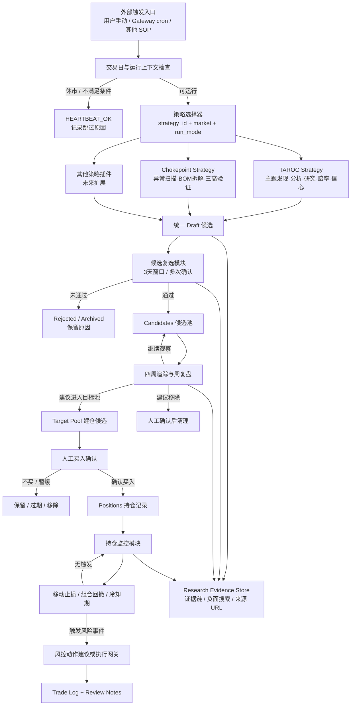

# REQ-01 — stock-picking

**项目**: stock-picking（模块化选股与持仓流程 SOP）
**状态**: S2 讨论版：流程图与节点评审待逐项确认
**日期**: 2026-06-23
**来源**:
- 收编已有 skill `stock-picking-v2`（v2.0，位于 `~/.agents/skills/stock-picking-v2/`）
- 纳入 serenity/chokepoint 方法论作为可插拔策略候选
- 根据 2026-06-23 原始需求讨论重构职责边界

---

## 一句话定位

`stock-picking` 不再是一个把选股、调度、复选、追踪、建仓、持仓监控、止损全部揉在一起的单体 skill。

它应当是一个 **股票研究/选股生命周期 SOP 编排层**：负责定义流程、数据契约、模块调用顺序和边界；具体选股策略、复选、追踪、持仓监控、止损风控都拆成可单独拎出来复用的能力模块。

---

## 用户画像

个人投资者（Evan），需要一套可复用、可替换策略、可追踪、有风控保护的股票研究与选股流程。

核心偏好：
- 不要拍脑袋选股，要有方法论和证据链
- 选股策略未来要能替换或并行，例如 TAROC、Chokepoint、其他策略
- 调度应由 Gateway/cron 负责，不写死在 skill 里
- 买入必须人工确认
- 卖出/止损逻辑可以独立成通用能力，服务不同策略来源的持仓

---

## 核心场景

1. **策略选股**
   - 用户或调度入口指定市场/策略
   - 调用一个或多个选股策略模块
   - 产出统一格式的 draft 候选

2. **候选复选**
   - 对不同策略产出的 draft 做统一复选
   - 3 天窗口内满足确认条件后进入 candidates
   - 复选逻辑不绑定 TAROC 或 Chokepoint

3. **候选追踪**
   - 对 candidates 做四周追踪和周复盘
   - 输出表现、催化变化、清理建议
   - 不直接替用户做买入决定

4. **建仓衔接**
   - 将候选转入 target pool
   - 买入动作必须人工确认
   - SOP 定义数据流，不做自动买入

5. **持仓监控与止损**
   - 对真实或模拟持仓运行独立监控
   - 移动止损、组合回撤、冷却期应作为可复用模块
   - 可被 stock-picking SOP 调用，也可被其他策略调用

---

## 全流程图（讨论基线）



这张图的核心假设：
- `stock-picking` 是 SOP 编排层，不是所有节点的实现集合。
- 触发入口在 SOP 外部，可能来自用户，也可能来自 Gateway cron。
- 策略模块只负责产出统一 draft，不负责复选、建仓和持仓风控。
- 复选、追踪、持仓监控、止损都是可单独调用的通用模块。
- 买入必须人工确认；卖出/止损即使未来自动化，也必须经过独立风控模块、dry-run 和审计日志约束。

---

## 节点逐项评审（讨论稿）

### 0. 外部触发入口

**评审会确认结论（2026-06-23）**
- 外部触发入口只接受“单市场 + 单策略 + 单运行模式”的原子请求。
- 多市场、多策略、完整流程都由 SOP 编排层拆成多个原子请求，并用 `correlation_id` 串联。
- Node 0 只负责入口契约、参数校验、幂等与审计，不负责 cron 调度、市场日历、策略实现或交易执行。
- v1 拒绝 `market: [US, HK]`、`strategy_id: mixed`、`run_mode: full`、`run_mode: monitor`、`dry_run: false`。

**v1 入口契约**
```yaml
request_id: uuid
correlation_id: uuid
caller: manual | cron | sop
requested_at: ISO8601

market: US | HK | CN
strategy_id: taroc | chokepoint | custom
strategy_version: semver
run_mode: discovery | validation | tracking

run_date: YYYY-MM-DD
signal_date: YYYY-MM-DD
timezone: Asia/Shanghai | Asia/Hong_Kong | America/New_York
universe: market | sector:{name} | watchlist:{name} | candidates:{market}

dry_run: true
priority: low | normal | high
idempotency_key: string
```

**验收标准**
- `stock-picking` 文档和源码不包含内嵌 cron schedule。
- 非原子请求必须在入口层失败，不能进入下游研究。
- 每次 run 必须记录 `request_id`、`correlation_id`、`caller`、`market`、`strategy_id`、`run_mode`、`run_date`、`dry_run`。
- `custom` 策略必须提供可解析的策略引用，不能接受自由文本策略。

**现在怎么做**
- 旧 `stock-picking-v2/SKILL.md` 直接写了三市场 cron 时间：港股 08:30、A 股 09:00、美股 20:30。
- 周复盘、持仓监控、组合回撤监控的触发频率也写在同一个 skill 文档里。

**优点**
- 使用者一眼能知道什么时候跑。
- 初版落地快，不需要额外查 Gateway 配置。

**缺点**
- cron 是运行基础设施，不是选股 skill 的业务能力。
- 调度和业务逻辑绑死后，换策略、换频率、临时暂停都容易改到 skill 本体。
- 多个策略共用同一套复选/监控时，cron 写在某个策略 skill 里会导致所有权混乱。

**改进建议**
- 基线中只保留“推荐调度入口”和“被调用参数”，不把 cron 当成 skill 内部逻辑。
- Gateway cron 单独作为部署配置或运维文档管理。
- 每次触发必须显式传入 `market`、`strategy_id`、`run_mode`、`dry_run`。

### 1. 交易日与运行上下文检查

**评审会确认结论（2026-06-23）**
- Node 1 不是简单判断“今天是否开市”，而是生成统一 `run_context`，供后续策略、复选、追踪模块消费。
- Node 1 负责市场本地日期校验、时区校验、交易日/休市/半日市/临时停市判断，以及是否允许继续运行的结构化决策。
- Node 1 不负责 cron 调度、策略选择、universe 解释、日历数据长期维护、个股停牌判断或交易执行。
- v1 采用“内置薄包装 + 内部日历表/override 表”的可落地实现；S3 再决定是否抽成 Layer 3 的 `market-calendar` 共享模块。
- 下游模块不得重复实现交易日判断，只消费 Node 1 输出的 `run_context`。

**v1 输出契约**
```yaml
decision: proceed | skip | needs_override | fail
calendar_status: open | closed | half_day | emergency_closed | unknown
market_session: premarket | regular | postmarket | closed | outside_session | unknown

session_open_at: ISO8601 | null
session_close_at: ISO8601 | null
next_open_at: ISO8601 | null

calendar_skip_reason: none | weekend | holiday | half_day_policy | emergency_closure | outside_session | calendar_unavailable | invalid_context
failure_code: null | INVALID_TIMEZONE | INVALID_MARKET_DATE | CALENDAR_SOURCE_ERROR | UNSUPPORTED_MARKET | AMBIGUOUS_CONTEXT

calendar_source: string
calendar_source_version: string
calendar_checked_at: ISO8601

override_id: string | null
override_reason: string | null
override_expires_at: ISO8601 | null
context_warnings: string[]
```

**默认行为**
- 正常交易日：`decision=proceed`。
- 周末、假日、已知休市：`decision=skip`，等价于 `HEARTBEAT_OK`，不调用下游策略节点。
- 半日市：v1 默认允许 `discovery`、`validation`、`tracking` 继续运行，但必须写入 `context_warnings`。
- 日历状态 unknown：
  - `caller=manual`：`decision=needs_override`。
  - `caller=sop`：`decision=needs_override`。
  - `caller=cron`：fail closed，不继续跑下游。
- 时区不匹配、market 不支持、日期格式错误：`decision=fail`。

**验收标准**
- Node 1 输入只接受 Node 0 的原子请求结果，不重新解释自由文本入口。
- `timezone` 必须与 `market` 的预期时区匹配，不允许用户随意覆盖。
- 输出必须包含 `decision`，不能只靠 `is_runnable` 推断行为。
- `calendar_status` 只表达市场状态；override 必须通过 `override_id`、`override_reason`、`override_expires_at` 审计。
- closed/holiday/weekend 场景不得调用下游策略节点。
- calendar unavailable 不能被伪装成“无机会”，必须通过 `needs_override` 或 `fail` 显式暴露。

**现在怎么做**
- 旧版要求读取 `holidays/{market}.yaml`，休市则返回 `HEARTBEAT_OK`。
- 但当前 `holidays/*.yaml` 更像文本说明，不是严格结构化交易日历。

**优点**
- 已经有“先判断是否交易日”的意识。
- 三市场独立处理，方向正确。

**缺点**
- 调休日、半日市、台风黑雨、美股夏令时等情况很难靠静态说明长期维护。
- 如果每个模块都自己判断交易日，会重复且容易不一致。

**改进建议**
- 抽成 `market-calendar` 或共享基础设施，不属于 TAROC 或 Chokepoint。
- 输出统一结果：`is_trading_day`、`market_session`、`skip_reason`、`next_open_at`。
- 对港股临时休市、美股半日市保留人工 override 入口。

### 2. 策略选择器

**评审会确认结论（2026-06-23）**
- Node 2 是纯策略注册表选择器（registry selector），不是策略执行器。
- Node 2 只在 Node 1 `run_context.decision=proceed` 后工作；否则结构化拒绝，不进入下游。
- Node 2 负责 registry lookup、版本解析、market/run_mode/caller/dry_run/schema/custom_ref 校验，以及生成 `strategy_dispatch` envelope。
- Node 2 不执行策略、不融合多策略、不排序候选、不兜底切换 TAROC、不处理 portfolio 或交易动作。
- 多策略编排仍在 SOP 外层完成；每个 atomic run 只 dispatch 一个明确策略版本。
- v1 不支持 `latest`；cron/sop 必须传精确 semver。manual 可在 registry 有明确 default 时省略版本，但必须写入 warning。
- `custom` 不能接受自由文本；`custom_ref` 必须来自白名单或 registry，禁止路径穿越、临时脚本、未审核策略。
- Chokepoint v1 先标记为 `experimental`，仅允许 `manual` 调用；拒绝 cron/sop。

**v1 输入契约**
```yaml
request_id: uuid
correlation_id: uuid
run_context:
  decision: proceed

market: US | HK | CN
run_mode: discovery | validation | tracking
caller: manual | cron | sop
dry_run: true

strategy:
  id: taroc | chokepoint | custom
  version: semver | null
  custom_ref: string | null

universe_ref: string
```

**v1 输出契约**
```yaml
request_id: uuid
correlation_id: uuid
node_id: node_2_strategy_selector
decision: dispatch | reject

strategy_dispatch:
  strategy_id: string
  strategy_version: semver
  entrypoint: string
  output_schema: draft_candidates.v1
  registry_version: string
  registry_record_hash: string
  policy_flags: string[]

reject:
  code: string | null
  message: string | null

warnings: string[]
audit:
  selected_at: ISO8601
  registry_snapshot_hash: string
```

**registry 设计**
```yaml
registry_version: 1
defaults:
  taroc: 1.0.0

strategies:
  - id: taroc
    version: 1.0.0
    name: TAROC
    entrypoint: strategies.taroc:run
    output_schema: draft_candidates.v1
    supported_markets: [US, HK, CN]
    supported_run_modes: [discovery, validation]
    status: active
    allowed_callers: [manual, cron, sop]
    owner: stock-picking
    last_reviewed_at: "2026-06-23"

  - id: chokepoint
    version: 0.1.0
    name: Chokepoint
    entrypoint: strategies.chokepoint:run
    output_schema: draft_candidates.v1
    supported_markets: [US]
    supported_run_modes: [discovery]
    status: experimental
    allowed_callers: [manual]
    owner: stock-picking
    last_reviewed_at: "2026-06-23"
```

registry 版本解析必须是原子动作：读取 registry、解析 default、选择版本、计算 record hash、生成 dispatch 必须来自同一份 registry snapshot，避免选择过程中 registry 漂移。

**拒绝码**
```yaml
upstream_not_proceed
strategy_not_found
version_required
version_not_found
ambiguous_version
unsupported_market
unsupported_run_mode
caller_not_allowed
strategy_disabled
experimental_not_allowed
custom_ref_invalid
output_schema_unsupported
dry_run_required
registry_invalid
```

**验收标准**
- `request_id` 和 `correlation_id` 必须透传，Node 2 不得断开审计链。
- `run_context.decision != proceed` 时拒绝，且不调用策略实现。
- cron/sop 未传精确 semver 时拒绝 `version_required`。
- manual 未传版本时，只有 registry default 存在且唯一才可 dispatch，并输出 warning。
- unknown strategy、unsupported market/run_mode、disabled strategy、cron 调用 experimental Chokepoint 均必须结构化拒绝。
- `custom_ref` 含自由文本、路径穿越或未注册引用时必须拒绝。
- 成功时只输出一个 `strategy_dispatch`，不允许 fallback 到其他策略。
- registry 必须有 schema validation 测试，dispatch 输出必须包含 registry version/hash。

**现在怎么做**
- 旧版默认只有 TAROC，用户可以“仅初选/仅复选/周复盘”，但不是插件化策略选择。
- serenity/chokepoint 方法论还没有正式接入，只是在需求讨论中准备收编。

**优点**
- 单策略时路径简单，执行成本低。
- TAROC 已有完整五阶段方法论，便于快速产出 draft。

**缺点**
- 策略与后续流程耦合，导致“换策略”像是在改系统，而不是换插件。
- 无法同时保留不同策略的候选来源、证据类型和置信度差异。

**改进建议**
- 定义统一策略接口：输入 `market`、`universe`、`risk_profile`、`run_date`；输出 draft 列表。
- 每个 draft 必须带 `strategy_id`、`strategy_version`、`source_evidence`、`negative_evidence`、`confidence`。
- SOP 可以并行调用多个策略，但复选模块只消费统一 draft schema。

### 3. TAROC Strategy

**评审会确认结论（2026-06-23）**
- TAROC 保留 T/A/R/O/C 方法论，但在新架构中只作为可插拔策略插件存在。
- TAROC 的职责是消费 Node 1 `run_context` 与 Node 2 `strategy_dispatch`，产出 `draft_candidates.v1`。
- TAROC 不负责交易日判断、cron、CSV 物理落盘、消息推送、复选入池、候选追踪、仓位金额、买入确认、持仓监控或移动止损执行。
- TAROC 只可输出“策略侧研究结论”：主题、个股 thesis、证据链、负面证据、分项评分、赔率、初始止损建议、追踪建议。
- `discovery.md` 里原来的 drafts CSV 写入和 Telegram 推送迁出到 SOP 层的 `draft_emitter` / output formatter。
- `taroc-methodology.md` 中具体仓位金额（例如标准仓位/快通道金额）迁出到未来 `position-sizer` / 风险预算模块。
- T 阶段信号源必须调和：广度搜索只是候选来源，必须经过专业价值判断与大众认知滞后评估后才能进入 A 阶段。

**v1 输入契约**
```yaml
request_id: uuid
correlation_id: uuid
dispatch_id: uuid

strategy:
  id: taroc
  version: 1.0.0
  registry_record_hash: string

run_context:
  decision: proceed
  market: US | HK | CN
  market_session: premarket | regular | postmarket | half_day
  run_date: YYYY-MM-DD
  signal_date: YYYY-MM-DD
  timezone: string
  context_warnings: string[]

universe_ref: market | sector:{name} | watchlist:{name} | candidates:{market}
run_mode: discovery | validation
caller: manual | cron | sop
dry_run: true

budget:
  max_web_searches: 20
  max_themes: 8
  max_candidates_per_theme: 2
  max_final_picks: 3

negative_search_required: true
evidence_policy:
  require_source_url: true
  require_source_type: true
  require_observed_at: true
```

**v1 输出契约：`draft_candidates.v1`**
```yaml
draft_candidates_version: "1.0.0"
produced_by:
  strategy_id: taroc
  strategy_version: 1.0.0
  registry_record_hash: string
produced_at: ISO8601
request_id: uuid
correlation_id: uuid
market: US | HK | CN
run_mode: discovery | validation
universe_ref: string

themes:
  - theme_id: string
    theme_label: string
    propagation_phase: 1 | 2 | 3 | 4
    window_remaining_days: int | null
    theme_score: number
    crowdedness_score: number
    sources: evidence_ref[]

candidates:
  - draft_id: uuid
    strategy_id: taroc
    strategy_version: 1.0.0
    stock_code: string
    stock_name: string
    market: US | HK | CN
    price: number
    thesis_summary: string
    subscores:
      theme_score: number
      fundamental_score: number
      catalyst_score: number
      valuation_score: number
      risk_score: number
    aggregate_score: number
    conviction:
      level: high | medium | low
      bull_case: string
      bear_case: string
      judge_rationale: string
    entry_zone:
      low: number
      high: number
    initial_stop_price: number
    target_price: number | null
    odds_ratio: number | null
    source_evidence: evidence_ref[]
    negative_evidence: evidence_ref[]
    negative_evidence_searched: true
    negative_evidence_count: int
    expires_at: ISO8601
    next_step: validation

warnings: string[]
budget_consumed:
  web_searches: int
  longbridge_calls: int
  duration_ms: int
partial: bool
failure:
  code: null | BUDGET_EXHAUSTED | TIMEOUT | NEGATIVE_EVIDENCE_MISSING | UNIVERSE_EMPTY | UPSTREAM_ERROR
  message: string | null
```

**评分与信号源规则**
- A 阶段赛道分和 C 阶段总确信度分必须分开命名，不能都叫 `score`。
- 对外只暴露 `subscores + aggregate_score + conviction.level`，禁止用单一 `score` 解释全部逻辑。
- T 阶段候选信号来自两类来源：
  - 垂直专业源：行业会议、产业媒体、专业数据库、监管/披露、资金流。
  - 广度搜索源：hot sectors、upgrades、earnings、policy、institutional、technical。
- 所有信号必须进入 T.2 专业价值判断与 T.3 大众认知滞后评估；Phase 4 / crowdedness 高的主题默认只进入 watch，不直接进入 validation。

**验收标准**
- `discovery.md` 不再写入 `review_day1/2/3_result`、`total_pass`、`final_status`。
- TAROC 输出必须包含 `strategy_id`、`strategy_version`、`draft_id`、`source_evidence`、`negative_evidence`、`expires_at`。
- `negative_search_required=true` 时，如果未执行负面搜索或无负面搜索记录，必须 fail loud，不能产出合格 draft。
- 仓位金额、买入建议、持仓移动止损执行从 TAROC 输出中移除。
- Telegram / Discord / message 格式化不由 TAROC 实现，由 SOP 输出层消费结构化结果。
- TAROC 不读取 `holidays/*.yaml`，只消费 Node 1 `run_context`。
- Chokepoint 专用字段（BOM、三高、卡脖子节点等）不得成为 TAROC draft 的必填字段。

**现在怎么做**
- `flows/discovery.md` 中 TAROC 已拆成 T/A/R/O/C：
  - Theme Discovery：多组搜索找热门赛道
  - Analysis：产业链与赛道评分
  - Research：个股基本面、新闻、负面搜索、技术面
  - Odds：估值、赔率、入场区间、止损位
  - Conviction：多空辩论或 AI 正反抗辩

**优点**
- 结构完整，天然适合做“每日/定期选股”。
- 强制负面搜索是好机制。
- 能覆盖宏观主题、行业、个股、技术面和赔率。

**缺点**
- 当前搜索模板偏泛，容易扫到共识热门股，alpha 可能不够。
- `score` 是单一分数，难以解释是主题强、赔率好，还是仅情绪强。
- TAROC 内部直接写入 drafts CSV，会和策略插件化目标冲突。

**改进建议**
- TAROC 只输出结构化 draft，不直接决定后续入池。
- 拆分分项评分：`theme_score`、`fundamental_score`、`catalyst_score`、`valuation_score`、`risk_score`。
- 增加“共识拥挤度/追高风险”字段，避免热门主题机械入选。

### 4. Chokepoint Strategy

**评审会确认结论（2026-06-23）**
- Chokepoint v1 是实验性策略插件，默认仅 `market=US`、`caller=manual`、`run_mode=discovery`。
- Chokepoint 不直接进入 cron/sop，不直接输出买卖建议，不直接写 candidates，不做仓位、止损或持仓监控。
- Chokepoint 的主要产物分两层：
  - `theme_research.v1`：主题/产业链研究线索，写入 `data/research/_themes/`。
  - `draft_candidates.v1`：满足证据门槛后，由 `draft-promoter` 升级出来的统一 draft。
- `lead-scanner`、`reverse-engine`、主六步框架都先产 research/thesis；只有通过证据门槛，才转为 draft。
- Serenity 的方法论可作为 framework reference；公开战绩、履历、具体 call 不进入 registry、dispatch 决策或默认信号。
- Node 4 必须显式暴露框架固有风险：单路径依赖、微型股流动性踩踏、不可验证履历、幸存者偏差、技术路径误判。

**v1 输入契约**
```yaml
request_id: uuid
correlation_id: uuid
strategy_dispatch:
  strategy_id: chokepoint
  strategy_version: 0.1.0
  entrypoint: strategies.chokepoint:run
  output_schema: theme_research.v1 | draft_candidates.v1
  registry_version: string
  registry_record_hash: string

run_context:
  decision: proceed
  market: US
  market_session: premarket | regular | postmarket | half_day
  calendar_checked_at: ISO8601

run_mode: discovery
caller: manual
dry_run: true
universe_ref: market | sector:{name} | watchlist:{name}

resource_budget:
  max_searches: 30
  max_runtime_seconds: 300
  max_theme_outputs: 5
  max_drafts: 3
```

**主题研究输出：`theme_research.v1`**
```yaml
theme_research_version: "1.0.0"
research_id: uuid
request_id: uuid
correlation_id: uuid
strategy_id: chokepoint
strategy_version: 0.1.0
produced_at: ISO8601
market: US

theme:
  theme_name: string
  one_liner: string
  lead_source: lead_scanner | reverse_engine | manual
  bom_tree_ref: string
  chokepoint_layer: string
  supplier_count: int | null
  trend_anchor:
    trend_type: tech_transition | penetration_inflection | policy_mandate | geopolitics
    trend_size: string
    trend_persistence: short | medium | long

signals:
  - signal: price | lead_time | capital | patent | talent | regulation
    strength: number
    source_evidence: evidence_ref[]

evidence: evidence_ref[]
negative_evidence: evidence_ref[]
break_conditions:
  - condition: string
    trigger_evidence: string
    severity: thesis_breaking | position_breaking

uncertainty_level: low | medium | high
risk_flags:
  single_path_dependency: boolean
  micro_cap_stampede_risk: boolean
  data_provenance_weak: boolean
  consensus_overlap: boolean

upgrade_triggers:
  - condition: string
    required_evidence: string

promotion_status: observe | eligible_for_draft | rejected
reject_reason: string | null
```

主题级输出必须写入：
```text
data/research/_themes/<theme-name>-<YYYY-MM-DD>.md
data/research/_themes/_index.md
```

**升 draft 门槛（draft-promoter）**
- 一手来源不少于 2 条。
- 至少 1 条 `source_type=primary`。
- 强制负面搜索已执行；无明确负面时也要记录搜索过程与不确定性。
- `break_conditions` 至少 1 条。
- `supplier_count <= 5` 才能视作卡脖子候选。
- A×B 交叉过滤成立：异常信号强，且有系统性趋势支撑。
- `uncertainty_level=high` 时不得直接升级 draft。
- `avg_daily_volume_usd` 低于流动性门槛时不得升级 draft。

**draft 输出约束**
- 成功升级后输出统一 `draft_candidates.v1`，并保留 `source_research_id`。
- 同一 ticker 可以有 TAROC thesis 与 Chokepoint thesis 并存，由下游聚合视图处理。
- 当 `consensus_overlap=true` 时，Chokepoint confidence 必须降权，避免双策略制造虚假高信心。
- `break_conditions`、`uncertainty_level`、`risk_flags` 必须进入 evidence store，与正面 thesis 同级保存。

**成熟度路径**
- v1：US + manual + discovery only，experimental。
- v1.1：manual 调用不少于 10 次、运行满 6 个月、无重大 thesis break 后，评审是否开放 HK/CN 或 tracking。
- v2：完成独立评审后，才考虑允许 sop 多策略编排。
- cron 调用必须另做评审，不能随 v1 默认开放。

**验收标准**
- Chokepoint 输出契约必须同时定义 `theme_research.v1` 与 `draft_candidates.v1`，不能把主题研究和候选 draft 混成一个 schema。
- `theme_research.v1` 必须带 `upgrade_triggers`，避免研究主题无限堆积。
- `lead-scanner` 的共识线索必须降级为 observe，不可直接进入 draft。
- `reverse-engine` 发现的邻居节点必须回到 theme research，不得绕过 evidence 门槛。
- `_themes/_index.md` 必须同时记录 active/rejected/observed 主题，淘汰有痕。
- framework reference only：不把 Serenity 履历、粉丝量、战绩作为信号或权重。

**现在怎么做**
- serenity/chokepoint 已收集了方法论资料：
  - 异常信号扫描
  - A 类趋势量级校验
  - BOM 拆解
  - 三高验证
  - 龙头定位
  - 崩塌条件
- 还没有作为正式 strategy skill 独立实现。

**优点**
- 更适合发现非共识供应链线索，而不是追每日热榜。
- 强调证据链、供需瓶颈、产业链位置和崩塌条件。
- 能补 TAROC 的短板：从“热门”转向“卡脖子节点”。

**缺点**
- 执行成本高，联网搜索和产业链判断更重。
- 很多结论依赖行业理解，误判技术路径会导致整条 thesis 失效。
- 公开战绩、人物可信度资料只能作参考，不能变成运行逻辑。

**改进建议**
- 作为独立 `chokepoint-strategy`，不塞进 TAROC。
- 输出优先进入 `research/_themes`，只有满足证据门槛才转 draft。
- 每条线索必须带 `break_conditions` 和 `uncertainty_level`，防止把研究线索包装成买入信号。

### 5. 统一 Draft 候选

**评审会确认结论（2026-06-23）**
- Node 5 是策略输出的标准化边界，只描述“为什么进入候选观察”，不保存复选过程、不写 candidates、不产生交易动作。
- 所有策略输出必须映射到 `draft_candidates.v1`，并保留可追溯的 `draft_id`、`strategy_run_id`、`correlation_id`、`evidence_ref`。
- `confidence` 是策略自评，不可跨策略直接相加或平均；下游只能按来源分别展示，不能做虚假综合置信度。
- `tracking_horizon` 必须在 draft 中声明或使用共享默认表；默认值不得散落在 Node 8。
- Node 5 依赖 Node 1 输出的 `run_context.calendar_status`、`run_context.next_open_at` 和 `correlation_id`；字段缺失时 fail closed。

**v1 输出契约补充**
```yaml
schema: draft_candidates.v1
draft_id: uuid
strategy_run_id: uuid
request_id: uuid
correlation_id: uuid
market: US | HK | CN
stock_code: string
strategy_id: string
strategy_version: semver
source_research_id: uuid | null
thesis_summary: string
confidence:
  source: strategy_self_rated
  level: high | medium | low
  score: number | null
tracking_horizon:
  kind: short_event | quarterly | structural
  default_window_sessions: int
source_evidence: evidence_ref[]
negative_evidence: evidence_ref[]
expires_at: ISO8601
next_step: validation
```

**现在怎么做**
- 旧 drafts 字段围绕 TAROC 和 3 天复选设计：
  - `score`、`reason`、`review_day1_result`、`review_day2_result`、`review_day3_result`、`total_pass`
- 缺少多策略来源字段。

**优点**
- CSV 简单，人工可读，可快速落地。
- 已经能支持初选到复选的状态流转。

**缺点**
- draft 同时混了“策略输出”和“复选过程字段”，边界不清。
- 缺少 `strategy_id`、证据 URL、负面证据、置信度、过期时间、去重键。
- 多策略同时产出同一股票时，不知道是重复发现还是同一个理由。

**改进建议**
- Draft schema 只描述“为什么进入候选”，复选字段移到 validation 记录。
- 增加 `draft_id`、`strategy_id`、`strategy_run_id`、`thesis_summary`、`source_evidence`、`negative_evidence`、`expires_at`。
- 同一股票允许多条 strategy thesis，但需要统一聚合视图。

### 6. 候选复选模块

**评审会确认结论（2026-06-23）**
- Node 6 消费 `draft_candidates.v1`，输出 append-only 的 `validation_event.v1`，不得把 day1/day2/day3 等状态写回 draft 主记录。
- 复选窗口按交易 session 计算，不按自然日；半日市默认 `half_day_policy=exclude`，除非输入明确 `allow_half_day_validation=true`。
- `calendar_status` 不是 `open` 或允许的 `half_day` 时，Node 6 fail closed，并写入 `validation_skipped` 事件，不做静默跳过。
- 每次复选必须生成 `validation_run_id`，幂等键为 `(draft_id, validation_run_id, signal_date)`；重复运行不得重复发出 `candidate_promoted`。
- `validation_confidence` 与 draft 的策略自评 `confidence` 分开命名，避免混淆。

**v1 输出事件**
```yaml
schema: validation_event.v1
validation_event_id: uuid
validation_run_id: uuid
draft_id: uuid
request_id: uuid
correlation_id: uuid
signal_date: YYYY-MM-DD
calendar_status: open | half_day
half_day_policy: exclude | allow
verdict: confirm | watch | reject | overheated | thesis_broken | validation_skipped
validation_confidence:
  level: high | medium | low
  rationale: string
price_action: string
thesis_update: string
new_evidence: evidence_ref[]
negative_update: evidence_ref[]
promote_candidate: true | false
```

**现在怎么做**
- 旧版 `flows/validation.md` 使用 3 天窗口，累计通过 >=2 次入池。
- 检查价格变化、新闻、原逻辑是否仍成立。
- 窗口按自然日，不是交易日。

**优点**
- 防止初选当天情绪化入池。
- 用“再次确认”过滤噪音，方向正确。
- 复选不是重做 TAROC，成本可控。

**缺点**
- 自然日窗口对跨市场和节假日不友好。
- pass/fail 太粗，不能区分“逻辑增强、逻辑未变、逻辑减弱、价格过热”。
- 复选仍写回 drafts CSV，状态和审计记录不够清晰。

**改进建议**
- 改成按交易日窗口，例如 `N trading sessions`。
- 输出 `validation_events`，而不是把 day1/day2/day3 写死进 draft。
- 判定从 pass/fail 扩展为：`confirm`、`watch`、`reject`、`overheated`、`thesis_broken`。

### 7. Candidates 候选池

**评审会确认结论（2026-06-23）**
- Node 7 是候选主记录与状态机，不再复制 tracking 时间序列。
- 候选必须保留 `origin_draft_id`，并可附带 `source_drafts[]` 表示多策略共同命中；`origin_draft_id` 用于主审计链，`source_drafts[]` 用于聚合视图。
- `aggregate_thesis` 必须声明生成方式：`aggregate_thesis_kind: concatenation | summary`。v1 默认 `concatenation`，避免把简单拼接误读成模型融合判断。
- 候选状态机为 `active | watching | promote_suggested | expired | removed`；`removed` 只能由 human 事件写入，schema validator 必须拒绝 `actor != human` 的 removed 写入。
- 任何 `*_suggested` 状态事件必须带 `suggested_reason` 和 `supporting_evidence`，AI 只能建议，不能直接移除。

**v1 候选记录**
```yaml
schema: candidate_record.v1
candidate_id: uuid
origin_draft_id: uuid
source_drafts:
  - draft_id: uuid
    strategy_id: string
    strategy_version: semver
    confidence:
      level: high | medium | low
stock_code: string
market: US | HK | CN
state: active | watching | promote_suggested | expired | removed
aggregate_thesis: string
aggregate_thesis_kind: concatenation | summary
created_at: ISO8601
expires_at: ISO8601
last_state_event_id: uuid
```

**现在怎么做**
- `candidates_{market}.csv` 存正式候选，包含入池价、当前周数、评分、状态、周表现。
- `four_week_tracker_{market}.csv` 又保存一份追踪状态。

**优点**
- 候选和 tracking 有初步区分。
- 四周追踪目标明确，不会无限期占用注意力。

**缺点**
- candidates 和 tracker 字段有重叠，容易双写不一致。
- “正式候选”和“建仓目标池”之间的转化条件还不够清晰。
- 不能很好表示多策略共同命中后的置信度提升。

**改进建议**
- Candidates 只保存当前有效候选与聚合 thesis。
- Tracker 保存时间序列事件和周复盘，不复制候选主数据。
- 增加候选状态机：`active`、`watching`、`promote_suggested`、`expired`、`removed`。

### 8. 四周追踪与周复盘

**评审会确认结论（2026-06-23）**
- Node 8 只产生 `tracking_event.v1` 和周复盘摘要，不直接改候选为 removed，不写交易指令。
- `tracking_event` 必须冗余 `origin_draft_id`，保证 `tracking_event -> candidate -> draft -> strategy_run` 审计链不断。
- 周复盘展示多策略来源时，必须分别展示每个 source draft 的 confidence，不输出单一综合 confidence。
- `actor=human` 的事件来源在 v1 暂定为 Gateway/聊天入口的明确确认命令；未接入前只能记录 `actor=system|agent` 的建议事件。
- 事件存储 v1 采用 per-market 串行写入；若未来允许并发，必须引入文件锁。JSONL 事件按 `market/week_id` 分片，避免单文件无界增长。
- 旧 CSV 迁移必须另有 migration plan，包含兼容窗口、回滚方案和迁移审计，不能在实现时临时改字段。

**v1 追踪事件**
```yaml
schema: tracking_event.v1
tracking_event_id: uuid
candidate_id: uuid
origin_draft_id: uuid
correlation_id: uuid
week_id: YYYY-Www
event_type: catalyst_update | risk_update | price_action | promote_suggested | remove_suggested | weekly_review
actor: system | agent | human
suggested_reason: string | null
supporting_evidence: evidence_ref[]
state_transition:
  from_state: string | null
  to_state: string | null
created_at: ISO8601
```

**现在怎么做**
- `weekly-review.md` 按 W1-W4+ 分组，生成周报。
- W4+ 必须给出清理建议，但 AI 不能自动删除。

**优点**
- 有明确时间盒，防止候选池越来越大。
- 周复盘把“新入池、表现、催化、清理建议”合在一起，适合人工决策。

**缺点**
- 四周长度是经验值，未按策略类型区分；Chokepoint 可能需要更长观察期。
- 追踪指标偏价格表现，thesis 变化、催化兑现、负面演化不够结构化。
- 周报和候选状态变更耦合，后续自动化难度较高。

**改进建议**
- 追踪期限由策略输出建议：短线事件、季度催化、产业链 thesis 分别有不同 `tracking_horizon`。
- 周复盘产出结构化事件：`catalyst_update`、`risk_update`、`price_action`、`recommendation`。
- 清理动作保持人工确认，但清理建议要可审计、可回放。

### 9. Target Pool 与人工买入确认

**评审会确认结论（2026-06-23）**
- Node 9 是 capital deployment 前的唯一 gated queue，只接收 Node 7/8 的 `promote_suggested` 或人工指定候选。
- `target_pool` 只表达“可进入人工建仓决策”，不是买入指令。
- 状态词汇固定为 `active | deferred | rejected | built | expired`；`dropped_opt_2268` 这类内容不得写入 status，必须迁移到 reason/audit。
- `target_price`、`entry_price`、`stop_loss`、`position_amount` 对 `active` build-ready 行是必填；若 `position_amount=0`，必须明确 `sizing_state=awaiting_sizing`，不可视作 build-ready。
- 每条 active 记录必须有 `decision_deadline`，默认不超过 `created_date` 后 10 个交易日；过期后进入 `expired` 或重新评审。

**v1 target pool 关键字段**
```yaml
pool_item_id: uuid
candidate_id: uuid
origin_draft_id: uuid
stock_code: string
market: US | HK | CN
entry_price: number
stop_loss: number
target_price: number
position_amount: number
sizing_state: sized | awaiting_sizing
promotion_reason: string
status: active | deferred | rejected | built | expired
created_date: YYYY-MM-DD
decision_deadline: YYYY-MM-DD
diff_audit_ref: string
```

**现在怎么做**
- `target_pool.csv` 存建议入场价、止损价、目标价、仓位金额、建仓理由。
- Skill 明确“买入必须人工确认”。

**优点**
- 买入人工确认这个红线正确。
- target pool 能把“研究候选”和“准备行动”分开。

**缺点**
- 从 candidate 晋升到 target pool 的条件未定义清楚。
- 仓位金额不应该由选股策略直接决定，应该来自资金/风险模块。
- 如果没有确认记录，事后很难知道是谁、何时、基于什么批准。

**改进建议**
- 增加 `promotion_reason` 和 `approval_required`。
- 建仓确认独立成 action request，记录 `approved_by`、`approved_at`、`approval_note`。
- 仓位建议只给风险预算区间，不直接等同交易指令。

### 10. 人工买入确认

**评审会确认结论（2026-06-23）**
- Node 10 是人工买入确认闸门，不是 positions 本身；真实买入必须有 machine-checkable approval artifact。
- 仅靠 `dry_run=false` 或文档规则不够，执行入口必须强制读取 `buy_approvals` 或等价 approval state。
- 真实买入允许条件：`approval_state in {approved, manual_ledger_restored}`、`approved_by=Evan`、`approved_at` 已记录、且 pretrade check 通过。
- `bin/futu_tool.py buy` 这类可触达券商 API 的入口在 S4 必须加硬闸门；没有 approval artifact 时 hard error，不是 warning。
- `trade_log` 中超过 7 天的 `pending dry_run_entry` 必须 flag 或 expire，避免模拟单长期堆积后被误提升为实盘。

**v1 approval artifact**
```yaml
approval_id: uuid
pool_item_id: uuid
candidate_id: uuid
action: buy
approval_state: requested | approved | rejected | expired | manual_ledger_restored
approved_by: Evan | null
approved_at: ISO8601 | null
approval_note: string
pretrade_check_id: uuid
expires_at: ISO8601
```

**现在怎么做**
- `OPERATION.md` 明确“买入必须人工确认”和“dry_run 首次默认 true”。
- `pretrade_check.py` 已能做冷却期、持仓冲突、资金、最小交易单位等检查。
- `futu_tool.py buy` 当前可直接调用券商 API，下单路径未强制绑定 approval artifact。

**优点**
- 交易前检查已经有雏形，可以作为 approval 前置条件。
- 人工确认原则已经写入运维文档，方向正确。
- dry-run 台账存在，适合沉淀模拟单和真实单的转换记录。

**缺点**
- 人工确认目前主要是文档约定，不是代码硬闸门。
- `dry_run=false` 可能被脚本直接写入，不能等同于已批准交易。
- `trade_log` 中旧的 pending dry-run entry 需要过期或清理机制。

**改进建议**
- 新增 `buy_approvals` 或等价 approval state，真实 buy 必须先读取并验证。
- `pretrade_check.py` 输出 `pretrade_check_id`，成为 approval artifact 的引用。
- 所有 buy/sell API 入口统一走 execution guard，不允许裸调用券商 API。

### 11. Shadow Positions 与 Reconcile

**评审会确认结论（2026-06-23）**
- Node 11 是 shadow positions 与真实券商持仓对账层；`positions.csv` 是本地策略账本，不是真实持仓唯一真相源。
- HK/US 等 API broker 以券商为真；`guosen`/A 股手工账户以本地 ledger 为真，并标注 `ledger_only` 或等价状态，不能误报为 `broker_missing_position`。
- 对账必须只读 positions，不直接修改本地持仓；修正本地账本属于单独的人工/风险处理流程。
- 每次 reconcile 记录运行日志：时间、broker mix、状态计数、错误；非 matched 事件必须进入 `risk-events.md` 或结构化 risk event。
- 非 matched 项必须有 `reconcile_resolution` 生命周期：`acknowledged | ledger_corrected | broker_corrected | will_not_fix`，并在 7 天内处理或升级提醒。
- broker quote/position 查询需要 staleness guard 和节流；v1 至少声明 5 分钟内不重复 storm 同一组合对账。

**v1 reconcile 输出**
```yaml
schema: reconcile_report.v1
reconcile_run_id: uuid
generated_at: ISO8601
summary:
  matched: int
  missing_local_record: int
  broker_missing_position: int
  quantity_mismatch: int
  ledger_only: int
mismatches:
  - stock_code: string
    broker: futu | longbridge | guosen | manual | unknown
    status: matched | missing_local_record | broker_missing_position | quantity_mismatch | ledger_only
    reconcile_resolution: null | acknowledged | ledger_corrected | broker_corrected | will_not_fix
```

**现在怎么做**
- `my_positions.py` 聚合富途与长桥真实持仓，并与 `positions.csv` 对账。
- 已有状态包括 `matched`、`missing_local_record`、`broker_missing_position`、`quantity_mismatch`，并能把异常追加到 `risk-events.md`。
- `DATA-PATHS.md` 已明确 `guosen` 无 API，本地记录需要单独处理。

**优点**
- 对账脚本已经把真实券商和本地策略账本分开，方向正确。
- `my-positions` 保持只读，适合作为观测与风险发现层。
- `risk-events.md` 已经有真实对账异常记录，说明链路能发现漂移。

**缺点**
- API broker 与手工 broker 的 truth source 不同，不能用同一套 `broker_missing_position` 语义。
- 对账能发现异常，但缺少 resolution 生命周期，容易长期悬挂。
- broker 查询与报价缺少统一节流、批量化和 staleness guard。

**改进建议**
- 把 reconcile 输出做成结构化报告，并记录运行日志。
- `guosen`/手工账户输出 `ledger_only`，不触发 API 缺失型误报。
- 对每个 mismatch 要求 7 天内设置 `reconcile_resolution` 或升级提醒。

### 12. 持仓监控、风控动作与交易日志

**评审会确认结论（2026-06-23）**
- Node 12 是 position monitor、risk event、trade log、execution guard 的组合边界。
- v1 默认只生成 `risk_event` 与建议动作，不直接下单；真实卖出/止损执行必须通过独立 execution guard。
- `position-monitor.py` 现有硬编码路径、shell 拼接 longbridge、规则写死等问题进入 S4 修复清单；新设计必须从 `DATA-PATHS.md` 读取路径，使用结构化 subprocess 参数，规则配置化。
- risk event 与 trade log 必须同时覆盖：建议、人工确认、执行、失败、override、broker error、quote anomaly。
- 自动卖出若未来开放，至少要求：dry-run 对照、二次报价确认、最大滑点、Node 1 市场状态校验、kill switch、授权范围、完整审计日志。

**v1 risk event**
```yaml
schema: risk_event.v1
risk_event_id: uuid
source: position_monitor | reconcile | portfolio_risk | execution_guard
stock_code: string | null
event_type: stop_loss_breach | drawdown_breach | quote_failed | reconcile_mismatch | execution_blocked
severity: info | warning | critical
recommended_action: observe | notify | request_human_decision | execute_guarded_sell
execution_allowed: false
evidence: evidence_ref[]
created_at: ISO8601
```

**现在怎么做**
- 旧版口径写了“卖出零人工干预”和“止损不可跳过”，但实现上主要是 position-monitor 输出动作。
- `trade_log.csv` 已规划，但 schema 还不完整。

**优点**
- 明确止损不能被随意跳过，这是风险纪律。
- 交易日志意识正确。

**缺点**
- “卖出零人工干预”风险很高，尤其在真实账户、数据错误、流动性差、停牌/半日市等场景。
- 自动卖出属于外部动作，不应和选股 SOP 混在一起。
- 缺少 kill switch、dry-run 对照、异常报价过滤。

**改进建议**
- 基线阶段先定义为：风控模块产生 `risk_event`，默认不直接下单。
- 如未来自动卖出，必须独立成 `execution-guard`：dry-run、二次报价确认、最大滑点、市场状态、审计日志、用户授权范围。
- `trade_log` 记录所有建议、确认、执行、失败和人工 override。

### 13. Research Evidence Store

**评审会确认结论（2026-06-23）**
- Node 13 是 Layer 3 共享基础设施，不是策略节点，也不是 SOP 中按顺序执行的一步。
- 它负责证据对象的创建、去重、索引、引用、生命周期和审计；策略与流程节点只写入/读取 evidence refs。
- 证据库是 thesis 的事实底座：正面证据、负面证据、反证搜索记录、break conditions、来源质量都必须同级保存。
- Markdown 是人工阅读投影，不是唯一真相源；v1 以 JSONL/JSON 作为 canonical record，Markdown 作为 render。
- v1 不做图数据库/RAG/实时 webhook；采用线性扫描和 per-ticker/per-theme 索引即可。
- 写入规则为 creator write-once，后续 append-only；不得静默改写旧证据。

**边界**
- 是：evidence ingestion、dedup、claim 引用、source quality、snapshot path、audit event、retention。
- 不是：搜索引擎、策略判断、推荐排序、交易账本、持仓风控记录、Obsidian/Notion 替代品。

**两层 schema**
```yaml
schema: evidence_ref.v1
evidence_id: ev_<ulid>
created_at: ISO8601
created_by: node_3_taroc | node_4_chokepoint | node_6_validation | node_8_tracker | node_11_reconcile | human
source_url: string | null
source_id: string | null
source_type: primary | secondary | community | ai_inference | unverified
source_subtype: filing | press_release | patent | earnings_call | broker_report | news | social | other
title: string
excerpt: string
fetched_at: ISO8601
observed_at: ISO8601
language: string
publisher_authority: number
ai_classified_quality: number
classification_method: publisher_table | llm_judge | human
status: active | superseded | retracted | access_lost
content_hash: sha256
raw_snapshot_path: string | null
```

```yaml
schema: claim.v1
claim_id: cl_<ulid>
created_at: ISO8601
created_by: string
scope:
  market: US | HK | CN | null
  stock_code: string | null
  theme_id: string | null
  candidate_id: uuid | null
  draft_id: uuid | null
claim_text: string
claim_kind: support | refute | risk | catalyst | break_condition | neutral_context
polarity: positive | negative | mixed | neutral
confidence:
  source: strategy | validation | human | llm_judge
  level: high | medium | low
evidence_ids: string[]
negative_search_performed: true | false
negative_search_query: string | null
valid_until: ISO8601 | null
status: active | superseded | retracted
```

**v1 存储布局**
```text
data/evidence/
  refs/YYYY/MM/<evidence_id>.json
  claims/YYYY/MM/<claim_id>.json
  snapshots/<evidence_id>.<ext>
  indexes/by_ticker/<market>/<stock_code>.jsonl
  indexes/by_theme/<theme_id>.jsonl
  indexes/by_request/<request_id>.jsonl
  audit/evidence_audit_YYYY-MM.jsonl

data/research/
  _themes/*.md
  <market>/<code>/*.md
```

**审计规则**
- 每个 draft/candidate/tracking/risk event 引用的 evidence_id 必须存在。
- `source_type=primary` 必须来自可信来源类型或 curated `source_id`；否则降级为 secondary/unverified。
- AI 推理只能作为 `source_type=ai_inference`，不能伪装成事实来源。
- 负面搜索即使没有发现明确反证，也必须写入 claim，记录查询、时间和结果。
- 来源被撤回、失效或 access lost 时，不删除旧记录，只追加 lifecycle audit，并让消费者重新评估 thesis。
- v1 保留原始 snapshot 时必须避免保存敏感个人信息；疑似 PII、私密聊天、账户信息不得进入 evidence store。

**验收标准**
- TAROC、Chokepoint、Validation、Tracker 输出中的 `source_evidence` / `negative_evidence` 均引用 `evidence_ref.v1`。
- 任意 candidate 可以通过索引追溯到 draft、strategy_run、claims 和原始 evidence refs。
- `reason` 字段不能作为唯一证据来源；CSV 只能保存摘要和 evidence ids。
- 对同一 `source_url + claim_hash` 重复写入时必须 dedup，返回原 evidence_id 或追加 claim 引用。
- 证据撤回/降级后，下游 weekly review 或 validation 必须能发现并输出 warning。
- Node 13 设计进入 S3 时必须单独落 `data-schema` 与 migration plan。

**现在怎么做**
- TAROC 有 reason 字段和强制负面搜索。
- Chokepoint 讨论中要求写 `data/research/_themes/[theme].md` 并附来源 URL。
- 旧 drafts/candidates CSV 不适合保存完整证据链。

**优点**
- 已经意识到“证据链”是选股质量的核心。
- Chokepoint 的研究报告格式更适合保存复杂 thesis。

**缺点**
- CSV reason 太短，无法支撑事后复盘。
- 证据和候选状态分散，候选入池后可能找不到原始依据。
- 没有统一证据质量分层：一手来源、二手报道、社区观点、AI 推理。

**改进建议**
- 每个 candidate/draft 都关联一个 evidence markdown 或 JSON。
- 证据存储分层：`source_url`、`source_type`、`claim`、`observed_at`、`confidence`。
- 负面证据和崩塌条件必须与正面 thesis 同级保存。

---

## 触发词

`选股` `stock-picking` `sp` `TAROC选股` `卡脖子选股`

---

## 核心功能

1. **SOP 编排**
   - 定义从策略选股到复选、追踪、建仓衔接、持仓监控的生命周期
   - 明确每一步输入、输出、状态流转和失败兜底

2. **策略可插拔**
   - TAROC 作为一个策略模块
   - Chokepoint/serenity 作为一个策略模块
   - 后续新增策略不应修改复选、追踪、持仓监控模块

3. **通用交易后流程**
   - 复选、四周追踪、持仓监控、移动止损、组合风控分别可独立使用
   - 每个模块有清晰数据契约，避免和某一个选股策略绑死

---

## 模块拆分

### Layer 1 — SOP 编排层

**`stock-picking` master SOP**

职责：
- 定义完整生命周期
- 串联各能力模块
- 管理数据契约与状态流转
- 说明调度入口，但不内置 cron

不做：
- 不实现具体选股策略
- 不执行 Gateway cron 管理
- 不自动买入
- 不把持仓风控写成只服务本 SOP 的私有逻辑

### Layer 2 — 独立能力模块

**策略模块**
- `taroc-strategy`：TAROC 五步法，输出 draft 候选
- `chokepoint-strategy`：BOM 拆解、三高筛选、lead-scanner、reverse-engine，输出 research 或 draft 候选

**通用流程模块**
- `selection-validation`：3 天 2 次复选入池
- `position-tracker`：四周追踪与周复盘
- `target-pool-manager`：建仓候选池、状态机、过期与 diff audit
- `buy-approval-gate`：人工买入确认、pretrade check、approval artifact
- `position-reconcile`：shadow book 与真实券商持仓对账
- `position-monitor`：持仓监控、移动止损、组合回撤、冷却期
- `execution-guard`：未来真实交易执行闸门，v1 默认不开放自动执行

### Layer 3 — 共享基础设施

- `data-schema`：drafts、validation_events、candidates、tracker、target_pool、approvals、positions、reconcile、risk_events、trade_log、trading_state
- `market-calendar`：A 股、港股、美股交易日历、半日市、临时休市、override
- `evidence-store`：evidence_ref、claim、索引、快照、证据生命周期与审计
- `strategy-registry`：策略版本、entrypoint、caller policy、registry hash
- `scripts`：可执行脚本，例如 position monitor
- `gateway cron`：外部调度，不属于 skill 内部职责

---

## 不做什么

- 不把每日定时触发写进 skill 逻辑；cron 是 Gateway 基础设施
- 不把 TAROC 作为唯一选股策略
- 不把 Chokepoint/serenity 简单塞进 TAROC，而是作为平级策略模块
- 不自动买入
- 不输出“买卖建议”口吻的结论，输出候选、证据链和流程状态
- 不处理加密货币、期货、期权
- 不把手动研究的个股自动写入 draft/pool，除非用户明确要求

---

## 约束条件

- **数据源**：优先复用 longbridge 系列 skill/CLI；新闻、政策、产业链证据需要联网搜索
- **调度**：由 Gateway cron 或其他外部调度器调用具体模块
- **交易日**：每个市场执行前检查交易日
- **安全默认值**：dry_run 默认 true；涉及真实交易动作必须显式配置
- **风控红线**：
  - 买入必须人工确认
  - 止损规则不能被跳过
  - 自动卖出能力必须有 dry-run 和双重确认/可审计日志
- **Discord 输出**：不用 Markdown 表格，摘要简短

---

## 验收标准

1. `stock-picking` 文档中只描述 SOP 编排，不再把 cron、TAROC、持仓监控混成单体实现
2. TAROC 与 Chokepoint 的职责边界清晰，能作为平级策略模块被调用
3. 复选、追踪、持仓监控可以独立定义输入输出，不依赖某个策略内部字段
4. cron 调度方案写成外部 Gateway 配置建议，不作为 skill 运行逻辑
5. 数据 schema 能覆盖多策略来源：draft 必须记录 `draft_id`、`strategy_run_id`、`strategy_id`、`source_evidence`、`negative_evidence`、`confidence`、`next_step`
6. 候选生命周期必须保留 `draft -> validation_event -> candidate -> tracking_event` 审计链
7. 买入必须通过 machine-checkable approval artifact；真实 broker buy 入口无 approval 时 hard error
8. 持仓对账必须区分 API broker 与手工 ledger，并输出 reconcile report 与 resolution 生命周期
9. 持仓监控模块有独立 dry-run 验证路径，v1 默认只生成 risk event，不直接下单
10. Evidence store 必须提供 `evidence_ref.v1 + claim.v1`，CSV reason 不能作为唯一证据来源
11. 旧 `stock-picking-v2` 的已知问题纳入 S4 修复清单

---

## 路由定位

**类型**：业务流 / SOP 编排层

**前置 Skill**：
- `longbridge` 系列：行情、财报、资金流、估值、新闻等数据能力
- `internet-search` / 联网搜索能力：产业链、政策、催化、负面证据
- 具体策略 skill：`taroc-strategy`（待建）、`chokepoint-strategy`（待建）

**后置 Skill**：
- `selection-validation`（待建）：候选复选
- `position-tracker`（待建）：四周追踪/周复盘
- `target-pool-manager`（待建）：目标池与建仓候选状态
- `buy-approval-gate`（待建）：人工买入确认
- `position-reconcile`（待建）：shadow positions 与券商对账
- `position-monitor`（待建）：持仓监控/止损
- `execution-guard`（待建）：真实交易执行闸门，默认关闭
- `longbridge-orders` / 交易相关能力：仅在用户明确进入交易执行阶段时使用

**重叠 Skill**：
- `stock-picking-v2`：旧单体 skill，将被拆解收编
- `longbridge-*`：提供数据，不负责选股生命周期编排
- `my-positions`：查询真实持仓，不负责策略复选和止损策略
- `quant-tpr-rough-loop`：研究/复盘方法论，不负责日常选股 SOP

---

## 已知问题与修复方向

1. 旧版把 cron 时间写进 `SKILL.md`，应改为 Gateway 调度建议
2. 旧版把 TAROC、复选、周复盘、持仓监控放在一个 skill 内，需拆模块
3. `holidays/*.yaml` 是文本说明，不是真正结构化数据
4. `futu_tool.py buy` 当前可裸调券商 API，必须接入 approval/execution guard
5. `position-monitor.py` 有硬编码路径、shell 拼接和规则写死问题，需参数化并改结构化 subprocess
6. `target_pool.csv` 存在空 `target_price`、`position_amount=0` 和 ad-hoc status，需要迁移
7. 旧 pending dry-run trade_log 需要过期/清理机制
8. 缺少 VERSION / CHANGELOG / dry-run 验证
9. serenity/chokepoint 内容需要清理：方法论进入策略模块，公开战绩类资料只作参考，不进入核心运行逻辑

---

## 版本规划

首个 Factory 管理版本仍从 **v1.0.0** 开始，但该版本目标从“收编旧单体 skill”调整为：

> 建立模块化 stock-picking SOP 与最小可运行模块边界。

原始 `stock-picking-v2` 历史记录进入 CHANGELOG 的 `Pre-factory` 段落。
